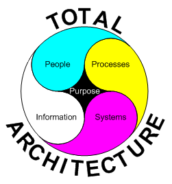
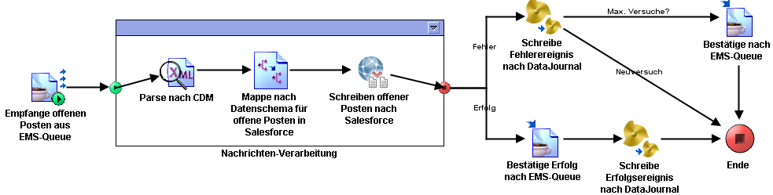
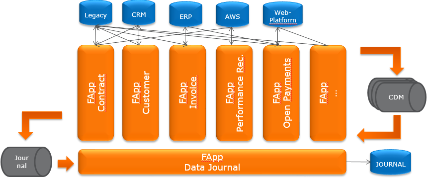
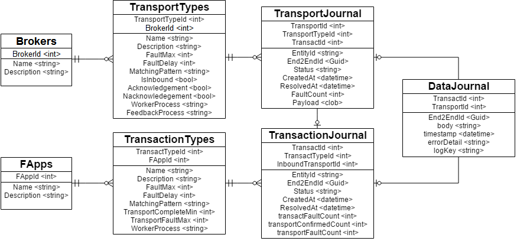
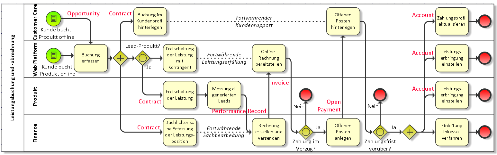
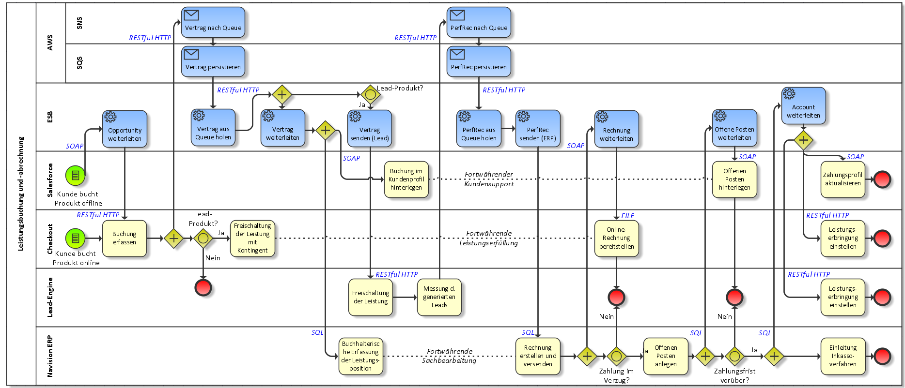
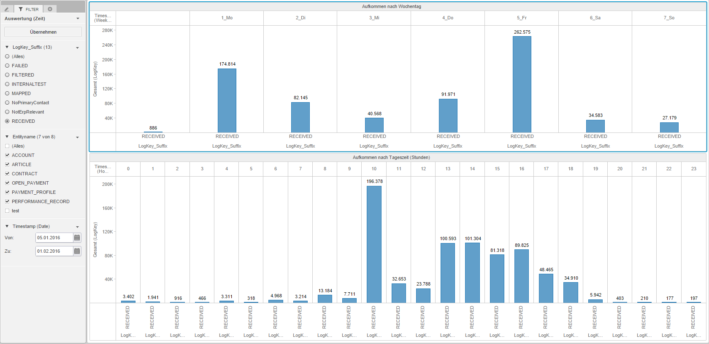
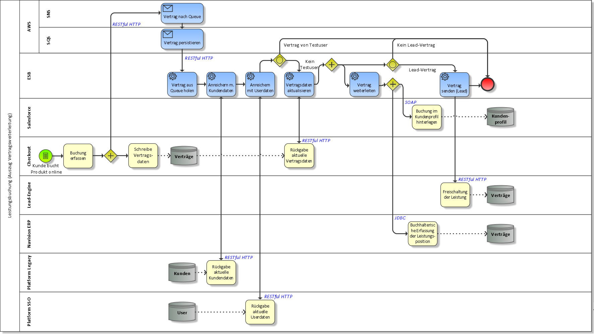
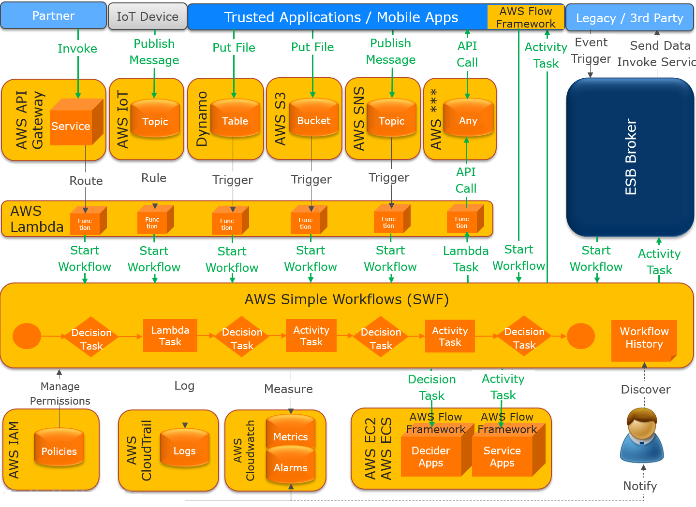
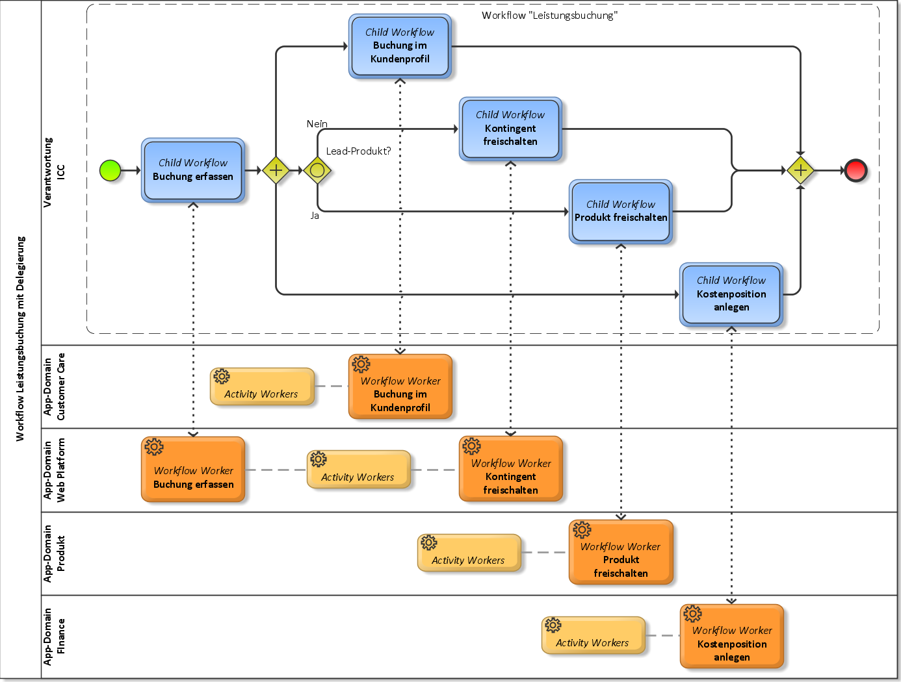

Technische Hochschule Nürnberg

FAKULTÄT ELEKTROTECHNIK FEINWERKTECHNIK

INFORMATIONSTECHNIK EFI

Software Engineering und Informationstechnik

{width="1.9in" height="1.9in"}

**Masterarbeit**

**Generisches Konzept und Implementierung einer **

**asynchronen Workflow-Engine unter Anwendung von **

**TIBCO BusinessWorks und Amazon Webservices**

  Autor            :   **Kay Lerch**
  ---------------- --- ---------------------------
  Matrikelnummer   :   2606128
  Gutachter        :   Prof. Dr. Herbert Fischer
  Zweitgutachter   :   Prof. Dr. Hans-Georg Hopf
  Abgabetermin     :   02.02.2016 (WS 15/16)

Prüfungsrechtliche Erklärung {#prüfungsrechtliche-erklärung .ListParagraph}
============================

Ich,

> Kay Lerch,
>
> Matrikel-Nr. 2606128,

versichere, dass ich die Arbeit selbständig verfasst, nicht anderweitig
für Prüfungszwecke vorgelegt, alle benutzten Quellen und Hilfsmittel
angegeben sowie wörtliche und sinngemäße Zitate als solche
gekennzeichnet habe.

Potsdam, den 02.02.2016

Kay Lerch

Kurzfassung / Abstract {#kurzfassung-abstract .ListParagraph}
====================================================================================================================

Die vorliegende Masterarbeit befasst sich mit den Herausforderungen der
technischen System-, Anwendungs- und Service-Integration im Zeitalter
des *Digital Business* und der digitalen Transformation von Unternehmen.
Sie begründet warum Konzepte der klassischen *Enterprise Application
Integration* (EAI) oder denen der serviceorientierten Architekturen
(SOA) unter häufigem Einsatz eines *Enterprise Service Bus* (ESB) nicht
mehr genügen, um mit der agilen Softwareentwicklung Schritt zu halten.
Deshalb überführt der Autor eine klassische Integrationslösung mit dem
Produkt TIBCO *BusinessWorks* über mehrere Ausbaustufen in eine hybride
Integrationsplattform (HIP), in der die *Amazon Webservices* (AWS) und
insbesondere die AWS *Simple Workflows* (SWF) verstärkt Anwendung
finden. Die finale Integrationslösung folgt den Prinzipien der agilen
Softwareentwicklung und fügt sich nahtlos in eine
*Microservice*-Architektur ein. Die als asynchrone *Workflow-Engine*
wahrnehmbare Lösung besitzt das Potential zur Integration neuartiger
Technologien aus den Bereichen *Internet of Things* (IoT), *Mobile* und
*Cloud* in die Geschäftsprozesse des Unternehmens. Mehr noch bereitet
sie den Weg für *Self-Service*-Integrations-Portale, welche Mitarbeitern
die Möglichkeit der selbstständigen *Service*-Integration gibt. Aus
diesen Gründen – so schlussfolgert der Autor – wird die entworfene
*Workflow-Engine* die digitale Transformation in Unternehmen
unterstützen.

Inhaltsverzeichnis {#inhaltsverzeichnis .ListParagraph}
==================

Prüfungsrechtliche Erklärung II

Kurzfassung / Abstract III

Inhaltsverzeichnis IV

Abbildungsverzeichnis VIII

Tabellenverzeichnis IX

Abkürzungsverzeichnis X

Vorwort XIII

1 Einleitung 1

1.1 Herausforderungen 3

1.2 Zielformulierung 4

1.3 Inhalte und Struktur der Arbeit 4

2 Klassische Integration in heterogenen IT-Landschaften 6

2.1 Applikation im Fokus – die klassische EAI 7

2.1.1 Messaging-Systeme 9

2.1.2 Message Oriented Middleware 10

2.1.3 Message Bus 12

2.2 Service im Fokus – Entwicklung der SOA 14

2.2.1 Konzept 14

2.2.2 Enterprise Service Bus 15

2.2.3 Resümee 16

2.3 Geschäftsprozesse im Fokus – Ausbildung des BPM 17

2.3.1 Business Process Management System 17

2.3.2 Abgrenzung zur SOA und dem ESB 19

2.3.3 Resümee 20

2.4 Workflow im Fokus – Automatisierung in der Workflow-Engine 21

2.4.1 Abgrenzung Workflow-Management und BPM 21

2.4.2 Referenz-Modell 22

2.5 Totale (Referenz-)Architektur 23

3 Integration für moderne IT-Landschaften 27

3.1 Agilisierung – die Softwarebranche denkt um 27

3.2 Modularisierung – Microservices übernehmen agile Wertekonzepte 28

3.2.1 Domain Driven Design 29

3.2.2 Operative Freiräume 31

3.2.3 Herausforderungen für Integration 32

3.3 Pragmatisierung –APIs, Messaging und sonst nichts? 32

3.3.1 Synchrone Kommunikation über RESTful Webservices 33

3.3.2 Asynchrone Kommunikation über Messages 33

3.3.3 Herausforderungen für Integrationslösungen 34

3.4 Virtualisierung – die Abkehr der Applikation vom System 35

3.4.1 Cloud-Services 35

3.4.2 Software-Container 36

3.4.3 Herausforderungen für Integrationslösungen 37

3.5 Mobilisierung – Vielfältigkeit zu integrierender Endgeräte 38

4 Integration im Wandel 39

4.1 Sinneswandel 39

4.2 Strukturwandel 40

4.3 Bewältigungsstrategien 41

4.3.1 Der bimodale Ansatz für Integration 41

4.3.2 Self-Service Integration 43

4.3.3 Hybrid Integration Platform 44

4.3.4 Self-Service Integration Portal 45

5 Integrationslösung mit TIBCO BusinessWorks 46

5.1 Anforderungsanalyse und Entwurf 46

5.1.1 Geschäftsprozess am Beispiel 46

5.1.2 Datenflüsse am Beispiel 47

5.1.3 Systemarchitektur am Beispiel 48

5.2 Grundlagen zur TIBCO Produktpalette 49

5.2.1 Message Service 49

5.2.2 ActiveMatrix 49

5.2.3 Administratives Werkzeug 51

5.3 Ausbaustufe 1: Modularisierung nach Fachlichkeit 52

5.3.1 Modularisierungskriterium 52

5.3.2 Komponentendesign 54

5.3.3 Sicherstellung einer garantierten Nachrichtenverarbeitung 56

5.3.4 Data-Journal 60

5.3.5 Zusammenfassung 61

5.4 Ausbaustufe 2: Modularisierung nach Funktion 62

5.4.1 Geteilte Ressourcen 62

5.4.2 Broker 63

5.4.3 Bessere Skalierung 64

5.4.4 Zusammenfassung 66

5.5 Ausbaustufe 3: Generischer Mittler 66

5.5.1 Prozesskoordination 67

5.5.2 Referenzmodell zum Datenfluss 69

5.5.3 Inhalts- und kontextgesteuerte Nachrichtenvermittlung 70

5.5.4 Metadatenspeicher und Data-Journal 71

5.5.5 Der Mediator 73

5.5.6 Zusammenfassung 75

5.6 Bewertung und Ausblick 75

6 Workflow-Engine mit Amazon SWF 77

6.1 Beschreibung und Einsatz 77

6.2 Komponenten 78

6.3 Funktionsweise 81

6.4 Flow Framework 83

6.4.1 Workflow Worker 84

6.4.2 Activity Worker 85

6.4.3 Workflow Starter 86

7 Hybride Integrationsplattform mit BusinessWorks und SWF 87

7.1 Der Anwendungsfall 88

7.2 Migration der Mediator-Komponenten 88

7.2.1 Inbound Transport Worker der Broker 89

7.2.2 Journale 90

7.2.3 Service Proxy Worker der Broker 91

7.2.4 Outbound Transport Worker der Broker 91

7.2.5 Service Worker der FApps 92

7.2.6 Mediator 93

7.2.7 Zusammenfassung 94

7.3 Integration im AWS-Ökosystem 95

7.4 Vendor Lock-in 97

7.5 Self-Service-Integration 97

7.6 SWF und Microservices 100

8 Schluss 101

8.1 Bewertung und Benchmark 101

8.2 Fazit und Ausblick 103

Anhänge XIV

Anhang 1: Prozessmodell für Leistungsbuchung (mit und ohne Entitäten)
XIV

Anhang 2: *Process Pattern Mapping* für Leistungsbuchung XV

Anhang 3: Data-Journal in Microstrategy XVI

Anhang 4: FApp-Architektur für Weiterleitung offene Posten XVII

Anhang 5: Referenz-Architektur für entitätsbezogenen Datenaustausch \#1
XVIII

Anhang 6: Referenz-Architektur für entitätsbezogenen Datenaustausch \#2
XIX

Anhang 7: Generischer Nachrichtenfluss im ESB mit Beispiel XX

Anhang 8: Generischer Nachrichtenfluss über ESB-Komponenten XXI

Anhang 9: Generisches Design eines ESB Brokers mit Beispiel XXII

Anhang 10: Generisches Design einer ESB FApp mit Beispiel XXIII

Anhang 11: Nachrichten mit anreicherndem Kontext im gen. Datenfluss XXIV

Anhang 12: Referenz-Architektur mit generischem Mediator XXV

Anhang 13: AWS Flow Framework Implementierung mit SWF Interaktion XXVI

Anhang 14: Vertragsweiterleitung bei Leistungsbuchung durch ESB XXVII

Anhang 15: Hybride Integrationslösung für Vertragsweiterleitung mit SWF
XXVIII

Anhang 16: SWF im AWS-Ökosystem XXIX

Anhang 17: SWF im AWS-Ökosystem (Exit-Strategie) XXX

Anhang 18: SWF-Workflow Leistungsverbuchung mit Delegierung XXXI

Anhang 19: CD-ROM XXXII

Literaturverzeichnis XXXIII

Abbildungsverzeichnis {#abbildungsverzeichnis .ListParagraph}
=====================

Abbildung 1: Enterprise Integration Patterns (Hohpe, et al., 2003, 2015)
11

Abbildung 2: Chaining Transformations (Hohpe, et al., 2004 p. 89) 12

Abbildung 3: Workflow vs. Prozess (Müller, 2005 p. 216 (Kindle)) 21

Abbildung 4: Workflow Reference-Model nach (Hollingsworth, 1995 p. 20)
22

Abbildung 5: Lifecycle eines Workflows (Hollingsworth, 1995 p. 23) 23

Abbildung 6: Lifecycle einer Aktivität im Workflow (Hollingsworth, 1995
p. 24) 23

Abbildung 7: Kombinierte Integrationsstrategien nach (Brown, 2009 p. 35)
24

Abbildung 8: Total Architecture nach (Brown, 2011 p. 10) 25

Abbildung 9: Geschichtete Architektur nach (Evans, 2003 p. 68) 29

Abbildung 10: Bounded Contexts (Martincevic, 2015) 30

Abbildung 11: Microservice-Stacks nach Bounded Contexts (Allen, 2013) 31

Abbildung 12: Context Map im DDD (Martincevic, 2015) 32

Abbildung 13: „Managed“-Grad eines Cloudportfolios (Thomas, 2015) 36

Abbildung 14: Building Blocks zur Beherrschung der Datenflüsse in einem
Digital Business (Axway, 2015) 39

Abbildung 15: Geschäftsprozess mit Mahnverfahren nach Leistungsbuchung
46

Abbildung 16: Auszug Business Object Model - Entitätsebene 47

Abbildung 17: Geschäftsprozess ergänzt um entitätsbezogene Datenflüsse
47

Abbildung 18: Systemarchitektur mit entitätsbezogenen Datenflüssen 48

Abbildung 19: Grafisches Mapping im TIBCO BusinessStudio 55

Abbildung 20: Prozess zum Empfang offener Posten aus ERP im Designer 55

Abbildung 21: Prozess zum Versand offener Posten nach Salesforce im
Designer 56

Abbildung 22: Ausbaustufe 1 – entitätsbezogene FApp-Modularisierung 62

Abbildung 23: Skalierung mit BW6 AppSpaces (TIBCO, 2014 p. 8) 65

Abbildung 24: Ausbaustufe 2 – entitäts- und systembezogene
Modularisierung 66

Abbildung 25: Elementare Bausteine einer SOA nach (WSO2, 2011 p. 9) 68

Abbildung 26: Lebenszyklus der Metaobjekte im Mediator-Konzept 71

Abbildung 27: Erweitertes Datenbankschema für Metadatenspeicher im ESB
72

Abbildung 28: Content-based Matching zwischen Transporten und
Transaktionen 72

Abbildung 29: Ausbaustufe 3 – Mediator als generischen Mittler 75

Abbildung 30: Komponenten in SWF und Interaktion mit
Workflow-Teilnehmern 80

Abbildung 31: Salesforce-Broker übernimmt Rolle eines Activity Worker 92

Abbildung 32: SWF Workflow-Choreografie über Domain/Team-Grenzen 98

Abbildung 33: SWF-Workflow-Verschachtelung über Verantwortungsbereiche
98

Abbildung 34: Prozessmodell für Leistungsbuchung mit Entitäten XIV

Abbildung 35: Prozessmodell für Leistungsbuchung ohne Entitäten XIV

Abbildung 36: *Process-Pattern-Matching* für Leistungsbuchung XV

Abbildung 37: Data-Journal Durchsatz-Statistik in Microstrategy XVI

Abbildung 38: FApp-Architektur für Weiterleitung offener Posten XVII

Abbildung 39: Referenzarchitektur für entitätsbezogenen Datenaustausch
\#1 XVIII

Abbildung 40: Referenz-Architektur für entitätsbezogenen Datenaustausch
\#2 XIX

Abbildung 41: Generischer Nachrichtenfluss im ESB XX

Abbildung 42: Generischer Nachrichtenfluss im ESB am Beispiel XX

Abbildung 43: Generischer Datenfluss über ESB-Komponenten XXI

Abbildung 44: Generisches Design eines ESB-Brokers XXII

Abbildung 45: Generisches Design eines ESB-Brokers am Beispiel XXII

Abbildung 46: Generisches Design einer ESB-FApp XXIII

Abbildung 47: Generisches Design einer ESB-FApp am Beispiel XXIII

Abbildung 48: Nachrichten mit anreicherndem Kontext im gen. Datenfluss
XXIV

Abbildung 49: Referenz-Architektur mit generischem Mediator XXV

Abbildung 50: AWS Flow Framework Implementierung mit SWF Interaktion
XXVI

Abbildung 51: Vertragsweiterleitung bei Leistungsbuchung durch ESB XXVII

Abbildung 52: Hybride Integrationslösung für Vertragsweiterleitung mit
SWF XXVIII

Abbildung 53: SWF im AWS-Ökosystem XXIX

Abbildung 54: Denkbare Exit-Strategie für SWF und Anrainer-Produkte XXX

Abbildung 55: SWF-Workflow Leistungsverbuchung mit Delegierung XXXI

Tabellenverzeichnis {#tabellenverzeichnis .ListParagraph}
===================

Tabelle 1: Gegenüberstellung ESB-Mediator-Konzept und SWF 2

Abkürzungsverzeichnis {#abkürzungsverzeichnis .ListParagraph}
=====================

  **AMX**     :   Active Matrix
  ----------- --- ---------------------------------------------------------------------
  **API**     :   Application Programming Interface
  **AWS**     :   Amazon Webservices
  **B2B**     :   Business to Business
  **B2C**     :   Business to Customer
  **BAM**     :   Business Activity Monitoring
  **BI**      :   Business Intelligence
  **BOM**     :   Business Object Model
  **BPEL**    :   Business Process Execution Language
  **BPM**     :   Business Process Management
  **BPMS**    :   Business Process Management System
  **BW**      :   BusinessWorks
  **CD**      :   Continuous Delivery
  **CDM**     :   Canonical Data Model
  **CI**      :   Continuous Integration
  **COBOL**   :   Common Business Oriented Language
  **CRM**     :   Customer Relationship Management
  **DB**      :   Datenbank
  **DBMS**    :   Datenbankmanagementsystem
  **DDD**     :   Domain-Driven Design
  **DIY**     :   Do It Yourself
  **DTL**     :   Design Time Library
  **EAI**     :   Enterprise Application Integration
  **EC2**     :   Elastic Compute Cloud
  **EMS**     :   Enterprise Message Service
  **EPK**     :   Ereignis-Prozess-Kette
  **ERP**     :   Enterprise Resource Planning
  **ESB**     :   Enterprise Service Bus
  **ETL**     :   Extract, Transform, Load
  **Fapp**    :   FachApplikation
  **FIFO**    :   First In, First Out
  **FTP**     :   File Transfer Protocol
  **gEMS**    :   graphical Enterprise Message Service
  **GUI**     :   Graphical User Interface
  **HIP**     :   Hybrid Integration Platform
  **HTTP**    :   Hypertext Transfer Protocol
  **IaaS**    :   Infrastructure as a Service
  **IAM**     :   Identity and Access Management
  **ICC**     :   Integration Competency Center
  **ID**      :   Identifier
  **IPaaS**   :   Integration Platform as a Service
  **ISaaS**   :   Integration Software as a Service
  **ISG**     :   Integration Strategy Group
  **IT**      :   Information Technology
  **JDBC**    :   Java Database Connectivity
  **JMS**     :   Java Message Service
  **JSON**    :   JavaScript Object Notation
  **JVM**     :   Java Virtual Machine
  **KPI**     :   Key Performance Indicator
  **LDAP**    :   Lightweight Directory Access Protocol
  **LIFO**    :   Last In, First Out
  **MOM**     :   Message Oriented Middleware
  **MQTT**    :   MQ Telemetry Transport
  **OASIS**   :   Organization for the Advancement of Structured Information Standard
  **OSI**     :   Open System Interconnection
  **PaaS**    :   Platform as a Service
  **PHP**     :   Personal Home Page
  **REST**    :   REpresentational State Transfer
  **RMI**     :   Remote Method Interface
  **RPC**     :   Remote Procedure Call
  **S3**      :   Simple Storage Service
  **SaaS**    :   Software as a Service
  **SCA**     :   Service Component Architecture
  **SDK**     :   Software Development Kit
  **SLA**     :   Service Level Agreement
  **SNS**     :   Simple Notification Service
  **SOA**     :   Service Oriented Architecture
  **SOAP**    :   Simple Object Access Protocol
  **SoR**     :   System of Record
  **SQL**     :   Structured Query Language
  **SQS**     :   Simple Queue Service
  **SSO**     :   Single Sign On
  **SWF**     :   Simple WorkFlow
  **TRA**     :   TIBCO Runtime Agent
  **UI**      :   User Interface
  **VM**      :   Virtual Machine
  **VPN**     :   Virtual Private Network
  **WfM**     :   Workflow Management
  **WfMS**    :   Workflow Management System
  **WS**      :   Webservice
  **WSDL**    :   Webservice Description Language
  **XML**     :   eXtensible Markup Language
  **XSD**     :   XML Schema Definition
  **XSLT**    :   eXtensible Stylesheet Language Transformation

Vorwort {#vorwort .ListParagraph}
=======

Diese Arbeit umfasst meine Gedankengänge, Gespräche, Forschungen und
praktische Erfahrungen, die ich im Laufe der letzten dreizehn Monate als
*Senior Product Owner* für das Team *Service Integration & Automation*
(SINA) im Unternehmen Immobilien Scout GmbH begangen habe. Als *Product
Owner* bin ich im Unternehmen für einen TIBCO *Enterprise Service Bus*
(ESB) fachlich verantwortlich und ich bin Ansprechpartner für
Integrationsthemen in der *Business Platform*. Die Datenflüsse über den
ESB konzentrieren sich mehrheitlich zwischen den *Webservices* und
Datenbanken der *Business Platform* und den *Backend*-Systemen.

Zunächst aus Gründen einer gewünschten Verbesserung im
Architektur-Design der ESB-Komponenten und damit einem effizienteren
Ressourcenmanagement entstand meine Motivation zu diesem Thema. Im Juni
2015 stieß ich auf die AWS *Simple Workflows*, mit deren
Berücksichtigung ich das Architekturkonzept und den Fokus dieser Thesis
überarbeitet habe. Aufgrund der Vielzahl an erkennbaren Vorteilen für
den Betrieb und das *Business* und einem erfolgreichen Prototyp,
verfolge ich mit dem SINA-Team seit Herbst 2015 die Cloud-Migration
aller ESB-Funktionalitäten im dafür initiierten Projekt S.I.M.P.L.E.
(*Service Integration & Mediation along Platform and Legacy
Environments*)

Im Jahr 2015 konnte ich auf vielen Veranstaltungen mit Fachexperten über
das entstandene Konzept sprechen und es verbessern.

-   TIBCO *Customer Workshop*, 11.06., Berlin, Immobilien Scout GmbH

-   TIBCO *Integration Customer Day*, 16.06., Frankfurt a.M., TIBCO

-   *Berlin Expert Days* (BED-Con), 17.-18 Sep., Berlin, Berlin Expert
    > Days e.V.

-   *AWSome Day*, 15.Sep., Berlin, Amazon Webservices

-   AWS *Architecting Bootcamp*, 04.11., Berlin, Amazon Webservices

-   Gartner *Application Architecture, Development and
    > Integration* (AADI) *Summit*, 01.12.-03.12., Las Vegas, Gartner

Ich möchte mich bei allen Gesprächspartner sowie bei meinem Team für
kontinuierliches Feedback und das entgegengebrachte Engagement bedanken.

Einleitung
=======================================================================================================================================================

*“I think we all realize the consumer has taken control and they’re not
giving it back, \[…\] So as every new technology comes forward, we have
to figure out how to integrate it.”*[^1]

So beschreibt Anne Sweeney die neuen Herausforderungen, denen sich
Unternehmen im Zeitalter des *Digital Business*[^2] stellen. Sie leiten
sich her aus der Entstehung neuer Absatzwege für Produkte und
Dienstleistungen über mobile Endgeräte und der Zunahme an Transparenz
und Flexibilität über die soziale Vernetzung für den Endverbraucher. Die
Adaption derartiger Technologien und Marktpotentiale vollzieht sich in
einem Prozess der digitalen Transformation von Unternehmen und mündet
zuweilen in disruptive Innovationen[^3] und Geschäftsmodelle, in denen
Unternehmen der *Old Economy*[^4] und des klassischen
*E-Commerce*-Geschäfts das Nachsehen haben . So revolutionierte Amazon
den Einzelhandel, Uber das Personentransportgewerbe und Reiseportale wie
Expedia oder Tripadvisor die Tourismusbranche. Die auflebende Kultur der
Startup-Unternehmen am Beispiel der Finanzbranche (*FinTech*[^5]) deutet
auf ein weiteres Wachstum des *Digital Business*‘ hin . Mehr noch
begünstigt die zunehmende Zahl von Mitwirkenden am digitalen Ökosystem
die geschäftsmäßige Vernetzung (B2B-Kommunikation) und das Angebot
wiederverwendbarer Services (bspw. über APIs), sodass sich aus diesem
Abhängigkeitsverhältnis ein exponentielles Wachstum schlussfolgert .

Für einen Markterfolg maßgeblich ist unter anderem die Leistung
schneller Produkteinführungen (*Time to market*). Dies hat Implikationen
auf die Art und Weise wie Software entwickelt und ausgebracht wird,
sodass Technologien, Konzepte und Paradigmen entstanden sind, die in der
agilen Softwareentwicklung unter den Schlagwörtern *Microservices*,
*DevOps* oder *Docker* geführt werden. Sie schaffen einerseits die von
der Produktentwicklung an Software geforderte Flexibilität und Agilität,
reagieren zum anderen aber auch auf die technologischen Potentiale und
Notwendigkeiten, die sich unter anderem mit den populär gewordenen
*Cloud-Computing*-Angeboten ergeben haben.

Den Innovationsgeist trafen zunächst vor allem Anwendungsdomänen, die
dem Kunden zugewandt waren (Domäne der *„customer experience“; Vgl.* ),
etwa *Website*- und *App*-Entwicklungen. Dem agilen Wertebild der
zugehörigen Entwicklungsteams ordnete sich eine pragmatische
Integrationsstrategie unter, die mit dem Vorbild der zur
Jahrtausendwende entstandenen serviceorientierten Architekturen (SOA)
den Ansatz der Konnektivität über APIs verfolgt .

Verantwortlich sind vor allem die hohe Komplexität und die besonderen
Anforderungen an Qualität und Stabilität, welche die
*Backend*-Systeme[^6] der Unternehmen (Domäne der *„process efficiency“;
Vgl.* ) nicht am Innovationsprozess teilhaben ließen oder immer noch
lassen. Nichtsdestotrotz sind es diese Systeme, die Geschäftsprozesse
treiben und welche historisch bedingt mit der Wertschöpfungskette des
Unternehmens eng verzahnt sind.

Um die Kluft der sperrigen *Backend*-Landschaft mit den
leichtgewichtigen Implementierungen aus dem Frontend zu überbrücken ohne
die Geschwindigkeit und Flexibilität des digitalen Marktplatzes zu
gefährden, fällt der klassischen Anwendungs- und Systemintegration eine
neue wichtige Rolle zu . So erzielt sich der Unternehmenserfolg
besonders aus dem harmonischen Zusammenspiel dieser beiden Domänen,
dessen Divergenz als das *„process efficiency and customer experience
dilemma“*[^7] bezeichnet. IBM-Vorstand Louis V. Gerstner Jr. wies auf
dieses Dilemma bereits im Jahr 1999 hin:

*„The Internet is ultimately about innovation and integration. \[…\] But
you don't get the innovation unless you integrate Web technology into
the processes by which you run your business \[…\] The true revolution
coming from the Web is when the Web can get integrated with business
processes.”*[^8]

Damit liegt die Vermutung nahe, dass Probleme durch
Integrationsstrategien und -produkte bis heute nicht adäquat gelöst
werden konnten oder aber die digitale Transformation die Signifikanz
dieser Problemstellung erneuert hat.

Herausforderungen
-----------------

Die Überwindung proprietärer technischer Schnittstellen zu einer
Vielzahl an Applikationen inner- und außerhalb eines
Unternehmensnetzwerkes bildet den Fokus einer system- und
anwendungsübergreifenden Integration. Die Arbeit wird in einem späteren
Kapitel auf konzeptionelle Anforderungen und implementierte Lösungen
eingehen und die Entwicklung dieser aufzeigen.

An dieser Stelle möchte der Verfasser dieser Arbeit auf die
Herausforderungen der digitalen Transformation für eine
Integrationsstrategie aufmerksam machen.

Wesentlich müssen sich Integrationslösungen und -strategien – wie diese
Arbeit mehrere beschreiben wird – auf zwei Domänen einstellen. Die
Einteilung der IT-Landschaft in einerseits den Kunden zugewandten,
kurzen teilweise sogar explorativen Entwicklungs- und Release-Zyklen
unterliegenden Anwendungsmodulen und andererseits den weniger flexiblen
und weitaus komplexeren Altsystemen (*Legacy IT*) gebraucht den Begriff
der *Two-Speed-IT* . Diese Differenzierung akzeptiert den Umstand der
Ungleichheit dieser beiden Domänen und spricht deren jeweilige
Berechtigung aufgrund der verschiedenen Anforderungen auch nicht ab.
Gartner teilt dieses Bild und charakterisiert für jede der beiden Seiten
im Hinblick auf Integrationsprojekte eigene Vorgehensstrategien, welche
als Modi bezeichnet sind. . Der bimodale Ansatz wird in dieser Arbeit
noch eingehender behandelt. Er gibt jedoch schon jetzt die Möglichkeit
einige neue Herausforderungen für Integrationsprojekte zu benennen.

*„Mode 2“*-Projekte zielen auf Agilität und geben iterative, kurze
Entwicklungszyklen vor. Sie stehen damit für das agile Manifest nach und
folgen den Erfordernissen der digitalen Transformation. Weiterhin sind
diese Projekte ausgezeichnet durch geringe Komplexität sowie starke
Ausrichtung auf Konsumenten und Produkte.

Klassische Integrationsprojekte (*„Mode 1“*) können diesen Anforderungen
nicht entsprechen, da sie sich durch lange Planungs- und Konzeptphasen
und dem Einsatz mächtiger, unzugänglicher Werkzeuge und
Laufzeitumgebungen wie etwa einem *Enterprise Service Bus* (ESB)
auszeichnen.

Abermals erwähnt wird die vertretbare Anwendung beider Modi, sodass der
ideale Zustand einer Integrationsplattform beide Vorgangsweisen zulässt
und sowohl die zuverlässige Anbindung der *Backend*-Systeme wie auch die
leichtgewichtige *Ad-hoc*-Integration der Produktentwicklungen
unterstützt. Besondere Disziplinen werden das Beherrschen der
Komplexität, der Systemverwaltung, des *Monitoring*s und der Skalierung
sein. Ebenso berücksichtigt werden muss die Einhaltung der Autonomie von
Entwicklungsteams in den Produktabteilungen, sodass eine Art
*Self-Service* für die Integration eigener Anwendungen denkbar ist.

Zielformulierung
----------------

Der Autor erhebt mit dieser Arbeit den Anspruch einem Großteil der
formulierten Herausforderungen über ein allgemeingültiges Konzept und
einer beispielhaften Implementierung mit Antworten zu begegnen. Dabei
werden zunächst allgemeine Anforderungen an systemübergreifender und
asynchroner Nachrichtenverarbeitung herausgestellt.

Geeignete Maßnahmen und Entscheidungen werden dem Verfasser helfen dem
Leser eine Referenzimplementierung mit TIBCO *ActiveMatrix
BusinessWorks* vorzustellen. Darüber hinaus soll der Lösungsansatz um
die Einbindung der *Amazon Webservices* (AWS) angereichert sowie die
Komplettmigration der Integrationslösung in die *Cloud* behandelt
werden.

Die Berücksichtigung der AWS-Produkte – allem voran die *Simple
Workflows* (SWF) –sollen die Abbildung umfangreicherer Anwendungsfälle
in Form von Workflows lösen. Damit möchte der Verfasser ein Szenario zur
Automatisierung von (Geschäfts-)Prozessen vorstellen, um den Anspruch
einer *Workflow-Engine* gerecht zu werden.

Der Leser soll so mehrere Referenzlösungen kennenlernen, die er mithilfe
der Bewertungen des Autors auf Eignung und Zukunftsfähigkeit im *Digital
Business* und aktuellen Technologietrends wie *Microservices*,
*Cloud-Computing*, *DevOps* oder den *Internet of Things* (IoT) prüfen
kann.

Die Arbeit schließt mit der Möglichkeit zur Anwendung cloudbasierte
Integrationsprodukte (*iPaaS*, *iSaaS*[^9]) und deren Stellenwert in der
digitalen Transformation eines Unternehmens.

Die Arbeit soll schlussendlich belegen, dass die zu erstellende
Integrationslösung den Prinzipien der agilen Softwareentwicklung folgen
und einen Beitrag zur digitalen Transformation eines Unternehmens
leisten kann.

Inhalte und Struktur der Arbeit
-------------------------------

Die Arbeit öffnet mit den klassischen Integrationsstrategien und stellt
mithilfe von Basisliteratur die Evolution dieser Strategien vor. Der
Leser wird nachvollziehen welche Problemstellungen die Ansätze der
einzelnen Evolutionsstufen zu lösen versuchten.

Dem anschließen wird sich die Abhandlung der technologischen
Veränderungen in der IT, welche die digitale Transformation begünstigen
oder von dieser eingefordert wird. Hierbei wird sich der Autor auf
Sachverhalte beschränken, die Berührungspunkte und Auswirkungen auf
System-, Anwendungs- oder Prozessintegrationen haben. Der Leser soll in
diesem Teil der Arbeit ein Verständnis darüber gewinnen, inwieweit sich
die Konzepte der klassischen Integrationsstrategien neuen Umständen
anpassen müssen und welchen Bedarf an Entwicklung es in diesem
Fachgebiet gibt.

Nach der theoretischen Betrachtung stellt der Autor der Reihe nach
Lösungskonzepte vor, die aufeinander aufbauen. Jeder Ansatz ist vom
Verfasser mit einer Implementierung erprobt, auf die er selektiv
eingehen wird. Damit wird dem Leser zum einen die Anwendung des
generischen Konzeptes aufgezeigt. Zum anderen wird er durch den Autor
aber auch auf Schwachstellen hingewiesen, die dieser mit der nächsten
Ausbaustufe seines Konzeptes zu lösen versucht. Zum Ende steht ein
allgemein anwendbares Konzept mit einer Beispielimplementierung, welche
mithilfe der Produkte TIBCO *BusinessWorks* als ESB-Instanz sowie den
AWS *Simple Workflows* als *Workflow-Engine* in der *Cloud* umgesetzt
ist.

Zum Ende soll ein Blick über erweiterte Lösungsvarianten gehen und der
Autor führt eine Bewertung hinsichtlich seiner in dieser Arbeit
gestellten Ziele durch.

Klassische Integration in heterogenen IT-Landschaften
=====================================================

Systeme und auf ihnen laufende Anwendungen sind bis auf wenige Ausnahmen
keine geschlossenen Einheiten, denn sie interagieren mit ihrer Umwelt
(Mensch, Maschine) über Ein- und Ausgaben. Um mit einem System von außen
über dessen Grenzen kommunizieren zu können, etablieren Entwickler in
ihren Hard- und Softwaresystemen Schnittstellen. Damit ist es Anwendern
möglich den Systemen Daten zuzuführen (Kommandos oder Daten) und
Ausgaben zu erhalten und zu verwerten (Bildschirm, Drucker, Datei u.a.).
Je offener ein System diesen Interaktionen gegenübersteht, desto mehr
Schnittstellen aber auch potentielle Gefahren birgt es. Es obliegt der
Abwägung des Entwicklers Programme für einen vielfältigen Einsatz zu
öffnen (etwa über eine Programmierschnittstelle) oder gar deren
Weiterentwicklung zu fördern (*OpenSource*).

Je geschlossener ein System für Interaktionen ist, desto mehr Kontrolle
und vermeintliche Sicherheit genießt es vor Manipulationen von außen.
Dies folgert jedoch auch einen begrenzten Einsatzspielraum des Anwenders
und schreibt den Systemen meist dedizierte Verwendungszwecke vor. Die
Debatte über offene und geschlossenen Systemen vollzog sich am
intensivsten zwischen Apple’s Steve Jobs und den Herstellern weniger
proprietärer Konkurrenzprodukte wie Microsoft’s Windows oder Google’s
Android. . Die Auseinandersetzung zeigt, dass es Gründe und
Erfolgsaussichten für beide der Ansätze – offen oder geschlossen – gibt.

Grundsätzlich tendieren Systeme zur Verkleinerung und Komponenten einer
System- oder Applikationsarchitektur werden zunehmend granularer
ausgeprägt. Die Abkehr vom monolithischen Gebilde hin in eine
modularisierte IT-Landschaft wird in den serviceorientierten
Architekturen genauso wie in den heute populären *Microservices*
propagiert. Die logische Konsequenz ist ein Anstieg der Anzahl von
Systemen und Applikationen in Unternehmen und damit auch die Anzahl
technischer Schnittstellen und deren Verbindung untereinander.

Gründe zur Schaffung von Integrationslösungen für die Beherrschung der
zunehmenden Vernetzung beschrieben in ihrem Standardwerk der *Enterprise
Integration Patterns*:

-   Die Unzuverlässigkeit des Netzwerks zwischen zwei zu integrierenden
    > Systemen gefährdet den Datentransport. Verteilte Systeme müssen
    > mit vielen Annahmen – etwa einem Netzwerkausfall – umgehen können.

-   Datentransporte über Netzwerke sind gegenüber lokalen Systemaufrufen
    > um ein Vielfaches langsamer und führen zu Performance-Einbußen.

-   Anwendungen sind hinsichtlich ihrer Technologie heterogen. Um
    > Datenaustausch mit anderen Applikationen auszuführen, haben sie
    > mit einer Vielzahl von proprietären Schnittstellen umzugehen.

-   Anwendungen und deren Schnittstellen ändern sich. Kommunizieren die
    > Schnittstellen der Applikationen direkt miteinander, ergibt sich
    > aus dieser Abhängigkeit ein Nachteil. Der Bedarf für eine
    > Anpassung kann sich im Schnellballprinzip durch mehrere
    > voneinander abhängige Anwendungen ziehen und den
    > Aufwand potenzieren.

Die genannte technologische Verschiedenheit der Systeme und ihrer
Anwendungen tragen zu dem heterogenen IT-Landschaftsbild in Unternehmen
bei und erschweren Integration maßgeblich. Die Homogenisierung der
Anwendungslandschaft wäre naheliegend, ist aus Sicht des Autors aber
kein erstrebenswertes Ziel. Sie limitiert die Innovationskraft eines
Unternehmens auf bestimmte Technologiezweige und löst nur einige der
oben erwähnten Herausforderungen.

Vielmehr fokussieren sich Konsortien wie die OASIS[^10] oder W3C[^11]
auf Standardisierungen über einheitliche Datenformate (XML, JSON u.a.),
Transportprotokolle (bspw. die WS-Protokollfamilie) sowie die
Ausarbeitung von Referenzarchitekturen (etwa der SOA), um der
technologischen Vielfalt an den Systemgrenzen und auf dem Transportweg
Einhalt zu gebieten.

Applikation im Fokus – die klassische EAI
-----------------------------------------

Zurückführend auf die ursächliche Herausforderung – die Überwindung von
Systemgrenzen zum Zwecke des applikationsübergreifenden Datenaustauschs
– entstand die anwendungsbezogene Sicht auf Integrationslösungen. Ihre
Überlegungen und Konzepte fassen sich unter dem Begriff *Enterprise
Application Integration* (EAI) zusammen und meint nach den
uneingeschränkten Austausch von Daten und Geschäftsprozessen zwischen
verbundenen Anwendungen und Datenquellen eines Unternehmens. Diese
allgemein gehaltene Definition gibt einen Eindruck darauf, welchen
Freiraum Entwickler in dieser Zeit in der Lösungsfindung hatten und auch
in Anspruch genommen haben. geht auf vier wesentliche Epochen ein,
welche Anwendungsintegration unterschiedlich zu lösen versuchten:

**Datenaustausch über Dateien**: Die Schnittstelle zweier sich
verbindender Applikationen stellen Dateien dar, die vom Datenproduzenten
geschrieben und vom Datenkonsumenten gelesen werden. Vorteil besteht in
der asynchronen Kommunikation, welche die Applikationen im Hinblick auf
Leistungsfähigkeit und Verfügbarkeit nur begrenzt abhängig machen. Einen
Nachteil stellt die geringe Übertragungsgeschwindigkeit der Daten dar,
die mitunter zu Dateninkonsistenzen zwischen den Anwendungen führen
kann. Verbreitet sind diese Ansätze in *Mainframe*-Systemen, die über
COBOL das Dateisystem beschreiben und so Datenabgänge realisieren.
Überlebt hat diese Methode auch in neueren Systemen – etwa beim
Austausch von XML-Dateien über FTP.[^12]

**Geteilte Datenbank**: Um den Austausch von Daten grundsätzlich zu
vermeiden, entstand der Ansatz zur Verwendung einer gemeinsamen
Datenbank. Mehrere Applikationen schreiben und lesen aus demselben
Datentopf. Die Synchronisation und Verwaltung der konkurrierenden Lese-
und Schreibzugriffe obliegt dem Datenbank-Managementsystem (DBMS). Zwar
ist die Konsistenz der Daten über Anwendungsgrenzen hinweg
gewährleistet, jedoch entsteht eine starke Kopplung zwischen den
Systemen. Da sich neben den Daten auch die Datenschemata geteilt werden,
haben Änderungen an ihnen gemeinhin Konsequenzen für alle lesenden und
schreibenden Applikationen. Aufgrund der Fragilität und Komplexität
dieses Konstrukts ist eine Abkehr davon besonders aufwendig. Darum
finden sich diese Integrationsmuster noch heute vielfach in Unternehmen
wieder.

**Entfernter Programmaufruf**: Dieser Ansatz erlaubt es einer
Applikation eine Ausführungsmethode von außen aufrufbar zu machen, indem
die entsprechende Ressource als *Remote Procedure* oder im
objektorientierten Kontext als *Remote Method* deklariert wird. Der
Aufruf dieser Ressource von einem anderen Programm wird dann als RPC
oder in der Programmiersprache Java als RMI[^13] bezeichnet. Erstmalig
ist nicht nur der Datenaustausch möglich, sondern ein Zugang zu
entfernten Funktionen eines anderen Programmes möglich. Der Vorteil
ergibt sich aus dem synchronen Aufruf, der dem Aufrufer unverzüglich mit
einem Ergebnis versorgt, ihn andererseits aber auch blockiert. Ein
weiterer Nachteil ist die hohe Abhängigkeit beider Applikationen durch
ihre geteilte Schnittstelle. Ähnlich wie bei einem geteilten Datenschema
verhält sich die Signatur der Programmschnittstelle. Der Aufrufer hält
die Schnittstellendefinition lokal vor und hat diese bei serverseitiger
Änderung zu synchronisieren. Diese Hürde wurde mit den heute gängigen
*Webservices* überwunden, da die Schnittstellendefinition in
deklarativer Form (WSDL[^14]) auf der Serverseite gehalten wird.

**Messaging**: Asynchrone Datenübermittlung bewies sich anhand des
Dateitransfers als effektivste Form zur Wahrung einer losen Kopplung
zwischen Systemen. Die Nachteile der dateibasierten Lösungen heben die
*Messaging*-Konzepte, denen aufgrund ihrer Bedeutsamkeit ein eigenes
Kapitel gewidmet ist, weitgehend auf.

### Messaging-Systeme

Die Übermittlung von Daten wird in Datenpaketen organisiert, die als
Nachrichten (*Messages*) bezeichnet werden. Dabei werden zu
übermittelnde Daten in Datensätze aufgetrennt und in möglichst atomarer
Form über einen Nachrichtenkanal (*Channel*) gesendet. Eine Nachricht
besteht aus Metainformationen (*Header*) über Transport und Verarbeitung
und einem optionalen Inhalt (*Body*) . Nachrichten können also nicht nur
einen Datensatz repräsentieren, sondern werden ebenso genutzt, um
Ereignisse (*Events*) auszudrücken. Sie bilden die ideale Voraussetzung
für ein ereignisgesteuertes *Messaging* (Vgl. ). Prinzipiell lassen sich
über den Body der Nachricht – unter Berücksichtigung von Limitierungen
im Hinblick auf die Größe einer Nachricht – Daten in jedem Format
übertragen. Durchgesetzt haben sich Datenstrukturen im XML-Format[^15] .

Der Übertragungskanal ist eine weitere Entwicklung gegenüber dem
Dateitransfer, denn er repräsentiert eine adressierbare Ressource, die
eingehende Nachrichten nicht nur persistiert, sondern für den
Konsumenten auch organisiert – zum Beispiel die Reihenfolge und
Priorisierung der Ausgabe[^16]. Am verbreitetsten ist das Konzept der
*Queues*[^17], die von einem *Messaging*-System verwaltet werden und
über ein Anwendungsprotokoll[^18] oder bequemer noch über eine API[^19]
mit einem sprechenden Bezeichner von einer Applikation adressierbar
sind.

*Messaging*-Dienste arbeiten nach dem *Publish-Subscribe*-Prinzip.
Daten- oder *Event*-Produzenten (*Publisher*) senden Nachrichten an eine
*Queue*, während Konsumenten (*Subscriber*) deren Empfang über ein
Abonnement auf die *Queue* initiieren können[^20]. Eine direkte
Verbindung zwischen beiden Parteien gibt es damit nicht. Dieser Umstand
führt zu der erwünschten losen Kopplung zweier oder mehr Applikationen.

Konkurrierende Zugriffe mehrerer Anwendungen auf eine *Queue* sind
möglich, versorgen aber nach dem „*First Come First Serve“*-Prinzip nur
den ersten Konsumenten. Ist eine Verteilung einer Nachricht auf mehrere
Konsumenten erwünscht, eignet sich das *Topic*[^21]. Es wird ebenso
durch einen *Messaging*-Dienst verwaltet und dient lediglich dem
Publisher zur Entsendung einer Nachricht. Die *Subscriber* abonnieren
sich auf eine eigene (nicht mit anderen geteilte) *Queue*, die
ihrerseits ein Abonnement auf das *Topic* hält.

Der *Messaging*-Dienst spielt den Vermittler zwischen allen Produzenten
und Konsumenten, sodass Applikationen sich ausschließlich nur noch an
Ressourcen (*Queues*, *Topics*) dieses Dienstes koppeln, nicht jedoch
weiter untereinander. Aufgrund der ausfallkritischen Rolle dieses
Dienstes gingen Unternehmen dazu über ihn in eigene physikalische oder
logische Einheiten[^22] auszulagern, um entsprechend besser skalieren zu
können und lose Kopplung von den angebundenen Applikationen auch
konsequent durchzusetzen. Diese Entscheidung bildete in der
System-Architektur einen neuen *Layer* aus, der mit dem Begriff der
*Middleware* assoziiert wird.

### Message Oriented Middleware

Eine Middleware wird zunächst als ein Werkzeug verstanden, welches die
Kommunikation zwischen Anwendungen übernimmt und die damit einhergehende
Komplexität über APIs vor einer Anwendung verbirgt .

Ein ausgelagerter *Messaging*-Dienst wird nicht zuletzt durch die
Vielzahl der für ihn entstandenen kommerziellen Produkte als *Message
Oriented Middleware* (MOM) bezeichnet. Es stiegen die Funktionsumfänge
dieser Dienste, indem sie nicht weiter nur die Infrastruktur und
Endpunkte für Nachrichtenübermittlungen bereitstellten, sondern fortan
auch mit Logik implementiert werden konnten. Die Route einer Nachricht
kann sich durch Anwendung von Filtern und Regelwerken, die auf den
Inhalt (*Body*)[^23] und den Metadaten (*Header*)[^24] einer Nachricht
angewendet werden, innerhalb der MOM ändern. Die Verkettung solcher
Weichenstellungen kann bereits komplexe Logik abbilden und erfüllen das,
was in als *Message-Router* bezeichnet wird.

Weitere aufkommende Features, die unter den Begriff der Transformatoren
fallen, können Nachrichten fortan nicht nur analysieren, umlenken oder
gar vervielfältigen und splitten, sondern auch deren Inhalte
manipulieren.

Um nun aber auch die Konnektivität hin zu dieser neu entstandenen
Vielfalt an Funktionen zu verbessern, bildete sich das Konzept der
Adapter heraus. Denn nicht jedes System – wie etwa ein *Mainframe* oder
eine Datenbank – können mit den APIs oder Protokollen des
*Message-Routers* arbeiten, sich auf asynchrone Interaktionsmuster oder
die Schnittstellenschemata der MOM einlassen. Adapter sind Konnektoren
für Applikationen und Systeme, die über vom MOM bereitgestellte
SDKs[^25] entwickelt werden können und als *Gateway* zum
*Messaging*-Dienst fungieren. Mit einem Angebot von
Standard-Adaptern[^26] für verbreitete Systeme und den
Erweiterungsmöglichkeiten über SDKs nennen sich entsprechende Produkte
*Message-Broker* , denn sie überwinden die Kommunikationshürde mit
proprietären System- und Anwendungsschnittstellen im wörtlichen Sinn.

{width="5.9in" height="3.55in"}

Abbildung : Enterprise Integration Patterns

Die Gesamtheit der Entwurfsmuster und -Werkzeuge für MOMs behandelt das
Buch unter Einführung eigener Notation und eigenem Vokabular. Die
*Enterprise Integration Patterns* gelten als akzeptierter Standard, die
am konsequentesten durch das Tool *Apache Camel*[^27] angenommen und
über dessen Framework implementiert werden können.

### Message Bus

Ein *Message Broker* ist ein ideales Instrument, um Datenaustausch
zwischen Applikationen zu realisieren und Logik für dessen Verarbeitung
und Weiterleitung mit eigens bereitgestellter Logik zu zentralisieren.
Jedoch ist diese sehr technische Herangehensweise für
Geschäftsanwendungen mit starkem Bezug auf Geschäftsentitäten und
-prozessen zu generisch, um leicht einsetzbar zu sein. Anwendungen,
deren Kommunikation einen geschäftlichen Zweck erfüllen, brauchen
Schnittstellen, die sich auf einen Anwendungsfall ausrichten (bspw.
Kunde hat Adresse geändert).

Die technische Repräsentation in Form eines Datenschemas des Kunden kann
in den einzelnen Anwendungen – so wie auch das den Anwendungsfall der
Adressänderung repräsentierenden Kommandos – verschieden sein. Wird es
der konsumierenden Applikation aufgetragen die Übersetzung der Daten
(*Content*) und Interpretation des Kommandos (*Context*) in die eigene
Semantik und Syntax zu vollziehen, ergibt sich eine neue Form der
Kopplung beider Systeme auf dem *Layer*[^28] der Datenstrukturen (siehe
Grafik).

{width="4.033333333333333in" height="1.6in"}

Abbildung : Chaining
Transformations

Datenstrukturen gerade bei kommerziellen Anwendungsprodukten sind schwer
abänderbar, sodass sich Transformationen zwischen Systemen nicht
vermeiden lassen. Die Anzahl der Abhängigkeiten kann jedoch durch
Etablierung eines kanonischen Datenmodells (CDM) verringert werden.
Dieses Modell[^29] stellt eine anwendungsübergreifende Übereinkunft für
Geschäftsentitäten und -objekte dar. Anwendungen müssen somit nur noch
Übersetzungen[^30] (*Mappings*) ihrer Datenmodelle in die kanonischen
Formen (und zurück) ausführen.

Ein Message-Bus vereint das Konzept der kanonischen Datenmodelle mit den
Funktionen eines Message Brokers. Er stellt zudem für dedizierte
Anwendungsfälle präparierte Schnittstellen[^31] und Kommandos[^32]
bereit, die eine abstraktere, weniger technische Möglichkeit der
Anbindung an geschäftsorientierten Schnittstellen ermöglichen. (Vgl. ).
Erstmalig wird beim Bussystem auch die Verwendung einer dedizierten
Infrastruktur vorausgesetzt, deren Notwendigkeit in der bis jetzt
beschriebenen MOM noch nicht zwingend war. Somit sind alle angebundenen
Anwendungen nunmehr auch auf Infrastrukturebene voneinander entkoppelt.
Es resultiert ein Architekturmuster, welches als *Hub & Spoke*
bezeichnet wird . Durch die Zentralität einer geteilten Anwendung
(*Hub*) ergibt sich der Vorteil, dass die Anzahl der
systemübergreifenden Schnittstellen nur noch der Anzahl angebundener
Systeme (*Spoke*) ist[^33]. Das löst das von Gartner als „*integration
spaghetti*“[^34] bezeichnete Netz an Schnittstellen im Netzwerk und
dient dem Abbau von Komplexität und leichterer Wartung. Herausfordernd
ist damit umso mehr die Skalierung des Message-Busses, da er die für
alle Anwendungen kritische Komponente wird und zum Flaschenhals der
Datenflüsse werden kann.

Der Message Bus bietet nicht weiter nur rein technische
Übertragungskanäle zur Integration entfernter Anwendungen an, sondern
wartet mit einem Satz von Schnittstellen auf, welche bereits die
Grundidee der Service-Endpunkte in einer SOA aufgreifen.

Service im Fokus – Entwicklung der SOA
--------------------------------------

Gegenüber der klassischen EAI, in der die Integrationswerkzeuge
Anwendungen zusammenbringen, fokussieren sich die serviceorientierten
Architekturen auf die Integration der Teilnehmer von Geschäftsdomänen
(Abteilungen, Unternehmen, Personen) und ihren angebotenen
Dienstleistungen (*Services*) in Geschäftsprozessen, um spezifischen
fachlichen Anforderungen (*business needs*) gerecht zu werden. SOA
definiert sich nach als ein Paradigma, welches die Identifikation mit
diesen *Services* fördert und die Ausgestaltung von, sowie die
Implementierung und Bereitstellung dieser *Services* steuert.

### Konzept

Grundsätzlich versucht SOA ein technisches Abbild der auf
Dienstleistungen und Prozessen ausgerichteten Fachdomänen zu schaffen,
um so die Angleichung von Technik und der fachlichen Organisation eines
Unternehmens zu erwirken (*Business-IT-Alignment*). Die Aktivitäten von
Geschäftsprozessen werden als anwendbarer *Service* in einem
Portfolio[^35] (*Service repository*) festgehalten, wobei die
Implementierung dieser *Services* durch eine Anwendung
(*Service-Provider*) für den Konsumenten verborgen bleibt. Werkzeuge
eines SOA-basierten Werkzeugs pflegen dieses Portfolio, ermöglichen die
Registrierung neuer *Services* (*Service registration*) für den
*Service*-Anbieter und steuern deren Vermittlung an den Konsumenten
(*Service discovery*). Dabei spielt das Design der *Services* eine
übergeordnete Rolle, denn sie entscheiden über den Grad der
Wiederverwendbarkeit und Nutzbarkeit. Etwa würden zu sehr auf einen
konkreten Anwendungsfall konzipierte *Services* eine Wiederverwendung
weitgehend ausschließen. Wohingegen sehr generische *Services* das Maß
an Nachvollziehbarkeit vermissen lassen.

Den großen Mehrwert erlangen SOA-Lösungen über die Kombination mehrerer
*Service*-Aufrufe (*Service orchestration*) in einer einem
Geschäftsvorfall entsprechenden Reihenfolge. Nach dem Baukastenprinzip
kann ein umfangreicher *Service*-Katalog durch immer neue
Aufrufkombinationen eine Vielzahl an Geschäftsprozessen abbilden. Die
einzelnen Implementierungen auf Applikationsebene sind für den Prozess
irrelevant, da eine gut designte *Service*-Schnittstelle sich auf den
Anwendungsfall (*Use case*) und nicht auf die Systemspezifika der
Implementierungsquelle fokussiert.

Das Entwickler-Team oder die Fachdomäne, die Verantwortung für einen
*Service* trägt, hat in diesem Moment nur noch bedingte Kontrolle und
Transparenz über die Nutzung und die Identität seiner Aufrufer. Anders
herum kennt auch der Konsument durch die Abstraktion der Schnittstelle
von der Implementierung den Ort der Leistungserbringung nicht mehr. Um
die Erwartungshaltung des Konsumenten an den *Service-Provider*
weiterzugeben, gibt es (nicht nur in der SOA) die Idee der *Service
Level Agreements* (SLA). Sie regeln unter anderem die
Leistungsparameter, Verantwortlichkeiten und technischen Spezifikationen
eines *Service*.

Es wird deutlich, dass eine SOA weit mehr umfasst als die
Implementierung und Bereitstellung eines *Service*. Unter anderem müssen
*Service registration*, *Service discovery*, *Business-IT-Alignment*,
*Service design* und SLAs zwischen den *Stakeholdern* koordiniert
werden. Diese Koordination wird meist einem Gremium aus Architekten,
Fachexperten, Entscheidungsträgern und Technikern übergeben. Ihre
Aufgabe lässt sich unter dem Begriff *SOA Goverance* und *SOA
Management* zusammenfassen. Einige Experten sehen das Fehlen oder die
falsche Besetzung dieser Gremien als Grund des Scheiterns einer SOA in
Unternehmen .

### Enterprise Service Bus

Die Ausführungen einer *Service*-Orchestrierung übernehmen wiederum
*Middleware*-Systeme. Die Orchestrierung kann als *Composite* *Service*
öffentlich gemacht werden, sodass nicht nur einzelne
Geschäftsaktivitäten (*Services*), sondern auch (Teil-)Geschäftsprozesse
zu neuen Ausführungsketten kombiniert werden können.
*Middleware*-Systeme, die diesen Ansprüchen gerecht werden, sind unter
dem Begriff des *Enterprise Services Bus* (ESB) bekannt. Sie ergänzen
die Funktionalitäten einer MOM oder ersetzen sie gar[^36]. Da
*Service*-Orchestrierungen zustandsbehaftet sein können, arbeitet ein
ESB mit Persistenztechnologien, die Zustände einer Prozessausführung bei
Unterbrechung oder dem Pausieren in eine Datenbank oder einem
Dateisystem ablegen. Kommerzielle Produkte wie TIBCO *BusinessWorks*
oder Microsoft’s *BizTalk*-Server bieten zudem grafische Designer, mit
denen komplexe Orchestrierungen unter Verwendung einer Werkzeugpalette
erstellt werden können. Die Elemente dieser Paletten lehnen sich häufig
an Konzepte der *Enterprise Integration Patterns* an. Je nach Produkt
und Preis bieten Hersteller in Kombination mit dem Kern-Produkt
zusätzliche Adapter zur Integration exotischerer Schnittstellen,
*Monitoring*-Werkzeuge wie einem *Business Activity Monitoring* (BAM)
und administrative Benutzeroberflächen für das System-Management an.

ESBs sind keine reinen SOA-Produkte. ESB-Systeme eignen sich auch für
andere Verwendungszwecke wie etwa als komfortable *Message
Broker*-Lösung.

### Resümee

Trotz dem es sich bei der SOA um ein technologieneutrales Paradigma
handelt, in der das technische Werkzeug nur einen Bestandteil ausmacht,
sind kommerzielle Produkthersteller und Beratungsunternehmen besonders
in der Vermarktung von ESB-Lösungen in Erscheinung getreten.
Infolgedessen hat es in der Einführung von SOA in Unternehmen viele
Missverständnisse und Misserfolge gegeben . Die besondere
Herausforderung an SOA und deren häufiges Scheitern ist zum einen die
Signifikanz der Veränderung, die nicht nur auf die IT-Architektur,
sondern auch auf die Organisation einwirken und zum anderen das unklare
Verständnis bis hin zu fehlender Unterstützung des Managements.

Die Verbreitung der ESB-Produkte sorgte mitunter zum Scheitern der
SOA-Einführung in ein Unternehmen, denn die Anwender sind auf die
Werkzeuge der Produkthersteller angewiesen, die wiederum durch das ihnen
eigene Verständnis für SOA eingefärbt sind. Die Vielzahl an Funktionen
eines ESB-Produktes lässt dem Nutzer nahezu grenzenlose Freiheit im
Lösungsdesign, sodass die Entwickler mitunter für eine SOA nonkonforme
Implementierungsmuster auf ihnen anwenden.

Die Kontroverse um SOA bleibt bestehen und kann im Netz ohne weitere
Angabe von Quellen nachverfolgt werden. Die überwiegende Meinung hält
SOA für gescheitert, macht dies aber an der fehlerhaften Umsetzung und
nicht am Konzept fest. Es wurden viele Ideen der SOA in die heute
populäre Architektur der *Microservices* übernommen, wodurch nicht
wenige Meinungen im Netz in ihnen die Reinkarnation und nächste
Evolutionsstufe der SOA sehen .

Die Etablierung einer zentralen Prozesssteuerung durch einen ESB sorgte
im Mindesten für eine Entlastung der Geschäftsanwendungen. Durch die
Propagation von Webservices als bevorzugte Schnittstellentechnologie für
*Services* entfällt für Applikationen der Integrationsaufwand und die
Anstrengung von den in der MOM eingeführten Adapter[^37]. Im Weiteren
sorgte die Einführung von SLAs für Sensibilisierung auf
Software-Qualität. Das Streben nach Wiederverwendung in der SOA führte
zu einer intensiveren Auseinandersetzung mit effizienter
Software-Modularisierung. Der in diesen Disziplinen einhergehende Trend
nach loserer Kopplung zwischen, und stärkerer Kohäsion[^38] in den
Modulen, bereiteten das Verständnis und den Weg für *Microservices*.

Geschäftsprozesse im Fokus – Ausbildung des BPM
-----------------------------------------------

Geschäftsprozesse in Unternehmen bilden den Ablauf von geschäftlichen
Aktivitäten ab unter Berücksichtigung von Rollen (Wer?), Artefakten
(Womit?), Ort der Erbringung (Wo?) und Geschäftsregeln (Wie?). Sie
werden durch Notationen wie einer Ereignis-Prozess-Kette (EPK) oder der
*Business Process Modelling Notation* (BPMN) grafisch modelliert.
Aktivitäten des Prozesses können automatisiert von Systemen übernommen
werden, manuell mit Softwareunterstützung erledigt oder gänzlich ohne
Einsatz von Software bewältigt werden. Daraus ergeben sich nicht selten
Medienbrüche[^39]. Die vollständige Prozessautomatisierung ist durch den
notwendigen Einbezug von Personen[^40] oder mangelnder technischer
Möglichkeiten[^41] nicht immer erreichbar, sodass es Managementsysteme
bedurfte, die menschliche Interaktionen berücksichtigen können und die
Lücke zwischen der fachlichen Prozessbeschreibung und einer
kontrollierten und technischen Prozessausführung schließen. In diesem
Feld helfen die *Business Process Management* Systeme (BPMS).

### Business Process Management System

Diese überwiegend kommerziellen Softwareprodukte unterstützen die
Ausfertigung grafischer Prozesse über einen *Designer*. Die
Kontrollflüsse von Aktivitäten lassen sich durch so genannte *Gateways*
in wahlweiser Abhängigkeit von Geschäftsregeln und von außen
einwirkenden Ereignissen (Signalen) aufspalten und wieder zusammenführen
. Die Aktivitäten repräsentieren fachlogisch eine im Kontext des
Geschäftsprozesses zu verrichtende Arbeit durch Mensch oder Maschine.
Technisch sind sie mit einem Service nebst dahinterstehender
Implementierung über ein externes oder internes System verbunden. Damit
wird dieses Modell für eine Prozess*-Engine*[^42] ausführbar.

Die Besonderheit von BPM-Systemen ist die Möglichkeit der Einbeziehung
von Fachexperten (z.B. Prozessverantwortlicher) in die Entwicklung des
Prozesses. So kann das von der SOA angestrebte *Business-IT-Alignment*
praktisch ausgelebt werden:

1)  Der Fachexperte modelliert den Prozess und formuliert
    Geschäftsregeln, die er in den Prozess einbringt, ohne technisches
    Detailwissen mit einem *Designer* der BPM*-Suite*[^43]. Für jeden
    Prozessschritt / Aktivität definiert er Ein- und Ausgabeparameter.
    Verknüpft er diese Werte mit Prozessvariablen oder Parametern vor-
    oder nachgelagerter Aktivitäten ist er zusätzlich in der Lage einen
    Informationsfluss durch den Prozess abzubilden.

2)  Der Entwickler programmiert Software zur Erledigung der Aktivitäten.
    Die fachlichen Anforderungen in Form von Ein- und Ausgaben und einer
    fachlichen Beschreibung hat der Fachexperte als Metadaten an der
    Aktivität hinterlegt. BPM-*Tools* generieren nicht selten bereits
    technische Schemata (WSDL o.ä.), welche die *Service*-Schnittstelle
    zur Software darstellen und die vom Programm des Entwicklers
    aufgegriffen werden. Der Entwickler braucht nicht zwingend
    Individualsoftware entwickeln, sondern kann auch Standardsoftware
    oder im Unternehmen im Einsatz befindliche kommerzielle Software
    verwenden, um der fachlichen Aufgabe gerecht zu werden. Nicht selten
    ist die Erledigung einer Arbeit in einem bestimmten System
    vorgeschrieben, da am Prozess beteiligte Personen dort arbeiten oder
    bestimmte zur Erledigung der Arbeit notwendige Daten
    dort bereitstehen. In diesem Fall bereitet ein Entwickler etwa nur
    eine grafische Schnittstelle in diesem System vor und verbindet sie
    mit dem *Service*-Endpunkt. Die Integration von Software in eine
    Prozessautomatisierung ist derart üblich, dass die meisten
    kommerziellen Anbieter spezielle *Features* dafür haben[^44].

3)  Der Integrationsexperte oder versierte Fachkundige verknüpft die
    Aktivität aus dem Prozessmodell mit dem *Service*-Endpunkt des
    Programms vom Entwickler. Die Verknüpfungen entsprechen einer
    Konfiguration und sind unabhängig vom Prozessmodell und
    der Implementierung. Änderungen wie etwa dem Austauschen einer
    Implementierung durch Anbindung eines neuen *Service* haben
    idealerweise keine direkten Auswirkungen auf das Prozessmodell.
    BPM-*Suites* bieten wie auch ESB-Lösungen einen Satz an Adaptern an,
    welche die Integration von externen Systemen über proprietäre
    Schnittstellen mit reinem Konfigurationsaufwand bewerkstelligen. So
    können der vorherige Schritt und die Beschäftigung eines Entwicklers
    obsolet werden.

4)  Der Fachexperte kann den Prozess über den *Designer* in seiner
    Ausführung testen und anpassen. Sofern er die technische
    Spezifikation einer Aktivität nicht ändert, kann er den
    Verwendungszweck eines einmal bereitgestellten *Service* durch den
    Entwickler beliebig wiederverwenden[^45]. Expertenrunden können in
    mehreren Iterationen den effizientesten Prozess finden und auch ohne
    technische Experten-Unterstützung einzelne Alternativen testen. Der
    finale Prozess wird an die IT für ein *Deployment* in die ebenfalls
    der BPM-*Suite* zugehörigen Prozess*-Engine* übergeben.

Kontinuierliches Feedback erhalten Prozessverantwortliche über ein in
BPM-Systemen üblicherweise mitgeführtes *Monitoring-Tool* (BAM). Die
Überwachung des Prozesses und die *Performance* der integrierten Systeme
sind aufschlussreich für die Bewertung der Effizienz des Prozesses, der
an ihnen arbeitenden Fachabteilungen und der technischen Ressourcen.
Nicht selten wird an diesen Messungen die Einhaltung von
Geschäftskennzahlen (KPI) nach innen und Leistungsversprechen (SLA) nach
außen überprüft. Die Verfahren dieser Auswertungen werden in Unternehmen
oft unter dem Terminus *Business Intelligence* (BI) zusammengefasst.
BPM-*Suites*, insbesondere deren *Reporting*- und
*Monitoring*-Werkzeuge, sind somit auch Instrumente der
Entscheidungsträger und des Managements.

### Abgrenzung zur SOA und dem ESB

Die SOA ist ein Geltungs- und Wirkungsbereich der
Geschäftsprozessautomatisierung und BPM-Systeme gelten nach als
wesentliche Voraussetzung dieses Konzepts. Die im letzten Kapitel
vorgestellten *Service*-Orchestrierungen in einem ESB können jedoch
nicht alle Anforderungen für BPM abbilden. Zum einen fehlt die direkte
Einbeziehung des Menschen (*Human interaction*), zum anderen mangelt es
an Instrumenten, welche die Komplexität eines Geschäftsprozesses[^46]
abbilden können. Es gibt ambitionierte Versuche wie den Standard
WS-BPEL[^47], der Geschäftsprozesse deklarativ im XML-Format beschreibt
und sie zur Grundlage einer technischen Ausführung über etwas einem BPMS
bringt. Diese und weitere[^48] technologieneutrale Standards für
ausführbare Prozessbeschreibungen haben bis heute nur mäßige Akzeptanz
gefunden und bleiben nur ein teilweise unterstütztes Feature in BPMS,
ESBs oder ERP-Lösungen (z.B. SAP).

BPM-Systeme sind darum neben dem ESB ein weiteres mögliches Instrument
der SOA, denn sie unterstützen die Einführung selbiger durch die
Möglichkeit der Geschäftsprozessautomatisierung auf Grundlage eines
Prozessmodells. ESB-Systeme führen Services eher technisch zusammen,
wohingegen BPMS den Kontrollfluss, die Überwachung und die Ausführung
auf Geschäftsprozesse und ihren Modellen auslegen.

### Resümee

Mit dem BPM halten nach in den vorherigen Abschnitten vorgestellten
Integrationslösungen nun auch die Geschäftsprozesse – insbesondere deren
Teilnehmer – Einzug. Der fachlichen Domäne wird über die Einbeziehung
von Prozessmodellen in ein BPM-System die Möglichkeit gegeben sich
gegenüber der IT verständlicher auszudrücken und die technische
Umsetzung ihrer Anforderungen auf Übereinstimmung zu überprüfen. In
einem BPM-System arbeiten Fach- und IT-Experten an denselben oder sich
ableitenden Artefakten. Dies verringert die Gefahr von
missverständlicher Kommunikation fachlicher Anforderung und fördert das
Verständnis technischer Abläufe in der Fachabteilung. Es resultiert das
*Business-IT-Alignment* – also der zunehmenden Angleichung der
fachlichen und technischen Realitäten.

BPM-Systeme versorgen das Management mit neuen Kennzahlen, indem die
(Teil-)Automatisierungen ihrer Geschäftsprozesse über BAM Metriken
generieren, welche deren Performance und Effizienz quantifiziert zur
Auswertung bringen. Daraus gewonnene Erkenntnisse zusammen mit der
Initiierung von Ausbesserungen unterstützen einen kontinuierlichen
Optimierungsprozess im Unternehmen, an dem Fach- und IT-Abteilungen
gleichermaßen mitwirken können.

Zum Nachteil gereichen andererseits die hohe Komplexität von
BPM-Lösungen und die aufwendigere Projektorganisation mit den
Stakeholdern. Wird BPM als (Macht-)Instrument des Fachbereiches
verstanden, um Entwicklern prozesskonformere Spezifikationen zu
übergeben, entsteht die Gefahr einer zunehmenden Unmündigkeit der
IT-Domäne. Eine Kultur der „Arbeit-nach-Vorschrift“ hemmt den
Innovationstrieb des Entwicklers.

Die Zentralisierung der technischen Prozessausführung in eine
Prozess*-Engine* entfernt den Prozess von seinen Daten . Zu einem
Geschäftsprozess zugehörige Daten sind nur über die integrierten Systeme
zu erreichen, sodass die Nutzung von auf ihnen basierenden
Geschäftsregeln entweder nur beschränkt oder mit dem Aufwand und
Nachteilen[^49] von Datenreplikationen oder -abrufen aus externen
Quellen verbunden sind. Dies mag ein Grund dafür sein, dass sich
Prozessautomatisierungslösungen besonders im integrierten Verbund mit
ERP- oder CRM-Lösungen durchgesetzt haben. Dedizierte BPM-Lösungen am
Markt sind vielfältig, haben jedoch keine populären und verbreiteten
Repräsentanten hervorgebracht (Vgl. Frauenhofer Studie von ).

Workflow im Fokus – Automatisierung in der Workflow-Engine
----------------------------------------------------------

Ein Workflow ist der technische Ablauf eines Geschäftsprozesses, den er
ganz oder in Teilen automatisiert unterstützt . Dabei muss er nicht das
exakte Abbild des fachlichen Geschäftsprozesses darstellen. Er ist
vielmehr die technische Interpretation des fachlichen Prozessmodells,
deren technische Realisierung über Bereitstellung von Fachfunktionalität
und -daten sein oberstes Ziel ist. . Dabei stehen im Mittelpunkt oft ein
oder mehrere Artefakte (Dokumente, Informationen, Aufgaben), die entlang
einer Kette von Aktivitäten und der Bearbeitung über die
Prozessteilnehmer auf Grundlage festgelegter (Geschäfts-)Regeln
(*Business Rules*) ihren Zustand ändern. Implizit wird damit das
eigentliche Geschäftsziel des (teilweise) gestützten Geschäftsprozesses
verfolgt.

### Abgrenzung Workflow-Management und BPM

Die Begriffe des Workflow-Managements (WfM) und Prozess-Managements
(BPM) sind nicht trennscharf und werden nach sogar nahezu synonym
verwendet. Die Prozessautomatisierung steht in beiden Managementsystemen
im Zentrum, wobei Workflows sich weit mehr auf die technische
Detaillierung der Implementierung von Prozessautomatisierung
konzentrieren. Es stützt sich dabei auf eigene Standards, Prinzipien und
Vokabeln, die in den 90er Jahren von der *Workflow Management Coalition*
in einem Referenzmodell zusammengeführt wurden (Vgl. ).

{width="3.005528215223097in"
height="1.1771653543307086in"}Workflow Management Systeme (WfMS) sind
einfache Softwarelösungen zur Automatisierung von arbeitsteiligen
Geschäftsaktivitäten, wohingegen die komplexeren BPMS die Technologie
zur Automatisierung ganzer (*End-to-End*)-Prozesse darstellen . Es
stützt sich das Modell des Workflows auf das Prozessmodell eines BPM.
Das Prozessmodell leitet sich vom Geschäftsprozess des Unternehmens ab.
Das WfMS kann damit als Instrument der BPM verstanden werden ein
Prozessmodell durchaus auch unter Anwendung mehrerer Workflows zu
automatisieren. Es ist gegenüber der BPMS limitiert in der Integration
von Personen[^50] und proprietärer Schnittstellen zu teilnehmenden
Systemen. , womit ein WfMS ein BPMS nicht ersetzt.

### Referenz-Modell

{width="5.9in" height="3.55in"}

Abbildung : Workflow
Reference-Model nach

Der *Workflow* hat ein festgelegtes Ablaufschema (*Workflow schema*),
welches sich aus dem Teil des zugrundeliegenden Geschäftsprozesses
ableitet, den er automatisiert. Nichtsdestotrotz kennen *Workflows*
Fallunterscheidungen und alternative Abläufe, die wie bei
Geschäftsprozessen auf externe Ereignisse und Eingaben reagieren. Die
Auslösung eines *Workflows* beruht auf einem Ereignis (*Trigger*) und
resultiert in einer *Workflow*-Instanz. Sie folgt dem Ablaufplan der
*Workflow-*Definition und hat zu jedem Zeitpunkt ihrer Ausführung einen
fest definierten Zustand (*State*). Die Laufzeitumgebung, über die
Zustände der Instanzen persistiert werden und die grundlegende Verhalten
eines *Workflows* steuern – wie etwa dem Entgegennehmen von Signalen
oder der Termination im Fehlerfall – nennt sich *Workflow-Engine*. Jede
Instanz durchläuft einen festgelegten Lebenszyklus (*Lifecycle*),
welcher von der Erstellung bis zum Abschluss von einer Software
übernommen wird, die nach dem Referenzmodell der *Workflow Management
Coalition* als *Workflow Enactment Service*[^51] benannt ist.

{width="5.9in" height="2.308333333333333in"}

Abbildung : Lifecycle
eines Workflows

*Workflow*-Instanzen arbeiten im Ausführungskontext der
*Workflow-Engine* selbst nicht an ihren Aktivitäten, sondern delegieren
die Arbeit wie schon in den Prozessen im BPMS an externe Applikationen
(*Workflow Client Applications*). Im Gegensatz zur
Geschäftsprozessautomatisierung im BPMS kommt es hier nicht nur zum
Aufruf eines Service (*Invoked Application*), sondern eher üblich zur
zentralen Bereitstellung eines Arbeitsvorrats (*Workload*) bestehend aus
Arbeitspaketen (*Workitems*), die den Instanzen von Aktivitäten im
Workflow entsprechen.

{width="5.9in" height="1.5416666666666667in"}

Abbildung : Lifecycle
einer Aktivität im Workflow

Über Schnittstellen (*Workflow APIs*) können *Workflow-Clients* die
Arbeitspakete abrufen und sie bearbeiten (bzw. den Anwender am *Client*
dazu berufen), ehe sie das Arbeitsergebnis wieder an die
*Workflow-Engine* zurückgeben. Dominiert dieses asynchrone
Kommunikationsmuster in workflowbasierten Systemen, entkoppelt sich die
*Workflow-Engine* von den *Clients* und ist nicht weiter auf deren
Stabilität, Erreichbarkeit und *Performance* abhängig.

Totale (Referenz-)Architektur
---------------------------------------------------------------------------------------------------------------------------

Die Entwicklung der Integrationsstrategien und -systeme zeigen, dass
sich weitreichende Folgen für die IT-Architektur in Unternehmen ergeben
haben. Die Einführung der Bus-Systeme (ESB, MOM) bildet auf dem Level
der Systemarchitektur einen neuen *Layer* aus und erweitert die
klassische Drei-Schichten-Architektur[^52]. Die SOA führt das
*Service*-Konzept in der Applikationsarchitektur ein und abstrahiert den
Zugriff auf Funktionalitäten und Daten einer Anwendung nach außen über
einheitliche auf *Webservice*-Technologien ausgerichtete Schnittstellen.
Mit der Homogenisierung der Schnittstellentechnologien und einer
effizienteren Anwendungsmodularisierung erhöht sich der Grad der
Wiederverwendung einer Funktion / eines *Service*. Damit wurde der
Grundstein für BPM- und WfM-Systeme gelegt.

Nach den technischen Artefakten der Systeme (*system*) und Applikationen
sind mit dem BPM und WfM auch fachliche und soziale Komponenten
einbezogen. Die Berücksichtigung von Geschäftsprozessen (*process*) und
ihren Teilnehmerrollen (*people*) ergab sich aus der zunehmenden
Auseinandersetzung von Fachdomänen eines Unternehmens mit neuen
Technologien. In ihnen verbargen sich die Effizienzgewinne und der
Zugang zu neuen Absatzmärkten und neuen Geschäftsideen.

Nicht näher ist diese Arbeit auf die system- und anwendungsübergreifende
Integration von Daten eingegangen. Der Austausch von Informationen
(*information*) steht zwar in jeder der vorgestellten Evolutionsstufen
der klassischen Integration im Mittelpunkt – jedoch gibt es für
Datenintegrationen eigene nicht näher erläuterte Strategien und
Technologien[^53] - wie etwa *Extract-Tranform-Load* (ETL).

{width="5.9in" height="2.175in"}

Abbildung : Kombinierte
Integrationsstrategien nach

Das Schaubild zeigt, dass die Kombination mehrerer
Integrationsstrategien möglich ist und sich nach dem Leistungspotential
einer zu integrierenden Anwendung richtet. Serviceorientierte
Anwendungen, die nicht in ein BPMS integriert werden können (mittig im
Bild), werden indirekt über etwa einen *Service*-*Proxy* (ESB o.ä.)
erreicht. Wohingegen Funktionen und Daten aus Altsystemen (rechts im
Bild) über eine ETL-Strecke oder einem Mittel der klassischen
EAI-Lösungen (bspw. MOM) zugänglich gemacht werden.

{width="2.4488188976377954in"
height="2.6141732283464565in"}Spätestens mit Einführung der SOA erhält
das Management eines Unternehmens Einzug in die Integrationsprojekte,
denn die Ausrichtung der Integrationsstrategie hat immer mehr
Auswirkungen nicht nur auf dem Technologie-*Stack* des Unternehmens,
sondern auch auf die Fachlichkeit und in ihr wirkende Prozesse und
Rollen. Nicht zuletzt sind es die Befugnisse zu weitreichenden
Entscheidungen, die das Management notwendigerweise in diese Projekte
ziehen.

Die technische Konzeption und Bewertung von Integrationsstrategien und
ihnen zugrundeliegenden Netzwerktopologien übernimmt die Rolle der
IT-Architekten eines Unternehmens. Sie stellen Prinzipien für den
Entwickler auf, die der Organisationsstrategie und dem Wertebild
(*purpose*) des Unternehmens entsprechen. Darum schlägt für den Aufbau
von IT-Architekturen als Prinzip das Leitbild der Totalen Architektur
vor. Sie bildet für ihn die Grundlage zur Durchführung und
Implementierung von SOA-basierten Integrationslösungen, denn sie vereint
fachliche und technische Konzepte in Ausrichtung auf die
Unternehmensziele. Es ergibt sich durch die Überlagerung eines
fachlichen Prozessmodells (*process model*) mit einem
komponentenorientierten Architekturmuster (*architecture pattern*), die
beide in einer gemeinsamen Notation (bspw. Sequenzdiagramm) ausgedrückt
werden, ein allumfassendes Architekturmuster (*process-pattern
mapping*). Gelingt es dem Architekten aus einer konkreten Anwendung
dieser Methode eine allgemeingültige Abbildung abzuleiten, ist ihm die
Erschaffung einer Referenzarchitektur für die Integration verteilter
Anwendungen gelungen. Um die Referenzarchitektur nicht zu generisch
auszuprägen, empfiehlt sich die Erstellung mehrerer
Referenzarchitekturen für je eine Gruppe von gleichartigen
Anwendungsszenarien.

Diese Totalen (Referenz-)Architekturen, die ihren Namen aufgrund ihrer
Umfänglichkeit tragen, dienen dem Architekten zur Durchsetzung von
Softwaredesign-Prinzipien für verteilte Anwendungen ohne Entwicklern
eine technische Implementierung vorzuschreiben.

Gleichzeitig dient eine Referenzarchitektur dazu, die interne
Komponentenstruktur einer Integrationslösung wie einem ESB zu planen.
Als zentrale Einheit der Prozessteuerung unterliegt seine
Implementierung aufgrund zahlreicher externer Abhängigkeiten vielen
Änderungen. Um deren Auswirkungen in Grenzen zu halten, ist die
geeignete Organisation von Ressourcen und Design-Artefakten
notwendig[^54].

In Kapitel 5.1 wird der Autor exemplarisch ein Totales Architekturmodell
anhand eines Anwendungsfalls erarbeiten und eine Referenzarchitektur
ableiten.

Integration für moderne IT-Landschaften
=====================================================================================================================================

Nachdem diese Arbeit das Aufkommen der verschiedenen
Integrationstechnologien im Zeitalter der klassischen
Softwareentwicklung (und teilweise darüber hinaus) beleuchtet hat,
widmet sich das aktuelle Kapitel neuen Herausforderungen, denen sich
Integrationsprojekte mit aktuellen Innovationen stellen müssen. Die
eingangs erwähnte digitale Transformation von Unternehmen bringt eine
Vielzahl von Neuerungen hervor, die den ständig wechselnden und von
Agilität abhängigen Geschäftsanforderungen entsprechen müssen.

Agilisierung – die Softwarebranche denkt um
-------------------------------------------

Nicht zuletzt aufgrund des durch die Globalisierung angetriebenen
Konkurrenzdrucks und der neuen Machtstellung des Konsumenten entstand
eine stärkere Dynamik auf den Märkten. Die Geschwindigkeit, in der
Unternehmen mit ihrem Angebot am Markt auf Konkurrenzprodukte reagieren
müssen (*Time to market*), sichert eine vorteilhafte Marktposition und
die langfristige Kundenbindung. Softwareprojekte, die für die technische
Implementierung dieser Angebote zuständig sind, können den Anforderungen
der Fachabteilungen durch klassische Projektmethoden wie dem
Wasserfallmodell nicht mehr gerecht werden. Zum einen sind diese starren
Vorgehensmodelle nicht auf Anforderungsänderungen (*Changes*) nach einer
abgeschlossenen Planungsphase vorbereitet. Zum anderen sind hier die
*Release*-Zyklen von *Features* zu lang. Aus diesem Grund wandte sich
das moderne Projektmanagement den agilen Vorgehensmodellen zu, deren
bekanntester Vertreter die Scrum-Methode ist. Deren Charakteristik
zeichnet ein flexibleres und reaktionsstärkeres Anforderungsmanagement,
einem auf Effizienz ausgerichtetem *Stakeholder-*Management und
pragmatischerer Anforderungsbewältigung aus. Die agilen Werte etablieren
eine liberalere Fehlerkultur, sodass das Kredo der fehlerfreien Software
aufgeweicht wird. Damit entsteht die Möglichkeit der Ausbringung von
Zwischenresultaten einer Software und es nimmt die Frequenz an
*Releases* zu. Diesem Ziel folgend stellen sich die
Arbeitsorganisationen und -pakete eines Projektes in Iterationen auf, an
deren Enden ein *release*fähiges *Feature* steht. Sämtliche *Features*
eines Projektteams gehen in das Produkt ein, für das sich ein Team
verantwortlich zeichnet. Eine agile Organisation richtet sich damit auf
Produkte aus und widerstrebt der traditionellen Aufteilung von
Zuständigkeitsbereichen in der IT-Organisation[^55].

Integrationsprojekte können sich den agilen Mustern der
Produktentwicklung schwerer fügen. Die Anforderungen an Qualität und
Sicherheit sind besonders hin zu den *Backend*-Systemen und in der
B2B-Integration hoch[^56]. Die Maßnahmen zur Qualitätssicherung – etwa
dem Ausführen automatischer Tests – sind wegen der Integration vieler
externer Komponenten aufwendiger. Letztendlich hängt die Eignung einer
SOA-basierten Lösung für häufige Änderungen und *Releases* von ihrem
Komponentendesign ab.

Mehr noch können Integrationslösungen die Produktentwickler hemmen, denn
die Integration ihrer *Features* in die *Workflows* des Unternehmens
über eine *Middleware* ist für das Produkt ein Abnahmekriterium. Es
liegt jedoch außerhalb ihrer Einflusssphäre. Hier ergibt sich dem
Produktteam ein Dilemma, denn es möchte externe Einflüsse weitgehend
vermeiden. Sie gefährden die Einhaltung ihres *Commitments*, welches sie
zum Beginn einer Iteration (*Sprint*) gegenüber ihren *Stakeholdern*
abgeben.

Es braucht einen Ansatz, in dem die Integrationsarbeit weitmöglich in
die Einflusssphäre des Produktteams umzieht, um die dringend notwendige
Autonomie der Produktentwicklung zu wahren. Das ist technisch mit den
Werkzeugen der klassischen Integrationsstrategien schwierig, denn sie
sind komplex und unternehmenskritisch und selten zugänglich für externe
Entwickler. Die notwendig aufzubauende Infrastruktur und die Beschaffung
weiterer Lizenzen[^57], die es braucht, um vielen Entwicklungsteams die
Arbeit mit einer SOA-*Suite* zu ermöglichen, sind kostenintensiv.

Modularisierung – Microservices übernehmen agile Wertekonzepte
------------------------------------------------------------------------------------------------------------------------------------------------------------

Das Dilemma der Abhängigkeiten einer Software zu externen Artefakten
manifestiert sich für autonome agile Teams nicht nur bei der Integration
ihrer Produktentwicklungen. SOA propagierte die Modularisierung von
Softwarekomponenten eher mit der Zielstellung ihrer
Wiederverwendbarkeit, nicht primär jedoch zum Zweck einer Unabhängigkeit
aller Module untereinander. Gerade bei monolithischen Softwaresystemen
teilen sich Produktteams technische Ressourcen, Daten oder
Funktionsbausteine. Die Anpassung dieser Elemente zugunsten eines neuen
Produkt*features* setzt Abstimmung mit anderen Teams voraus. Im
schlechtesten Fall ist die Anpassung nicht möglich, da etwa die zu
ändernde Ressource im Hoheitsbereich einer anderen Fachdomäne liegt, die
der gewünschten Modifikation nicht zustimmt. Es sind diese
Abhängigkeiten, welche einem Team trotz Raum für agile
Selbstorganisation ihre Autonomie rauben. *Microservices* sollen
Applikationen derart modularisieren, das sie – ähnlich den an ihm
arbeitenden autonomen Teams – Freiräume und Selbstbestimmung bei der
Entwicklung, dem *Deployment* und dem Betrieb ermöglichen. Je granularer
sich eine Applikation (fortan *Microservice* genannt) ausprägt, desto
weniger Ressourcen und Ansprüche wird sie haben – umso weniger
potentielle Abhängigkeiten hat sie zu lösen. In ihrem Umfang sehr kleine
*Microservices* werden andererseits auch einen sehr begrenzten
Funktionsumfang aufweisen und in ihrer Gesamtzahl die
Anwendungslandschaft im Unternehmen komplexer machen.

### Domain Driven Design

Die grundsätzlichste Fragestellung der *Microservice*-Enthusiasten ist
das richtige Maß an Granularität eines *Service* sowie die Kriterien,
nach denen ein *Microservice* geschnitten werden sollte . Im
Zusammenhang mit dieser Fragestellung entsinnt Newman sich auf das von
Eric Evans eingeführte *Domain-Driven-Design* (DDD). Es sind die
fachlichen Abhängigkeiten zweier Systeme, die sie zur technischen
Ressourcenteilung zwingen wird. Somit sollten auch *Microservices* aus
fachlichen Gesichtspunkten heraus konzipiert werden. legt die Abbildung
des Informationenmodells eines Unternehmens in ein Domänenmodell nahe.

{width="2.575in" height="3.115972222222222in"}Das
Informationenmodell identifiziert unter anderem die Geschäftsobjekte
(Differenzierung nach Entitäten und Werteobjekten) mit ihren Attributen,
ihren Beziehungen zueinander und ihrer physikalischen oder logischen
Heimat in *Repositories* bzw. *Factories*. Auch ohne bewusste
Aufstellung solcher Modelle existieren Ausprägungen von ihnen in der
geschichteten Architektur einer IT-Landschaft. Geschäftsanwendungen auf
dem *Application Layer* gebrauchen Entitäten in individueller Manier und
Medien auf dem *Infrastructure Layer* unterstützen deren Ablage und
anwendungsübergreifende Übertragung. Ein zwischen diese beiden Schichten
geschobener *Domain Layer* manifestiert die oben genannten Modelle nun .
Die Schicht versteht sich als eine Abstraktion der konzeptuellen Natur
von Geschäftsobjekten und deren Organisation weg von ihrer individuellen
Verwendung (Implementierung in Applikationen, Ablage in Infrastruktur).
Die Abstraktionen beeinflussen das Design der Objekte in den
Applikations- und der Infrastrukturkomponenten. Nur so wird das DDD
seinem Namen gerecht. Anstatt aber nun einen physikalischen *Domain
Layer* auszubilden, soll nur die durch sie gewonnene Abstraktion helfen,
*Microservices* zu schneiden. Die Modelle des *Domain Layers* haben in
verschiedenen Fachbereichen eines Unternehmens naturgemäß
unterschiedliche Bedeutungen, wodurch auch deren Verwendung und
Interpretation im Sprachgebrauch wie in der technischen Implementierung
auseinandergeht. Diese semantischen Dissonanzen wirken sich negativ auf
abteilungs- und anwendungsübergreifende Kommunikation aus und sind stets
auch eine Herausforderung in Integrationsprojekten. Denn sie lassen sich
gegenüber syntaktischen Verschiedenheiten nicht durch technische Mittel
wie einem *Mapping* beherrschen. Um nun die Integrität eines Modells zu
gewährleisten, führt den *Bounded Context* ein. Er bildet ähnlich einer
Demarkationslinie von Völkerrechtsstaaten ein Gebiet aus, in deren
{width="4.058333333333334in"
height="2.6506944444444445in"}Grenzen die Eigenschaften, Bedeutungen und
Verhaltensweisen eines Modells im geschäftlichen wie im technischen Sinn
einheitlich sind. Beziehen sich mehrere identifizierte Kontexte in
widersprüchliche Weise auf gleiche Modelle, besteht die Kunst darin die
Essenz der Eigentümlichkeit im Kontext zu behalten und sämtliche
Übereinstimmungen in einem sogenannten *Shared Kernel* auszulagern.
Idealerweise bilden sich überschneidungsfreie Dörfer von Kontexten aus,
deren Zuständigkeit und Wirkungsgrad auf ein Modell konzentriert ist.

Die Kontexte eines DDDs können sich für einen *Microservices* eignen. .
Sind die Grenzen eines *Microservice* definiert, werden technische
Artefakte bis hin zu den Daten aus allen Applikations- und Systemdomänen
in den Anwendungs*stack* des *Microservice* umgezogen .

{width="4.941666666666666in" height="2.475in"}

Abbildung 11:
Microservice-Stacks nach Bounded Contexts

*Microservices* arbeiten in der Regel mit einer eigenen Datenbank, einer
eigenen Implementierung und einer eigenen Laufzeitumgebung. Sie sind
technisch und fachlich nach innen stark kohärent und nach außen lose zu
anderen Systemen gekoppelt. Ein wohl definierter *Bounded Context*
sollte dafür bereits Sorge getragen haben.

### Operative Freiräume

Aufgrund der eliminierten Abhängigkeiten kann ein Produktteam den
*Microservice* nach Belieben modifizieren sowie Änderungen
kontinuierlich in ein *Code-Repository* einchecken und testen (CI:
*Continuous Integration*).

Schlussendlich ist von den Softwareentwicklern die Ausbringung ihrer
Software in den Produktivbetrieb sowie die Kontrolle über das
Produktivsystem von einem externen Betriebsteam (*Operations*) als
externe und unerwünschte Abhängigkeit erkannt worden. Die Befähigung
eines Entwicklers die produktive Laufzeitumgebung eigenverantwortlich zu
betreiben, verschiebt die Zuständigkeiten zwischen dem Betriebsteam und
den Entwicklern. Diese Kooperation wird unter dem Schlagwort
*DevOps*[^58] geführt. Der Zugewinn an Verantwortlichkeit ermöglicht es
dem Entwickler nun auch seine Software kontinuierlich in die Produktion
einzuspielen (CD: *Continuous Delivery*). Um den Aufwand und die
Qualität für die Ausbringung der Software zu gewährleisten,
automatisieren Unternehmen ihre *Deployment*-Prozesse und bauen
Qualitätssicherungsinstrumente wie automatisierte Tests und
Konfigurationsmanagement in ihre Ausbringungsketten (*Delivery Chains*)
ein. Weitere Strategien wie *Blue-Green*- oder
*Canary*-*Deployments*[^59] (Vgl. ) reduzieren die Gefahrenpotentiale
selbstverantworteter Releases im CD.

### Herausforderungen für Integration

Für Integrationslösungen bleiben die Herausforderungen für mehr Agilität
bestehen, verstärken sich durch *Microservices* aber zunehmend. Mit CD
unterliegen produktive *Deployments* keiner zentralen Kontrolle mehr.
Die Systemlandschaft wird potentiell fragiler und dynamischer. Durch die
zunehmende Granularität und Unabhängigkeit der *Services* erhöhen sich
Anzahl und Veränderlichkeit zu integrierender Schnittstellen. Das
Aufsetzen eines neuen *Microservice*, von denen Produktteams viele
besitzen können, ist durch etablierte technische Prozesse (*DevOps*)
ohne großen Aufwand verbunden. Integrationslösungen müssen sich damit
zusätzlich auf schnelle Integration neu auflebender *Services*
einstellen.

*Microservices* erheben durch ihre zugesprochene Verantwortlichkeit für
Daten und Funktionen nun auch den Anspruch über Bestimmung des
Datenmodells ihr Entitäten (SoR[^60]). Das für den *Message Broker*
vorgestellte CDM gibt Bedarf zur Diskussion – möchte es nicht nur ein
redundantes und zu pflegendes Artefakt der Wahrheitsquelle sein.

Pragmatisierung –APIs, Messaging und sonst nichts? 
------------------------------------------------------------------------------------------------------------------------------------------------------------------------------------------------

{width="4.059027777777778in"
height="2.6979166666666665in"}*Microservices* kapseln ihre Interna, um
unnötige Komplexität in der Anwendungslandschaft zu vermeiden und
andererseits die Freiheitsgrade des an ihm entwickelnden Teams zu
erhöhen. Jedoch erfüllen *Microservices* einen Wertbeitrag vorwiegend
erst über deren Integration in die geschäftlichen Abläufe des
Unternehmens. Bei der Aufstellung der *Bounded Contexts* nach Evans
zeigen sich unweigerlich Beziehungen zu anderen Fachdomänen und
-systemen. Die Abbildung dieser Beziehungen – etwa Kommunikations- und
Informationswege und übrig gebliebene technische Abhängigkeiten –
resultieren in einer *Context Map* . Einerseits dient die Darstellung
zur Identifikation zu etablierender technischer Schnittstellen – zum
anderen zeigt sie die Auswirkungen und gegebenenfalls
Optimierungspotentiale der Grenzverläufe. Die technische Anbindung
zweier in der *Context Map* erkannten Beziehungspartner, braucht nun
eine geeignete Integrationsmethode.

### Synchrone Kommunikation über RESTful Webservices

Die Abschottung eines *Microservice* impliziert die gewollte Freiheit
für ein Entwicklerteam die zur Umsetzung der *Features* angewandten
Technologien frei zu bestimmen[^61]. Umso wichtiger wird es, die
Schnittstellen an den Systemgrenzen technologie-agnostisch zu halten und
auf Standards zu setzen. Aufgrund der sich durchgesetzten *Webservices*
ist insbesondere *RESTful* HTTP[^62] zur Grundlage einer
*Microservice*-API geworden . Dieses Paradigma gestaltet eine
*Webservice*-Schnittstelle ressourcenorientiert. Sie adressiert
standardisierte Lese- und Schreiboperationen[^63] auf einen Datensatz
und ist darum ideal, um einen entitätsbezogenen Datenaustausch mit dem
*Microservice* auszuführen. Eine weitgehende Einhaltung des
REST-über-HTTP-Standards an den Schnittstellen erleichtert die
Integration des *Service* durch Integrationslösungen oder den anderen
*Microservices*. Tatsächlich gedeiht der Pragmatismus in der agilen
Softwareentwicklung derart, dass die Punkt-zu-Punkt-Verbindungen neuen
Ruhm erlangen. *Microservices*, die auf einem Layer (z.B. auf der
Präsentationsschicht) agieren, haben einen hohen Anspruch an
*Performance* und weit weniger Anforderungen an eine gesicherte
Datenübertragung. Deshalb wählen *Microservices* untereinander häufig
die synchrone Kommunikation zum Lesen und Schreiben von Daten.

### Asynchrone Kommunikation über Messages

Nehmen *Microservices* die Rolle eines SoR an, müssen diese dafür Sorge
tragen, dass umliegende Dienste, die mit den betreffenden Entitäten
ebenso arbeiten möchten, Datenzugriff erhalten. Das Auslesen eines
Datensatzes über synchrones Aufrufen einer *RESTful* API erfüllt nicht
immer diese Anforderung, denn es fehlt dem Aufrufer die
Erkenntniserlangung über die Änderung eines Datensatzes oder eines für
sie relevanten Ereignisses im SoR.

Bereits in der SOA wurde das *Event-Driven Messaging* eingeführt,
welches die Emittierung einer Nachricht in Form eines *Events* an einen
Übertragungskanal vorsieht. *Microservices* arbeiten intensiv mit diesem
Paradigma und nutzen dazu bewährte Infrastrukturen wie einen
*Messaging-*Dienst. So etwa wird jede relevante Datensatzänderung in der
Manier eines *Broadcast* einer *Queue* oder einem *Topic* übergeben, an
deren anderen Enden sich die konsumierenden Anwendungen hängen. Dieses
asynchrone Übertragungsmuster zwischen zwei Systemen über einen
*Messaging*-Dienst behält alle bereits ausgearbeiteten Vorteile für
Integration bei – insbesondere die lose Kopplung der
Kommunikationspartner.

Das Konzept der *Microservices* schreibt es nicht vor wann welches
Kommunikationsmuster zu verwenden ist, sodass besonders der
pragmatischste Ansatz synchroner API-Aufrufe dominiert .

### Herausforderungen für Integrationslösungen

Integrationslösungen müssen sich zum einen auf den neuen
Übertragungsstandard *RESTful* HTTP einstellen. Neuere Produkte wie
TIBCO *BusinessWorks* 6.x haben bereits REST-Adapter im Funktionsumfang.
Ältere SOA-basierte Produkte (z.B. TIBCO *BusinessWorks* 5.x) sind noch
auf SOAP-Webservices eingeschworen. Weitaus schwieriger ist der Umgang
mit dem im *Microservice*-Umfeld immer mehr bevorzugten
JSON-Datenformat. *Messaging*-Dienste und ESB-Produkte haben eine starke
Ausrichtung auf XML – unter anderem, weil viele ihrer grundlegenden
Funktionen wie XSLT für *Mappings* oder XSD für die Definition von
Datenschemata auf XML aufbauen.

Klassische Integrationslösungen – besonders die als zentrale
Flaschenhälse wahrgenommenen Vertreter – müssen im
*Microservice*-Ökosystem um ihre Daseinsberechtigung ringen. Zumeist ist
ein ESB bei der Anbindung von *Legacy*-Systemen oder proprietärer
Schnittstellen gefragt. Prozessorientierte SOA-Lösungen wie BPMS und
WfMS werden im Zusammenhang mit *Microservices* selten erwähnt.

Die Problemstellung der gesamtheitlichen Integration von
Geschäftsprozessen und die Etablierung von *Workflows* kommen im
*Microservice*-Konzept zu kurz. *Service*-Orchestrierung stellt für die
überwiegende Mehrheit der Experten und Buchautoren dieses Fachgebietes
ein Antipattern dar, denn es verletzt den dogmatisch verfolgten Ansatz
der Dezentralität und Autonomie von *Microservices.* Dennoch müssen auch
über *Microservices* hinweg Daten- und Funktionsflüsse möglich sein, da
Geschäftsprozesse sonst nicht mehr abbildbar wären. Darum wird häufig
die auch in der SOA praktizierte *Service*-Choreografie – als
Gegenspieler der *Service*-Orchestrierung – präferiert. . Gegenüber der
Orchestrierung werden Teilnehmer an einem Arbeitsfluss nicht mehr
zentral über einen Dirigenten (BPMS, ESB o.ä.) angewiesen, sondern
erhalten ihre Anweisung vom Vortänzer (dem Teilnehmer vor ihm im
Arbeitsfluss). Ein Geschäftsprozess in der *Service*-Choreografie
vollzieht sich damit über eine Art kontrollierter Kettenreaktion, in der
die Ablauflogik auf alle Teilnehmer verteilt wird und nicht weiter
zentral gehalten ist. Bestehende Prozessautomatisierungslösungen müssen
sich auf die geänderten Umstände einstellen und alternative Lösungswege
finden oder aber das Dogma der Choreografie-Enthusiasten bekämpfen.

An dieser Stelle sei noch die Reaktion der Produkthersteller auf die
neuen Auswüchse der API-Ökosysteme erwähnt. Aufgrund der Vielzahl von
APIs und der Homogenität ihrer Schnittstellentechnologie bietet sich die
Etablierung von API-Management-Lösungen an. Sie realisieren die
administrative Verwaltung, die Absicherung und Monetarisierung der
Nutzung öffentlicher APIs (*Open API*). Integrierte Konzepte wie etwa
das von TIBCO verbinden API-Management-Produkte mit ihren klassischen
Integrationsprodukten wie einem ESB.

Virtualisierung – die Abkehr der Applikation vom System
-----------------------------------------------------------------------------------------------------------------------------------------------------

### Cloud-Services

Mit dem Durchbruch der *Cloud-Computing*-Dienste[^64] wie Amazon’s AWS
oder Microsoft’s Azure ist es heute sehr einfach nicht nur virtuelle
Hardware, sondern auch virtualisierte Software und Plattform-*Services*
einzusetzen. Die konsumentenfreundliche Ausrichtung aller Angebote als
*Service* etablierte die Begriffe *Infrastructure-as-a-Service* (IaaS)
für virtualisierte Hardware, *Platform-aaS* (PaaS) für normalerweise
Applikationsservern vorbehaltene Funktionen und *Software-aaS* (SaaS)
für virtualisierte Anwendungssysteme mit eigener Benutzerschnittstelle
(UI). Allen Angeboten ist gemein, dass sie das hardwareseitige
Ressourcenmanagement für den Konsumenten nicht nur übernehmen, sondern
auch abstrahieren. Bis hin zu den SaaS-Angeboten werden immer mehr
*Layer* des Anwendungs*stacks* verwaltet, weshalb man bei diesen
Angeboten auch vom „*Managed Service*“ spricht. Für die
Softwareentwicklung und dem operativen Betrieb erübrigen sich viele
Mühen, sodass Systeme effizienter aufgesetzt und Software effizienter
ausgerollt werden kann. Für IT-Manager sind *Cloud*-Angebote aufgrund
flexibler Abrechnungsmodelle *(„Pay as your go“*) und damit
transparenterer Kostenstrukturen interessant.

{width="5.891666666666667in"
height="2.433333333333333in"}

Abbildung :
„Managed“-Grad eines Cloudportfolios

Virtualisierung über *Cloud*-Dienste bietet eine völlig neue Dimension
der Skalierungsmöglichkeiten von Software. Auf dem Level der IaaS ist es
erschwinglicher ausfallsichere Infrastruktur zu betreiben. Durch das
flexible und schnelle Aufsetzen neuer, identischer Systeme in einem
Serververbund ist der Betrieb von *Standby*-Systemen zwingend nicht mehr
notwendig. *Cloud*-Anbieter lassen sogar die dynamische Zu- und
Abschaltung von Systemen – in Abhängigkeit von ihrer Auslastung (*Load*)
und ihrem Zustand (*Health*) – in einem Verbund zu und übernehmen die
Lastverteilung (*Load-Balancing*) in ihnen (Vgl. AWS *Autoscaling
Groups*). Da auf Ebene der PaaS-Angebote die Infrastruktur verwaltet
wird, übernimmt der *Cloud*-Anbieter in ihnen die Verantwortung der
Skalierung aller Ressourcen. Der Konsument spricht in diesem
Zusammenhang aufgrund der wahrgenommenen unendlichen Skalierung von der
Elastizität einer Ressource.

### Software-Container

Die Herausforderung bei der Ausbringung von Software besteht darin, dass
sie sich nicht immer gleich auf allen Systemen verhält. Ein Programm auf
dem Produktionssystem läuft nicht wie auf dem System des Entwicklers.
Virtualisierung ermöglicht die aufwandsarme Reproduktion identischer
Systeme und damit Laufzeitumgebungen für Software. Wird eine Software
gemeinsam mit ihrer Laufzeitumgebung auf einer virtualisierten
Infrastruktur ausgerollt, ist die Erwartung an ihr gleichartiges
Verhalten in Bezug auf Funktionalität und Stabilität in der neuen
Hardware-Umgebung sichergestellt. *Container* machen sich diese Idee
zunutze und sie reagieren gleichzeitig auf den Umstand, dass die
Ausbringung einer Software mit System als virtuelle Maschine (VM) zu
ineffizient im Hinblick auf Erstellung (*Build*) und Bereitstellung
(*Deployment*) ist. *Container* werden effizienter, da sie nicht durch
Nutzung eines *Hypervisors* auf Betriebssystemebene virtualisieren,
sondern auf Ebene des Betriebssystemkerns (*Kernel*). . Der *Container*
teilt sich also mehr mit der Standardinstallation eines virtualisierten
Systems als es die herkömmliche VM tut. Darum sind *Container* sehr
leichtgewichtig und flexibel – eben aber auch weniger stark isoliert von
anderen *Containern* und dem Betriebssystem. Die Konzepte um
*Software-Container* werden im Moment am stärksten durch die Technologie
*Docker* getrieben.

Auf Grundlage eines vorkonfigurierten Systems in Form einer VM
(*Base-Image*) kann Software sich eine abgeschottete Laufzeitumgebung
schaffen, die sie über eine Konfigurationsdatei (*Dockerfile*)
beschreibt. Die speicherintensiven *Base-Images* liegen in zentralen
*Repositories* und werden darum nicht mit der Software mitgeführt.
*Cloud*-Anbieter haben *Docker* entweder schon integriert oder eigene
*Container*-Dienste auf Basis von *Docker* entwickelt (bspw. AWS EC2
*Container Services*).

### Herausforderungen für Integrationslösungen

Für Integrationslösungen bieten die *Cloud*-Dienste auf dem Level der
PaaS die größten Mehrwerte. Ein *Service* in fast allen PaaS-Anbietern
ist eine *Messaging*-Infrastruktur mit *Queues* und *Topics* (bspw. AWS
SQS, SNS). Ihre Verwendung ist gegenüber dem Betrieb einer MOM meist
kostengünstiger und skalierbarer. *Cloud*-Lösungen befinden sich jedoch
außerhalb des Unternehmensnetzwerkes, sodass Strategien gefunden werden
müssen, welche der potentiell neuen Flut an externen Schnittstellen
unter Berücksichtigung der Sicherheits- und Datenschutzrichtlinien eines
Unternehmens entsprechen können.

Eine Konsequenz aus der anhaltenden Migration von Unternehmen in die
*Cloud* ist die gewachsene Anzahl von *Open APIs*. Unternehmen ergeben
sich damit im B2B-Segment – und gerade aufgrund der sehr offenen
sozialen Netzwerke auch im B2C-Umfeld – neue Geschäftsmodelle und
Zielkundengruppen[^65]. Integrationslösungen beschäftigen sich schon
heute mit der kommerziell motivierten Anbindung solcher APIs.

*Cloud*-Anbieter und die traditionellen Produkthersteller für
Integrationssysteme satteln nunmehr auf Produkte um, welche sich
explizit dem Thema Integration in der *Cloud* widmen. Sie fassen sich
unter den Begriffen *Integration*-Paas (IPaas) und *Integration*-SaaS
(ISaaS) zusammen.

*Container-Services* sind für Integrationslösungen im Moment nur am
Rande interessant. Die Lösungskonzepte dieser Arbeit werden die
Technologie jedoch zumindest theoretisch einbeziehen, sodass sich auch
für sie ein Verwendungszweck ergeben wird.

Mobilisierung – Vielfältigkeit zu integrierender Endgeräte
----------------------------------------------------------

Die zunehmende Nutzung mobiler Endgeräte der Kunden und neuer
technischer Innovationen im Bereich der *Smart-Devices* diversifizieren
die Absatzwege für Produkte am Markt und erweitern den
Wertschöpfungsprozess eines Unternehmens. Die Integration mobiler
Endgeräte und *Internet-of-Things* (IoT)-Geräte ist ein wesentlicher
Bestandteil der digitalen Transformation eines Gewerbes .

Für die Integration mobiler Endgeräte stellt nicht der Weg von der *App*
eines Endgerätes zum Server die größte Herausforderung (*Many-to-one*),
sondern der umgekehrte Weg vom Server auf die App (*One-to-Many*), weil
die Identifikation und Registrierung vertrauenswürdiger und außerhalb
der Unternehmensgrenzen liegender *Clients* anspruchsvoller im Hinblick
auf die Sicherheit ist.

Für IoT-*Devices* ist Integration überlebenswichtig, denn für sich
allein stellen diese Geräte meist wenig Mehrwert her. Da diese Endgeräte
voraussichtlich auch stark im Bereich der Sensortechnik angesiedelt sein
werden, ist mit großen Datenmengen und vor allem hochfrequentierten
Dateneingängen zu rechnen. Zudem werden IoT-Geräte wegen ihrer
Kompaktheit und dem Kostendruck bis auf weiteres nicht sehr
leistungsfähig sein, sodass Kommunikationsprotokolle wie HTTP potentiell
zu klobig sind und sich auf einem OSI-Layer bewegen, die vom Gerät
eventuell nicht bedient werden.

Integration im Wandel
===================================================================================================================

Kapitel 3 dieser Arbeit stellte den Wandel der IT in der digitalen
Transformation der Unternehmen dar und gab bereits Einblick in die
Implikationen für die System- und Anwendungsintegration. Es sind nicht
nur die technologischen Innovationen, welche die Integration
herausfordern, sondern insbesondere der organisatorische Wandel und die
Dynamik der modernen Softwareentwicklung, welche ein Umdenken bei der
Planung und Durchführung von Integrationsprojekten erfordern.

Sinneswandel
----------------------------------------------------------------------------------------------------------

Ein *Integration Competency Center* (ICC)[^66] in einem Unternehmen, das
sich mit der Integration in der IT-Landschaft befasst, muss lernen zu
akzeptieren, dass es mit den klassischen Integrationsstrategien kein
Auskommen mehr gibt. Sie basieren auf einer zentralen Autorität und
zentralen Systemen, von denen zu viele der dynamischen Entwicklungen
technisch wie auch organisatorisch abhängen. Der Trend zur dezentralen
Selbstbestimmung von Projektteams und ihren Produktentwicklungen ist ein
Erfolgsfaktor des *Digital Business*. Dem muss sich das ICC anschließen.

{width="4.141666666666667in"
height="2.97170384951881in"}Die erst kürzlich aufgekommene Welle von
Innovationen im IPaaS und ISaaS-Produktumfeld Jahre nach der Etablierung
von PaaS und SaaS-Produkten, zeigt am Beispiel der *Cloud*-Technologien
einen zeitlichen Versatz, mit dem Integrationslösungen den Innovationen
des *Digital Business* hinterhereifern. Um den Fehler in der
SOA-Evolution nicht zu wiederholen, müssen Unternehmen die Erkenntnis
gewinnen, dass die erfolgreiche Transition in ein neues Weltbild nicht
nur mit der Einführung kommerzieller Produkte zusammenhängt, sondern
genauso mit einem organisatorischen und unternehmenskulturellen Wandel
einhergeht. Das Schaubild zeigt aus Sicht von Axway, dass etwa die
*Workflow*-Instrumente aus dem Einzugsbereich der Integrationsdomäne hin
in ein verfügbares und anwendbares Framework für eine größere Zielgruppe
umziehen. Das unterstreicht beispielhaft den neuen
Kollaborationsgedanken, den die Kultur der IT-Integration in Unternehmen
aufnehmen muss. Integrationsspezialisten sorgen zukünftig vornehmlich
für die Befähigung einer „*Self-Service-Integration*“ von Entwicklern
und Fachbereichen, in dem sie *Templates*, Regelwerke und Schulungen
anbieten. Sie beschränken ihr aktives Mitwirken an Integrationslösungen
nur noch auf strategisch wichtige Projekte .

Strukturwandel
--------------

Schon der in Kapitel 2.5 von vorgestellte Ansatz der Totalen Architektur
erkennt die Abhängigkeit von Integrationsstrategien und -lösungen zum
Business und ihre Auswirkungen auf IT-Architekturen in Unternehmen.
Studien von Gartner bestätigen diese Tatsache für heutige und zukünftige
IT-Strategien . Sie beschreiben die Entwicklung der
Unternehmens-Architektur (*Enterprise Architecture*) aus einer
konzeptuellen hin in eine strategische Disziplin, deren Ziel die
Antizipation disruptiver Innovationen („*disruptive forces*“) ist. Sie
gibt den Entscheidungsträgern eines Unternehmens richtige Impulse, um
durch technologische wie organisatorische Änderungen die Erreichung der
Vision eines Unternehmens zu entsprechen.\
Die Disziplin der *Enterprise Architecture* instrumentalisiert die
Aufstellung technischer Architekturen (*Technical architecture*)[^67]
dazu, die von ihr ausgegebenen Ziele in das allgemeingültige Design
(etwa SOA) der Anwendungslandschaft zu etablieren. Dies kommt der
Referenzarchitektur gleich, welche von im Ansatz zur Totalen Architektur
beschrieben ist. Zuletzt ist es die Lösungsarchitektur (*Solution
architecture*), welche dieses Referenzschema für die Planung und
Durchführung der Umsetzung eines konkreten *Use Cases* verwendet. Es
sind die Erkenntnisse und Erfordernisse der Implementierungen, die
rückwärts wieder auf die allgemeinen Konzepte der *Enterprise*- und
*Technical Architecture* Einfluss nehmen können. Aus diesem
Abhängigkeitsgeflecht ergeben sich die Durchsetzung der
Unternehmensziele vom Allgemeinen zum Konkreten (*Top-Down*) und
andererseits die Einflussnahme technischer Innovationen aus der
praktischen Umsetzung auf das *Business* (*Bottom-Up*).

Dieses Vorgehen erscheint logisch und nicht neu. Tatsächlich aber ändern
sich die Wirkungs- und Geltungsbereiche der IT-Architekten, da sie sich
immer mehr den strategischen, weitaus abstrakteren Planungen in
Unternehmen zuwenden. . Nach Thomas zielt die IT nicht weiter nur auf
die Angleichung an das *Business* (*Business-IT-Alignement*) ab, sondern
verschmilzt mit diesem in einem digitalen Ökosystem (*digital
ecosystem*).

Bewältigungsstrategien
----------------------

### Der bimodale Ansatz für Integration

Auf die Zweigleisigkeit in der Unternehmens-IT ist diese Arbeit bereits
mehrmals eingegangen. Sie wurde als *Two-Speed-IT* oder als *„process
efficiency and customer experience dilemma”* betitelt und weist im Kern
auf die unterschiedlichen Agilitätsgrade hin, die zwischen der
innovationsgetriebenen Produktentwicklung und der komplexen,
traditionsorientierten *Backend*-Domäne existieren. Gartner fördert den
Begriff der Bimodalität zweier in Unternehmen eingegangener
Vorgehensmodelle, die sich je eine der Domänen zuordnen.

**„*Mode 1*“** meint das Projektvorgehen der *Backend*-Domäne, in denen
die klassische Anforderungsaufnahme und -durchführung vorherrscht und
solide Vorhersehbarkeit und Planungssicherheit vorzieht.

„***Mode 2*“** ist der agile Ansatz der Produktentwickler, die gemeinsam
mit den Stakeholdern die Möglichkeiten mehrerer Lösungsalternativen
beleuchten und ausprobieren. Kollaboration, Innovation,
Selbstorganisation und Exploration sind Säulen dieser Domäne (Vgl. ).

Den Modi folgend leiten sich nach Guttridge zwei Integrationsstrategien
ab, deren gemeinsame Koexistenz es organisatorisch wie technisch zu
bewältigen gilt. Dabei ist es unabdingbar die Autorität über die
Strategie einer Integration einem übergeordneten Gremium – einer
„*Integration Strategy Group*“ (ISG) – zu übergeben. Denn die
üblicherweise dafür autorisierte ICC ist in den „*Mode 1*“-Strukturen
aufgehängt und besitzt nach Guttridge weder die Befugnis noch
Weitsichtigkeit für eine umfassende Integrationsstrategie. Das ISG
hingegen steht über den Modi und setzt sich interdisziplinär aus
verschiedenen technischen Entscheidungsträgern zusammen[^68]. . Ihnen
obliegt die Zuordnung und Unterstützung von Projekten in den Modi,
unterweist sie aber auch in die Regeln und Grenzen der auferlegten
Integrationsstrategie.

Einmal mehr kann sich dieses Konzept nur etablieren, in dem es in der
Unternehmenskultur verankert wird. spricht von drei Subkulturen, die
jeweils in einem organisatorischen Rahmen zusammengehören, ein
gemeinsames Wertebild pflegen und gemeinsam über die beiden Modi die
Unternehmensstrategie verfolgen.

**Die operative Kultur** („*Operator culture*“) findet sich vornehmlich
in der *Backend*-Domäne und arbeitet demnach in „Mode 1“-Manier. Sie
fokussieren effiziente, regelkonforme[^69] und umsatzgetriebene Prozesse
und organisieren sich in klassischen Projektvorgehensmodellen wie dem
Wasserfall-Modell. Diese Kultur entfaltet sich mehrheitlich in den
Fachabteilungen des *Backoffice* oder in ihnen dediziert unterstellten
IT-Teams – etwa Systemadministratoren oder ein CRM-Entwicklungsteam.

**Die innovative Kultur** („*Innovator Culture*“) bildet sich im Umfeld
der Produktentwicklung aus. Damit agieren sie im „Mode 1“, und
fokussieren weitaus pragmatischer und zielorientierter das
Kundenerlebnis mit dem Produkt. Sie sind gegenüber der operativen Kultur
stärker auf Produktkennzahlen fokussiert, in denen nicht der Umsatz,
sondern eher die *Performance* (z.B. *Conversion-Rate*, *Traffic*) auf
ihren Produkten maßgeblich ist.

**Die behütende Kultur** („*Guardian culture*“) wird im oberen
Management gelebt. Sie agieren umsichtig und vorsichtig. Sie regulieren
und leiten die anderen Kulturen durch Einhaltung der Richtlinien und der
Unternehmensvision.

Durch diese Kultivierung entsteht zum einen mehr Verständnis der
verschiedenen Kulturbilder untereinander. Zum anderen ergibt sich
dadurch die Form ihrer Zusammenarbeit, denn mit ihren Leitbildern
ergänzen sich die Kulturen auf unterschiedliche Weise. So können
Produktentwickler agil in ihrem Umfeld wirken und Risikobetrachtungen
dem Management überlassen. Das ist zulässig, denn die Signifikanz des
Verantwortungsbereiches einer Kultur in Bezug auf Risiken, Einhaltung
von Vorgaben und potentieller Schadensausmaße ist auf die Charakteristik
jedes Leitbildes abgestimmt. So ist das Scheitern eines explorativ
vorgehenden Produktentwicklers weniger folgenreich als das Missgeschick
eines Managers bei einer Risikobewertung.

Die Unterscheidung von Vorgehensmodellen über zwei Modi und die
Ausprägung dreier Kulturen, welche diese anwenden, ist die
Grundsituation, auf die das Konzept der im Folgenden beschriebenen
*Self-Service*-Integration reagieren möchte.

### Self-Service Integration

Es ist das ausgewiesene Ziel eines *Self-Service* den Anwender eines
Systems zur eigenständigen Erledigung seiner Arbeit unter Anwendung
eines bereitgestellten Hilfsmittels zu befähigen. Im Kontext der
klassischen Integration ist dies aufgrund der hohen Komplexität und
Unzugänglichkeit ihrer Werkzeuge sehr schwierig. Die alleinige
Delegierung oder Aufteilung der Integrationsarbeit zwischen einem ICC
und etwa einem Produktentwickler ist auf dieser technischen Grundlage
somit ausgeschlossen. Es ist also nicht nur die organisatorische
Herausforderung, deren potentielle Lösung im letzten Kapitel behandelt
wurde, sondern eine technische Bereitstellung notwendig, um eine
*Self-Service*-Integration zu realisieren. Deren Motivation zielt klar
auf die Förderung der Eigenständigkeit agiler Produktentwickler und
weiterer Zielgruppen ab.

unterscheidet drei Zielgruppen, die an selbstständiger Lösung von
Integrationsproblemen interessiert sind. Sie unterscheiden sich im Kern
durch ihr technisches *Knowhow* und die ihnen zur Verfügung stehenden
technischen Mittel.

**Integrationsspezialisten** („*Integration specialists*“) sind die
Experten aus dem ICC, welche umfangreiches Wissen und Werkzeuge mit sich
bringen, um Integrationsprobleme zu lösen. Sie sind ausschließlich mit
diesen Problemen beschäftigt und bewältigen unternehmenskritische und
komplexe Integrationsprojekte.

**Ad-hoc-Integratoren** („*Ad-hoc Integrators*“) bilden die Gruppe der
Produktentwickler, die mit ihrem technischen *Knowhow*
Geschäftsanforderungen umsetzen. Sie werden zwangsläufig mit
Integrationsbedarfen konfrontiert, um ihre Entwicklung in das digitale
Ökosystem des Unternehmens einzubetten.

***Citizen Integrators*** gehören zur jüngsten Interessengruppe für
Integration. Die Anforderungen dieser größtenteils der Anwenderschicht
zugehörigen Personengruppe wurden bislang von den Geschäftsanwendungen
gedeckt. Durch ein zunehmendes technisches Verständnis generieren sich
in diesem Kreis neue Anforderungen – etwa bei der Anbindung externe
Datenquellen. Sie fordern Selbstständigkeit bei der Erstellung von
Geschäftsberichten und anderen Auswertungen und unterliegen wie auch den
Ad-hoc-Integratoren einem hohen Zeitdruck und dem Anspruch
höchstmöglicher Agilität.

Jede der Zielgruppen entwickelt ohne die Bereitstellung von Hilfsmitteln
eigene Strategien, um individuelle Anforderungen zu bewältigen.
Beispielsweise sind es die Produktentwickler, die den
Integrationssystemen (ESB o.ä.) zum Trotz durch ihr agiles
Selbstverständnis pragmatische Integration über APIs oder triviales
Messaging betreiben (Vgl. Kapitel 3.3). Die Durchsetzung der von einer
ICC oder ISG zu diktierenden Integrationsstrategie und Leitlinien werden
schwieriger, je länger und intensiver solche unkoordinierten Initiativen
stattfinden. Durch den Fortschritt und die zunehmende
Anwendungstauglichkeit von teils kostenlosen Integrationsprodukten am
Markt werden sich solche Entwicklungen zunehmend verstärken. Es gehört
nicht zur Aufgabe einer ISG den Gebrauch dieser Werkzeuge und die
Eigenständigkeit der Nutzergruppen grundlegend zu unterbinden. Die
Eigendynamik muss vielmehr koordiniert werden und den Prinzipien einer
Integrationsstrategie untergeordnet werden. Sie greift idealerweise die
bereits in Verwendung befindlichen, sich in ihrer Tauglichkeit bewährten
und den Verwendungsrichtlinien eines Unternehmens entsprechenden
Produkte auf. Diese Produkte lassen sich nach in aktuell vier
wesentliche am Markt identifizierbare Gruppen aufteilen:

***Cloudstreams*** sind *Features* einer mit der *Cloud* angebundenen
Anwendungsplattform, die eine „*Out-of-the-Box*“-Integration zweier
*Cloud-Services* über Konfiguration anbieten. Sie machen regen Gebrauch
von *Open-APIs* bekannter Dienstanbieter (Salesforce, Facebook, Twitter
o.ä.).

**IPaaS** sind *Cloud*dienste, die ein Angebot vorgefertigter
*Cloudstreams* beinhalten. Sie haben bereits umfassende modellgetriebene
Entwicklungswerkzeuge. Die Zielgruppe für diese Produkte sind vorwiegend
Ad-hoc-Integratoren.

**ISaaS** bauen auf IPaaS-Angebote auf und sie geben Anwendern die
Möglichkeit ohne Programmieraufwand Service-Orchestrierungen zu
erstellen. Sie erinnern an SOA-*Suites* in der *Cloud*, in denen
Konnektoren zu IoT-Geräten und mobilen Endgeräten enthalten sein können.
In ISaaS-Produkten ist der *Self-Service*-Gedanke am weitesten
ausgeprägt. Aufgrund der Anwenderfreundlichkeit sind sie für den
*Citizen Integrator* ideal.

***Data Preparation Tools*** fokussieren sich auf Datenintegration. Die
Aggregation von Daten aus mehreren verteilten Datenspeichern und einer
geeigneten Visualisierung machen diese Produkte interessant für den
*Citizen Integrator*.

### Hybrid Integration Platform

Die vorgestellten Möglichkeiten zur *Self-Service*-Integration in der
*Cloud* (Vgl. 4.3.2) decken nur Dienste ab, welche aus der *Cloud*
erreichbar sind. Das trifft auf die internen Systeme eines Unternehmens
nicht immer zu, da sie aus sicherheitsrelevanten Gründen nur innerhalb
des Rechenzentrums adressierbar sind. Besonders die Systeme in den
Datenzentren sind für die Zielgruppen der Integratoren interessant, da
sie die Geschäftsdaten des Unternehmens vorhalten. Für eine umfassende
Lösung zur *Self-Service*-Integration müssen diese Systeme also ebenso
in Betracht gezogen und angebunden werden. Je stärker sich eine
Unternehmenslandschaft auf APIs homogenisiert, desto leichter wird deren
Berücksichtigung in *Self-Service*-Werkzeugen werden .

Das Tor zur *Cloud* für Systeme im internen Rechenzentrum, deren
Adressierung aus der *Cloud* unmöglich oder dessen Öffnung einer
Schnittstelle in die *Cloud* undenkbar ist, bleibt die lokal etablierte
Integrationslösung (ESB, MOM o.ä.). Anstatt die Systeme direkt mit der
Cloud kommunizieren zu lassen, agiert die lokale Integrationsplattform
als *Gateway*. Stellvertretend für ein System mit eingeschränkter
Konnektivität ist bspw. ein ESB in der Lage Daten über eine dedizierte
öffentliche Schnittstelle passieren zu lassen. Die Schnittstelle kann
gesondert gesichert sein, in dem sie etwa einen VPN-Tunnel mit einem
*Cloud*-Anbieter aufbaut.

Wird ein lokaler ESB mit einem IPaaS oder ISaaS-Angebot in der Cloud
verbunden, erhöhen sich die Integrationsmöglichkeiten dieser
*Self-Service*-Dienste für den Anwender. nennt den Zusammenschluss von
einer stationären und einer cloudbasierten Integrationsplattform eine
hybride Integrationsplattform (HIP), deren Benutzerschnittstelle das
IPaaS/ISaaS-Frontend darstellt. Die ISG hat mit der HIP die Möglichkeit
Integration von Systemen in *Self-Service*-Manier zuzulassen und hat mit
ihr ein Instrument, mit dem es regulierend auf den Prozess einwirken
kann.

### Self-Service Integration Portal

Damit sich die Integrationsstrategie der ISG auch erklärt, können mit
der HIP Templates ausgeliefert werden oder Dokumentationen hinterlegt
werden. Die Pflege dieser Artefakte und weiterhin die Durchführung von
Schulungen obliegt der ICC, deren neue Rolle als Unterstützer
(*Enabler*) des Integrationsbedürftigen damit gerecht wird (Vgl. Kapitel
4.1). Das ICC macht sein gesamtes Portfolio den Mitarbeitern eines
Unternehmens (Ad-hoc-Integratoren, *Citizen Integrators*) über ein *Self
Service Integration Portal* zugänglich. Das Aufstellen dieses Portals
ist eine sehr große Herausforderung und ihre Umsetzung zum großen
Teil[^70] noch theoretisches Gedankengut. Es braucht die weitere
Entwicklung der IPaaS/ISaaS-Produkte, deren Geburtsstunde noch nicht
lang zurückliegt.

Integrationslösung mit TIBCO BusinessWorks
==========================================

Diese Arbeit geht nun von der theoretischen Betrachtung in die
praktische Anwendung vorgestellter Konzepte über. Die Lösungen, welche
sich über mehrere Ausbaustufen entwickeln werden, sind durch den Autor
implementiert worden und praxiserprobt. In Teilen geben sie Einblick auf
Auszüge einer in der Produktion betriebenen oder in der Umsetzung
befindlichen Integrationslösung im Unternehmen Immobilien Scout GmbH.
Jedes der Konzepte wurde mit Fachexperten von Herstellern der
eingesetzten Technologien besprochen.

Anforderungsanalyse und Entwurf
----------------------------------------------------------------------------------------------------------------------------------------------------------------------------

Der diesen Lösungen zugrundliegenden Herausforderung ist die
systemübergreifende Sicherstellung von konsistenten Geschäftsdaten,
denen Vertrags-, Kunden, Produkt- und Rechnungsinformationen des
Unternehmens angehören. Die Daten werden durch verschiedene
Fachabteilungen in unterschiedlichen Systemen oder Anwendungsdomänen
erfasst und bearbeitet. Die zeitnahe Synchronisation erstellter und
modifizierter Datensätze ist für eine ordnungsgemäße Sachbearbeitung und
Rechnungslegung im *Back-Office* des Unternehmens von existentieller
Bedeutung, denn sie ermöglicht arbeitsteilige Geschäftsprozesse durch
Realisierung von Datenflüssen über System- und Abteilungsgrenzen hinweg.

### Geschäftsprozess am Beispiel

{width="5.904861111111111in"
height="1.8250109361329834in"}

Abbildung :
Geschäftsprozess mit Mahnverfahren nach Leistungsbuchung[^71]

Die Aufstellung eines Modells veranschaulicht zunächst den
abteilungsübergreifenden Prozess zur Leistungsbuchung mit Zahlungsverzug
und Zahlungsfristüberschreitung bis hin zur Einleitung eines
Mahnverfahrens. Die in den Aktivitäten beschriebenen Vorgänge werden
durch Erstellung oder Modifikation von Geschäftsobjekten ausgelöst. Etwa
initiiert das Inkrementieren der Mahnstufe und deren Überschreitung
eines in einer Geschäftsregel festgelegten Wertes ein Mahnverfahren und
die Einstellung der Leistungserbringung. Der Prozess ist
teilautomatisiert und unterliegt Medienbrüchen. So geschieht die
Überführung der Angebotsdaten in einen Vertrag händisch durch einen
*Sales*-Mitarbeiter durch das Einpflegen der Daten über ein
*Web-Interface* der *Web*-Plattform.

### Datenflüsse am Beispiel

Um für diesen Prozess nun die Datenflüsse zu ermitteln, ist es zunächst
notwendig die an ihm beteiligten Geschäftsentitäten und ihre Beziehungen
zueinander zu erarbeiten. Die Bewältigung dieser Aufgabe wird im
Unternehmen mit Vertretern der Organisationseinheiten in einem Gremium
vollzogen, deren Ergebnisse im allgemeingültigen *Business Objekt Model*
(BOM) zusammengetragen sind. Es beschreibt die Entitäten fachlich und
ordnet ihren Attributen bereits Typeigenschaften zu. Die für den oben
dargestellten Prozess sind die folgenden Entitäten relevant:

{width="5.904861111111111in"
height="2.110748031496063in"}

Abbildung
: Auszug Business Object Model - Entitätsebene

Einzelne Entitäten werden nun auf den abteilungsübergreifenden
Datenflüssen abgebildet, um abhängige Datenmodelle zwischen zwei
Interaktionspartnern zu erkennen.

{width="5.904861111111111in"
height="1.8250109361329834in"}

Abbildung : Geschäftsprozess ergänzt
um entitätsbezogene Datenflüsse

Das BOM hilft nun bei einer vereinfachten, semantischen Übereinkunft
zweier Abteilungen bezogen auf die durch sie auszutauschenden Entitäten.
Denn ihre Modelle sind im BOM allgemeingültig und bedeuten in jedem
Kontext dasselbe. Durch die Typisierung der Attribute einer Entität im
BOM ist die Ableitung von technischen Beschreibungsschemata für jedes
Modell möglich. Kapitel 2.1.3 hat diese Schemata mit dem Begriff des
kanonischen Datenmodells (CDM) behandelt.

### Systemarchitektur am Beispiel

Das Unternehmen hat sich zur technischen Beherrschung der Datenflüsse
für einen ESB entschieden, der die Konformität zum CDM von allen
anliegenden Schnittstellen einfordert. Es ist jedem Anwendungssystem
eine auf die fachlichen Bedürfnisse ausgerichtete, individuelle
Datenstrukturierung nach innen überlassen, solange sie nach außen eine
CDM-konforme Schnittstelle bereitstellen. Je mehr sich die internen
Datenstrukturen dem CDM gleichen, desto geringer ist der Aufwand eines
Daten-*Mappings*, das entweder systemintern oder durch den ESB[^72]
übernommen werden kann.

{width="5.904861111111111in"
height="2.859646762904637in"}

Abbildung :
Systemarchitektur mit entitätsbezogenen Datenflüssen

Die Datenflüsse sind in der obigen Grafik nicht mehr auf den Prozess
abgebildet, sondern auf die Systemlandschaft. Denn es ist bekannt über
welche Benutzerschnittstellen die Prozessrollen aus Abbildung 17
mitwirken und welche Systeme dahinterstehen.

Nach der in Kapitel 2.5 behandelten Totalen Architektur wird das
Prozessmodell nun auf das Systemarchitekturmodell gelegt. Das
entstehende *Process-Pattern Mapping* ist in (Anhang 2: *Process Pattern
Mapping* für Leistungsbuchung) auf Seite II dargestellt. Es
identifiziert alle Grenzüberschreitungen am Prozess beteiligter Systeme
und benennt an ihnen bereits das Kommunikationsprotokoll. Das Modell
wird die Grundlage des Architekturdesigns der Integrationslösung im ESB,
welches ab Kapitel 5.3 erarbeitet wird. Der vom Unternehmen eingesetzte
ESB basiert auf Produkten des Herstellers TIBCO.

Grundlagen zur TIBCO Produktpalette
-----------------------------------

TIBCO bietet zur technischen Umsetzung einer SOA eine Vielzahl von
Produkten an, die sich in der Palette TIBCO *Active Matrix* (AMX)
zusammenfassen. Hinzu kommt ein Produkt, das eine *Messaging*-Lösung
unterstützt. Es ist die Kombination aus mehreren Produkten, welche eine
umfassende Integrationslösung ermöglicht. Zum Betrieb eines Servers mit
TIBCO Produkten ist grundsätzlich der TIBCO *Runtime Agent* (TRA)
notwendig, denn er stellt zur Ausführung benötigte Bibliotheken bereit.

Nachfolgend wird eine Auswahl interessanter TIBCO-Produkte vorgestellt.

### Message Service

Der *Enterprise Message-Service* (EMS) von TIBCO ist ein Bestandteil der
TIBCO Infrastruktur. Er stellt viele aus der MOM bekannten Konzepte und
Instrumente bereit, die einer anwendungsübergreifenden
Nachrichten-Kommunikation dienlich sind. Es können *Topics* und *Queues*
bereitgestellt werden, die über eine interne API oder SDKs erreichbar
sind. An ihren Schnittstellen erfüllt der EMS *die Java Message Service*
(JMS) Spezifikation in der Version 1.1 , ab EMS 8.x auch die der Version
2. Der *Message Service* übernimmt ebenso die Persistierung von
Nachrichten in eine angeschlossene Datenbank oder einem Dateisystem. Der
EMS läuft als Server und ist über die Kommandozeile oder der GUI gEMS
administrierbar.

Der EMS kommt in der Integrationslösung des Autors als Instrument zur
internen Kommunikation in den BW-Prozessen zur Anwendung.

### ActiveMatrix

AMX besteht aus mehreren Produkten, die individuelle Bestandteile einer
SOA umsetzen. Sie stellen Werkzeuge bereit mit deren Hilfe verteilte
Anwendungen und *Services* entwickelt, orchestriert und aufgerufen
werden können.

AMX-Produkte bestehen unter anderem aus *Design*-Werkzeugen, mit denen
sich Artefakte zur Prozessautomatisierung, Anwendungsintegration oder
*Service*-Orchestrierung erstellen lassen. Zusammengefasst in
*Deployment*-Paketen (*Composite Assemblies*) kommen die Artefakte
standardmäßig in einer *Java Virtual Machine* (JVM) zur Ausführung.
Dieser Laufzeit-Container wird in TIBCO-Dialektik Knoten (*Node*)
genannt und läuft entweder *stand-alone* auf einem oder mehreren
AMX-Hosts oder im Kontext einer koordinierenden Umgebung wie dem AMX
*Service-Bus*.

**AMX *Service Bus ***bildet das Fundament einer SOA in der
AMX-Produktpalette, denn er koordiniert die Aufrufe von
(*Service*-)Komponenten und die Kommunikation zwischen ihnen. Mithilfe
des TIBCO *BusinessStudio* – einem grafischen Designer – werden so
genannte *Mediation Flows* entworfen. Gängige Funktionen in diesen
*Flows* sind die Daten-Transformation (*content transformation*),
Daten-Anreicherung (*augmentation*) oder das Routen von Nachrichten
zwischen *Service*-Anbietern und *Service*-Konsumenten . Der Betrieb des
*Service* *Bus* und die Ausführung von dessen *Service*-Orchestrierungen
bedingen den EMS, da die interne Kommunikation im Bus
nachrichtenorientiert ist.

Der *Service Bus* kommt in der Integrationslösung des Autors nicht zum
Einsatz.

**AMX *Service Grid*** ergänzt den *Service Bus* um die Möglichkeit der
Aufnahme von Komponenten, die in verschiedenen Programmiersprachen –
etwa *Java*, C++ oder *Spring* – implementiert werden können.

Das *Service Grid* kommt in der Integrationslösung des Autors nicht zum
Einsatz.

**AMX BPM** basiert ebenso auf dem *Service Bus* und ist ein Werkzeug
zur Geschäftsprozessautomatisierung. Über das *BusinessStudio* können
ausführbare Prozessmodelle erstellt werden. Die technische Überwachung
der Prozessausführungen übernimmt ein Prozess-Manager, wohingegen der
*Work*-Manager die in ihnen enthaltenen Aktivitäten überwacht. Eine
LDAP-Anbindung ermöglicht die personelle Zuordnung auf Prozessrollen,
die gegenwärtig an den Aktivitäten arbeiten (dürfen).

Die BPM-Werkzeuge kommen in der Integrationslösung des Autors nicht zum
Einsatz.

**AMX *BusinessWorks* (BW)** ist das Werkzeug zur Erstellung von
*Services* und *Integration-Flows*. Sie werden über einen *Designer*
unter Anwendung breiter Funktionspaletten entworfen, die bereits
*Broker*-Funktionalität zu einer Bandbreite an häufig genutzten
Schnittstellen (FILE, JDBC, FTP, HTTP, JMS, SOAP usw.) anbieten. Es
lässt sich komplexe Ablauflogik abbilden, die zeit- oder
ereignisgesteuert initiiert werden kann. Zusammengenommen werden die
Artefakte (Prozesse, Variablen, Konfigurationen) in einem Archiv
ausgebracht, welches dann *stand-alone* in einer JVM auf einem *Host*
oder als AMX-*Node* im *Service Bus* integriert zur Ausführung kommt.
BW-Applikationen können alle gängigen Anforderungen an einen ESB oder
einer MOM erfüllen.

BW ist elementarer Bestandteil der Integrationslösungen des Autors.

**AMX Adapter** erweitern die Konnektivität eines *Service Bus* oder
einer BW-Applikation. Viele zu lizensierende Adapter-Produkte
ermöglichen Kommunikation mit proprietären Schnittstellen. Adapter
laufen *stand-alone* auf einem Server zusammen mit der sie verwendenden
Applikation – etwa einem BW-Prozess in einer JVM – oder werden in einer
AMX *Node* ausgebracht und damit für den *Service Bus* anwendbar.

Die Integrationslösung des Autors verwendet zwei AMX Adapter – einen für
*Salesforce*-Integration über SOAP *Webservices* und einen zur
Integration einer ORACLE Datenbank. Beide erweitern die Funktionspalette
des TIBCO *Designers*.

### Administratives Werkzeug

Zur Überwachung und Verwaltung von Systemen und Ressourcen gibt es eine
Reihe an administrativen Werkzeugen, die mit den vorgestellten Produkten
lizenzkostenfrei mitgeliefert sind. Erwähnt werden hier ausschließlich
die Instrumente, die in der Integrationslösung des Autors Beachtung
finden.

**TIBCO Administrator** verwaltet die Systeme, die in einer logischen
Lösungsdomäne (*Domain*) zusammenarbeiten. Systeme müssen als Verbund in
einer Domäne registriert werden, denn diese hält globale Konfigurationen
bereit wie etwa die Art der Persistenz von Konfigurationen[^73], die
Anbindung an das Netzwerk oder das systemübergreifende
Kommunikationsprotokoll[^74]. Insbesondere jedoch erledigt sich durch
die Registrierung eines *Hosts* in der Domäne dessen Bekanntmachung für
die anderen teilnehmenden *Hosts*. Gleichartige TIBCO-Anwendungen können
in *Failover-Clustern* organisiert werden, sodass Ausfallsicherheit und
*Load-Balancing* realisiert werden kann. Der Administrator stellt eine
webbasierte UI zur Zustandsüberwachung der *Hosts* und seinen
Komponenten bereit sowie das kommandozeilenbasierte *DomainUtility*.

Der Administrator ist ein Instrument zur Durchführung der Konfiguration,
nicht aber zur Anwendung dieser. Aufgrund ihrer Auslagerung ist sie
jedem *Host* auch ohne den Administrator zugänglich. Es existiert zur
Laufzeit keine Abhängigkeit zum Administrator, denn *Hosts* in einer
BW-Domäne handeln ihr Verhalten (etwa bei einem *Failover*-Schwenk)
untereinander aus. Das erledigt ein auf jedem System installierter
*Agent*.

***Hawk***

Unter diesen Begriff fallen mehrere Komponenten, die zur Überwachung der
TIBCO-Komponenten und den Zustand des Systems selbst dienen. Der so
genannte H*awk Agent*, der auf jedem TIBCO-*Host* läuft, überwacht die
Komponenten seines Systems und tauscht wesentliche Informationen mit
anderen *Hawk Agents* in einer TIBCO-Domäne aus. Die Vielzahl von
Metriken[^75], die der *Agent* sammelt, können über eine webbasierte UI
(*Hawk Display*) eingesehen werden. *Hawk Rules* ermöglichen die
Auswertung der Metriken auf Grundlage von formulierten Regeln und
definieren bei Wahrheitserfüllung einer Regel durchzuführende Aktionen
wie einer E-Mail-Benachrichtigung oder die Abschaltung eines
System-Dienstes.

Ausbaustufe 1: Modularisierung nach Fachlichkeit
----------------------------------------------------------------------------------------------------------------------------------------------

Zur Umsetzung der Anforderungen aus Kapitel 5.1 wird TIBCO BW verwendet.
Das *Process Pattern Mapping* (Vgl. Abbildung 36) identifiziert auf dem
ESB-*Layer* bereits eine Anzahl von Funktionsmodulen und die
Schnittstellentechnologien an den Systemgrenzen. Diese können für die
Grundlage eines lösungsinternen Komponentendesigns dienlich sein. Es ist
keine weise Entscheidung sämtliche Funktionsmodule in einer Applikation
einzulagern und dort an ihnen zu arbeiten. Denn die in ihr entstehenden
Artefakte werden zum *Deployment* in einem Paket zusammengefasst und
ausgerollt. Mit steigender Komplexität würden kleine Änderungen am
Prozess eines Funktionsmoduls das *Deployment* auch aller unveränderten
Ressourcen bedeuten. Es lohnt also die Aufteilung der
*Deployment*-Artefakte in mehrere schon zur Entwurfszeit getrennte
Applikationsmodule.

### Modularisierungskriterium

Kapitel 3.2 beschäftigte sich ausführlich mit der Findung effizienter
und praktikabler Modularisierungskriterien. Die Anwendung von DDD legt
eine auf fachlichen Kontext ausgerichtete Betrachtung nahe, den diese
Lösung vorerst folgen wird. Aus dem *Use Case* der Leistungsbuchung
ergeben sich zwei potentielle Differenzierungsmöglichkeiten für die
Zugehörigkeit eines Artefaktes zu einer oder einer anderen Typenklasse.

Ein Ansatz besteht darin, sämtliche Artefakte in einer Applikation zu
bündeln, die einem Anwendungsfall angehören. Es gäbe dann die
Applikation „Leistungsbuchung“ und eine andere mit Namen
„Mahnverfahren“. Ein zweiter möglicher Ansatz verfolgt die Idee der
Auftrennung von Artefakten hinsichtlich ihrem Bezug zu einer
Geschäftsentität. Applikationen hießen dann „*Open Payment*“ oder
„*Contract*“. Zur Identifizierung der besseren Alternative werden beide
Ansätze auf die in Softwaremodulen entscheidenden Faktoren bewertet.

**Eine gute Modularisierung zeichnet starke Kohäsion aus **

Um nun Sorge dafür zu tragen, dass Änderungen eines Artefakts möglichst
wenige unbeteiligte / nicht betroffene Artefakte berühren[^76], ist die
Wahrung einer starken Kohäsion in einem Modul wichtig. Denn die
Wahrscheinlichkeit, dass eine Änderung an Artefakt X einer Änderung oder
zumindest einem neuen Softwaretest an Artefakt Y bedarf, ist höher,
desto mehr sich beide Artefakte semantisch nahestehen.

Die Verwandtschaft zweier Artefakte aufgrund ihrer Zugehörigkeit zu
einem Prozess ist eher schwach. Da jede Prozessaktivität und das mit ihr
assoziierte Artefakt etwas Individuelles leistet, ist von einer eher
geringen Ressourcenteilung auszugehen. Die Einflussnahme von Artefakt X
beschränkt sich auch nur auf im Prozesslauf nachgelagerte Artefakte.
Hingegen ist die Verwandtschaft zweier Artefakte aufgrund ihres Bezuges
auf eine Entität ausgeprägter, da sie beide ihre Leistung auf das
gemeinsame Entitätsobjekt ausrichten.

**Eine gute Modularisierung zeichnet lose Kopplung aus**

Anders herum sollte ebenso ausgeschlossen werden, dass eine
auszuführende Änderung mehrere Applikationen / Module gleichzeitig
betrifft. Die Wahrscheinlichkeit, dass eine Änderung an Artefakt X im
Modul A eine Änderung an Artefakt Y in Modul B bedarf, ist höher, desto
mehr sich beide Artefakte semantisch nahestehen.

Es ist nicht ausgeschlossen, dass die Aktivität in einem
Geschäftsprozess auch in einem anderen verwendet wird. Die Funktion
hinter „Vertrag weiterleiten“ ist nicht nur im Prozess
„Leistungsbuchung“ denkbar, sondern ebenso bei einer
„Leistungskündigung“. Die Bekanntschaft zweier Artefakte in einem
Prozess ist jedoch umso stärker, denn sie beziehen sich durch die
Verkettung von Aktivitäten im Geschäftsprozess. Sind die Artefakte
dieser gekoppelten Aktivitäten in mehrere Module aufgeteilt, verstärkt
sich die Kopplung zwischen den Modulen durch gegenseitiges Aufrufen. Es
sei vorweggenommen, dass dieses Bewertungskriterium im Lösungskonzept
irrelevant ist, da keine *Service*-Orchestrierung umgesetzt wird und
zwei benachbarte Prozessschritte stets durch einen neutralen
Übertragungskanal und asynchroner Kommunikation entkoppelt werden. Der
Autor wird später darauf eingehen.

Die Bewertung spricht sich für das Modularisierungskriterium der
Beziehung eines Artefakts zu einer Entität aus. Diesem Ansatz wird im
weiteren Verlauf dieses Kapitels gefolgt.

### Komponentendesign

Entsprechend dem vorherigen Kapitel werden die Artefakte und Ressourcen
in Applikationsmodule aufgetrennt, die in dieser Arbeit als
Fachapplikationen (FApps) bezeichnet werden. Nicht jede der im BOM (Vgl.
Abbildung 16 auf Seite 2) identifizierten Entitäten wird einer eigenen
FApp zugeschrieben. Unter Berücksichtigung des
Verwandtschaftsverhältnisses werden Entitäten sinnvoll in einer FApp
zusammengefasst. So etwa ordnen sich Artefakte, die sich der
Vertragszeile (*Contract-Item*) oder der Rabattzeile
(*Contract-Discount-Item*) zuordnen lassen, in die FApp zum Vertrag
(*Contract*) unter. Es ergeben sich die folgenden FApps, zu der je ein
BW-Designer-Projekt erstellt wird:

-   **FApp Contract** zuständig für Vertrag (*Contract*), Vertragszeile
    > (*Contract-Item*), Vertragsrabattzeile (*Contract-Discount-Item*),
    > Opportunity, Opportunity-Item

-   **FApp Customer** zuständig für die Entitäten Kunde (*Account*),
    > Benutzer (*User*), Kontakt (*Contact*)

-   **FApp Invoice** zuständig für die Entitäten Rechnung (*Invoice*),
    > Rechnungsposition (*Invoice-Item*), Rechnungsrabattposition
    > (*Invoice-Discount-Item*)

-   **FApp Open Payment** zuständig für die Entität Offener Posten
    > (*Open Payment*)

-   **FApp Performance Record** zuständig für die Entität
    > Leistungsnachweis (*Performance Record*)

Ihre elementarsten Ressourcen sind CDM-Schemata der durch sie
repräsentierten Entitäten. Sie werden aus der technischen Spezifikation
des BOM in XML-Schemata (XSD) überführt. Ein weiterer wichtiger
Bestandteil sind die Schnittstellen-Schemata. Der Vorteil der
AMX-Adapter und den *Broker*-Aktivitäten aus der Funktionspalette des
*Designers* ist die generelle Ausrichtung auf XML. Jede Schnittstelle –
unabhängig vom dahinterstehenden Protokoll – wird über XSD beschrieben.
Die Schemata generiert der *Designer* für den Entwickler über die Angabe
der konkreten *Service*-Schnittstelle. So generiert die „*JDBC
Query*“-Aktivität ein dem Tabellenschema entsprechendes XSD, wohingegen
die „*Salesforce Query All*“-Aktivität ein XSD auf Grundlage der WSDL
der SOAP-Schnittstelle in *Salesforce* ableitet. Jeder Datenstrom, der
einen Prozess des ESBs durchläuft, ist demzufolge in XML ausgedrückt.
Dies erleichtert es dem *Designer* durch grafisches *Mapping* oder
eigenem XSLT-Script Transformationen zwischen Datenschemata, die an den
Schnittstellen anliegen, umzusetzen.

Die folgende Abbildung zeigt ein *Mapping* zwischen zwei XML-Schemata
zum Absetzen eines HTTP-*Requests* gegen die AWS REST-API und zeigt,
dass nicht nur die Daten selbst (*ASCIIContent*) übersetzt werden,
sondern auch Schnittstellenkonfigurationen (wie hier Bestandteile des
HTTP-*Headers*) beschrieben werden.

{width="5.916666666666667in" height="2.25in"}

Abbildung : Grafisches
Mapping im TIBCO BusinessStudio[^77]

Es werden *Designer*-Prozesse genutzt, um die XML-Eingabe über eine
Schnittstelle oder einem Adapter, die XML-Ausgabe in eine oder mehrere
andere Schnittstellen sowie die dazwischenliegende Ablauf- und
Transformationslogik zu entwerfen. Sie bedienen sich der bereits
erwähnten Funktionspalette des *Designers* und können komplexe
Kontrollflüsse beinhalten. Prozesse können andere Prozesse aufrufen,
sodass Teile von Kontrollflüssen in Subprozesse ausgelagert werden
können. Dies fördert die Nachvollziehbarkeit des Prozess*designs* und
ebenso den Grad der Wiederverwendbarkeit einzelner Prozesskomponenten.

{width="5.9in" height="1.6541666666666666in"}

Abbildung : Prozess zum Empfang offener
Posten aus ERP im Designer

Die Abbildung zeigt einen zeitgesteuerten *Designer*-Prozess, der den
Empfang von offenen Posten über JDBC aus dem ERP-System initiiert und
jeden iterierten Posten nach CDM wandelt und anschließend einer
EMS-*Queue* übergibt. Eine direkte Übertragung an *Salesforce* wird aus
diesem Prozess heraus nicht durchgeführt, denn die beschriebene
Integrationslösung verfolgt das asynchrone Interaktionsmuster zur
garantierten Nachrichtenverarbeitung. Demzufolge schließt sich ein
weiterer *Designer*-Prozess an, der aus Nachrichteneingängen in die
EMS-*Queue* reagiert und das *Salesforce*-System mit den offenen Posten
versorgt.

{width="5.9in" height="1.492361111111111in"}

Abbildung : Prozess zum Versand offener
Posten nach Salesforce im Designer

### Sicherstellung einer garantierten Nachrichtenverarbeitung

Der ESB als zentrales Instrument zur systemübergreifenden
Datensynchronisation übernimmt eine kritische Aufgabe im Unternehmen,
sodass ein besonderes Augenmerk auf die gesicherte Verarbeitung der
durch ihn hindurchfließenden Datensätze gesetzt wird. Es werden
verschiedene Risikofaktoren durch Anwendung geeigneter Maßnahmen
minimiert.

**Problem / Risiko: Die technische Ressource wird im System des
Produzenten vom ESB blockiert.** Es wird ein synchroner Aufruf einer
SOAP-Schnittstelle des ESBs von *Salesforce* zur Übertragung der
*Opportunity* (Vgl. Kapitel 5.1.3) betrachtet. Die technische Ressource,
die den Aufruf auslöst, ist in diesem Fall ein *Workflow* in
*Salesforce*. Da es sich hier um eine *Request-Response*-Kommunikation
handelt, schließt die Verbindung erst mit Rückgabe einer Antwort seitens
des ESB-Systems. Es ist daher wichtig, dass die Verarbeitung der
eingehenden Nachricht im zuständigen *Designer*-Prozess und eine
nachfolgende Antwort an *Salesforce* in einer Zeitdauer geschieht,
welche die maximale Wartezeit auf Antwort (*Response-Timeout*) des
Aufrufers nicht überschreitet. Je zeitaufwendiger die
Nachrichtenverarbeitung und -weiterleitung an die Konsumenten im ESB
ist, desto geringer ist die Möglichkeit der garantierten Einhaltung der
Zeitfrist. Die Konsumenten-Schnittstelle weist in diesem Fall die größte
Verhaltens-Variabilität auf, die vom ESB nur durch Auferlegung eines
eigenen *Response-Timeouts* beherrschbar wäre.

**Lösung**: **Delegierte Nachrichtenverarbeitung etablieren**. Das
Problem ist gelöst, wenn der Nachrichtenkonsument in der Einflusssphäre
des ESBs liegt. Aus diesem Grund wird der Nachrichtenempfang von der
Nachrichtenaussendung an den eigentlichen Konsumenten (in diesem
Beispiel ist das der *Checkout*) getrennt. Die Übergabe geschieht
asynchron innerhalb des ESBs durch Verwendung einer EMS-*Queue*. Nach
Übergabe einer empfangenen Nachricht an die *Queue* wird der
SOAP-*Request* von *Salesforce* mit einer *Response* beantwortet. Die
Antwort bestätigt dem Aufrufer nicht mehr den Abschluss der
Nachrichtenverarbeitung, sondern nur noch den erfolgreichen Empfang mit
der Aussicht auf erfolgreiche Verarbeitung. Dieses Versprechen ist für
den Aufrufer in der Regel ausreichend, denn er ist nicht weiter
blockiert und weiß seine Anweisung adressiert und delegiert. Der ESB ist
damit in die Verantwortung genommen, die Nachrichtenverarbeitung
sicherzustellen. Der Prozess in Abbildung 20 unterliegt keinem
*Response-Timeout*, denn er vollzieht einen unidirektionalen Aufruf (SQL
SELECT) und blockiert den Datensatz nicht. Er gibt sein Versprechen
vielmehr durch eine Statusänderung am Datensatz (SQL-*Update*) im
ERP-System. Aufgrund der Zeitsteuerung des Prozesses würde eine
Bearbeitungsdauer über zehn Sekunden einen erneuten Empfang desselben
Datensatzes auslösen. Darum ist es auch hier mit der gleichen Motivation
wie beim Empfang der *Opportunity* sinnvoll die Nachrichtenverarbeitung
vom Empfang des offenen Postens zu trennen.

Die Anwendung dieser Koordinationsmuster wird für synchrone Aufrufe
„*Delegation*“, für asynchrone Aufrufe „*Delegation with Confirmation*“
genannt. . Die besondere Herausforderung bei asynchronen Bestätigungen
(*Confirmation*) ist es eine Korrelation zwischen dem *Request* und der
*Response* herzustellen. Die ergibt sich für synchrone Aufrufe über die
offene Verbindung von selbst. Bei asynchronen Aufrufen hingegen wird der
Bezug über einen *Identifier* (*Correlation-ID*) hergestellt. So wird
beim Empfang des offenen Postens aus dem ERP-System der Primärschlüssel
des Datensatzes mitgeführt und bei der Zustandsänderung (SQ-*Update*)
angewendet.

**Problem / Risiko**: **Das Versprechen der Nachrichtenverarbeitung kann
vom ESB nicht eingehalten werden**. Zunächst wird nur die Gefahr
fehlschlagender Nachrichtenaufbereitung ohne die Weiterleitung der
Nachricht an die Konsumenten betrachtet. Denn bevor eine Nachricht
versendet werden kann, müssen Arbeiten an der Nachricht – etwa
Entschlüsselungen oder Datentransformationen – ausgeführt werden, die
ebenso das Risiko des Fehlschlags in sich bergen.

**Lösung: Nachrichtenaufarbeitung wird Bestandteil des
Nachrichtenempfangs. **

Die Aufbereitung meint in diesem Kontext allgemein die Anwendung
statischer / unveränderlicher Prozeduren auf eine variable
Nachricht[^78]. Wird die einwandfreie Funktionalität dieser Prozeduren
angenommen, kann die Ursache fehlerhafter Nachrichtenaufbereitung nur in
der Ausprägung der Nachricht selbst liegen. Diese Tatsache ist durch
Reproduzierbarkeit des Fehlers mit derselben Nachricht nachweisbar. Da
der Nachrichtenproduzent (nach obigem Szenario ist das *Salesforce*) den
Zustand und Inhalt der Nachricht verantwortet, sind Fehler dieser
Kategorien an den Aufrufer zurückzugeben. Denn die Fehlerreproduzierung
macht es dem ESB unmöglich die Nachrichtenaufarbeitung durchzuführen. Es
besteht Handlungsbedarf beim Produzenten. Somit sollten all jene
Aktivitäten (Prozeduren) eines *Designer*-Prozesses zwischen dem
Nachrichtenempfang und der Aussendung der Empfangsbestätigung liegen,
die der Nachrichtenvalidierung und -aufarbeitung zum Zwecke einer
nachstehenden Verarbeitung zuträglich sind. Der Prozess aus Abbildung 20
führt etwa das *Mapping* der Empfangsnachricht in das CDM noch vor der
Empfangsbestätigung aus. Aufbereitungsfehler werden dem Produzenten
(hier ERP) ebenso über *Delegation* oder *Delegation with Confirmation*
zugetragen. Die Abbildung zeigt eine Ausnahmebehandlung, die für
Datensätze im ERP-System einen Fehlerstatus schreibt (SQL-*Update*). Für
*Salesforce* synchronen Aufruf wird der Fehler über die SOAP-*Response*
zurückgegeben.

**Problem / Risiko**: **Das Versprechen der Nachrichtenübermittlung kann
vom ESB nicht eingehalten werden.** Nachdem die aufbereitete Nachricht
dem Prozess zur eigentlichen Verarbeitung / Versendung übergeben wurde,
ergeben sich auf dieser Seite ähnliche Herausforderungen. Denn auch hier
gibt es potentielle Fehlersituationen, die der ESB berücksichtigen muss,
um sein Versprechen gegenüber dem Nachrichtenproduzenten aufrecht zu
erhalten. So etwa kann aus dem Beispiel zu offenen Posten aus Abbildung
21 die *Salesforce*-Schnittstelle nicht erreichbar sein oder ihrerseits
einen Verarbeitungsfehler aufzeigen. Das Auftreten solcher Ereignisse
kann vom ESB nicht vorhergesehen werden, sodass auch deren Ausschluss
vor Übersendung der Empfangsbestätigung an den Produzenten nicht
stattfinden konnte.

**Lösung 1: Wiederholungsversuche**: Im Gegensatz zur Aufarbeitung einer
Nachricht, die jeden Neuversuch auf Grundlage zweier Unveränderlicher
(Prozedur, Nachricht) durchgeführt hätte, haben Wiederholungsversuche
gegen externe Systeme mehr Erfolgsaussichten. Denn ihr Verhalten ist
veränderlich und unterliegt dem Moment der Zeit, in der es aufgerufen
wird. Wird ein Fehlverhalten an der Schnittstelle identifiziert, kann es
differenziert betrachtet werden. Soweit die Fehlerausgabe einer
Schnittstelle eine technische Interpretation zulässt, können
Fehlerklassen, die auf ein flüchtiges Fehlverhalten des externen Systems
hinweisen die Initiierung eines Neuversuchs auslösen. Je mehr Zeit
zwischen den Neuversuchen liegt und je mehr Neuversuche durchgeführt
werden, desto größer sind etwa bei einer kurzzeitigen
Nichterreichbarkeit eines Systems die Erfolgsaussichten. Nach einer
bestimmten Zeitdauer mögen Neuversuche jedoch aussichtslos und zu
ressourcenvereinnahmend werden ohne manuell auf das System einzuwirken
bzw. den Systemverantwortlichen zu konsultieren. Darum gilt es die
Kaskade an Neuversuchen für eine Nachricht auf ein Maß zu reduzieren.
Fehlerklassen hingegen, die eindeutig auf ein potentiell beständiges
Fehlerbild im System hinweisen, sollten – soweit technisch
identifizierbar – keine Neuversuche, sondern eine entsprechende
Indikation über einen Alarm oder ein *Logging* auslösen.

Abbildung 21 zeigt die beispielhafte Umsetzung. Ist die
Nachrichtenverarbeitung mitsamt der Übersendung an *Salesforce*
erfolgreich, wird die aus der EMS-*Queue* empfangene Nachricht
bestätigt. Nach dem Prinzip der *Delegation with Confirmation* verbleibt
die Nachricht in der *Queue* für *Clients* unsichtbar, solange sie durch
den abrufenden *Client* nicht bestätigt wurde oder aber eine bestimmte
Zeitdauer nicht verstrichen ist[^79]. Nach Bestätigung entfernt EMS die
Nachricht aus der *Queue*. In der im *Designer*-Prozess dargestellten
kontrollierten Fehlerbehandlung – jedoch ebenso bei nicht abgefangenen
Fehlern – bleibt die Bestätigung aus, sodass mit Verstreichen der
Zeitdauer die Reservierung der Nachricht für die aktuelle Ausführung
erlischt und wieder über die *Queue* konsumierbar ist. Mit diesem Ansatz
sind sämtliche Schlupflöcher gestopft, durch die eine Nachricht ohne
erfolgreiche Verarbeitung gelangen kann. Ein Neuversuch wird durch das
nochmalige Abholen der Nachricht aus der EMS-*Queue* ausgelöst. Der
Kreislauf wird neben der Bestätigung nach erfolgreicher Verarbeitung
ebenfalls verlassen, sollte die Anzahl Neuversuche ein konfiguriertes
Maximum überschreiten. Den Zähler trägt die Nachricht mit sich und muss
über eine in XPATH formulierte Regel lediglich ausgewertet werden. Ist
das Maximum erreicht, wird die Nachricht an der EMS-*Queue* bestätigt.
Die Regel könnte hier erweitert werden um die Auswertung der Klasse des
abgefangenen Fehlers. Wird ein potentiell beständiges Fehlerbild
identifiziert, könnte die Nachricht den Kreislauf ohne Neuversuch
verlassen. Bemerkt sein muss, dass sich das Vorgehen der Neuversuche nur
für idempotente[^80] Prozessabläufe eignet.

**Lösung 2: Versprechen zurückrufen**. Greift das Konzept der
Neuversuche nicht, muss der ESB einen Prozess in Kraft treten lassen,
der auf fehlerhafte Verarbeitung reagiert. Lösung 1 kann mit diesem
Konzept ergänzt werden. Die dahinterstehende Idee ist es den Produzenten
auf den Misserfolg hinzuweisen und sich aufgrund der offensichtlichen
Machtlosigkeit aus der Verantwortung zu nehmen. Dieses Vorgehen kann
berechtigt sein, denn die Initiative zur Weiterführung der Fehleranalyse
obliegt mitunter dem Prozess- oder Dateneigentümer. In jedem Fall müssen
etwaig getroffene SLAs und die Verantwortung (*Ownership*) für
beteiligte Prozesse oder Daten berücksichtigt werden. Rein technisch
befähigen nur die Mitführung einer *Correlation-ID* in der Nachricht
sowie ein bekannter *Feedback*-Kanal zum Produzenten die Umkehrung der
Delegierung zur Datensatzverarbeitung. Der Prozess in Abbildung 21 ließe
sich derart erweitern, dass die Fehlerbehandlung den Versand einer
E-Mail an das ERP-Team aussendet oder aber der Status des betreffenden
Datensatzes in der ERP-Tabelle nachträglich als fehlerhaft markiert
wird.

Da jede Kommunikation mit Schnittstellen der Systeme in jeweils
eigenständige Prozesse ausgelagert ist und diese auch nur asynchron
miteinander interagieren, folgt die Lösung dem Muster der Choreografie.
Transaktionale Lösungskonzepte greifen hier nicht und werden darum nicht
betrachtet. Konzepte zu verteilten Transaktionen wie etwa dem
*Two-Phase-Commit* sind aufgrund der hohen Anforderungen an die
teilnehmenden Systeme für den vorgestellten Anwendungsfall generell nur
bedingt anwendbar. *Service*-Orchestrierungen werden gerade aufgrund der
Herausforderung an transaktionale Integrität vom Autor in seiner Lösung
weitgehend gemieden.

Unberücksichtigt aller getroffenen Maßnahmen zur gesicherten
Nachrichtenverarbeitung ist ein transparenter Nachrichtenfluss im ESB
sehr wichtig, um unvorhergesehene Fehlersituationen zu erkennen und
analysieren zu können. Aus diesem Gründen etabliert sich neben den FApps
noch eine weitere Applikation.

### Data-Journal

Die Lösung des *Data-Journals* richtet sich auf dem Wunsch aus
Nachrichtenflüsse im ESB auf einfachere Weise analysieren zu können als
nur sehr aufwendig über ein *Logging*. Gegenüber einer Textdatei mit
umfangreichen *Log*-Ausgaben eignet sich etwa eine SQL-Tabelle besser
für Auswertungen[^81]. Der Einsatz von *Monitoring*-Werkzeugen wie einem
BAM ist in BW standardmäßig nicht gegeben.

Aufgrund der Aufteilung der Abarbeitung eines Nachrichtenflusses in
mehrere Prozesse und deren unabhängigen Ausführungen, ist die
Überwachung einer Laufzeitinstanz nicht zielführend. Es gilt vielmehr
relevante Ereignisse aus dem Inneren der Prozessausführungen
festzuhalten und ihre Zusammenhänge bezogen auf einen vollständigen
Datenfluss (*End-to-End*) zu erkennen. Es werden an ausgewählten Punkten
in den *Designer*-Prozessen Nachrichteninhalte gemeinsam mit relevanten
Kontextinformationen wie der Herkunft (Name des *Designer*-Prozesses),
einem Zeitstempel und einem durch ein Schlagwort ausgedrücktes Ereignis
in eine der *Data-Journal*-FApp angehörende EMS-*Queue* geschrieben. Die
wichtigste Kontextinformation ist eine *Correlation-ID*, die in Form
eines eindeutigen Schlüssels einmal und unmittelbar nach einem
Nachrichtenempfang in einer FApp generiert wird. Alle vom Empfang
ausgehenden Prozessausführungen übernehmen diese ID und verwenden sie
für Journal-Einträge. Die als *End-to-End-ID* bezeichnete
*Correlation-ID* ermöglicht das Herstellen einer Beziehung zwischen
Journal-Einträgen, die von ein- und demselben Dateneingang am ESB
ausgegangen sind.

Die *Data-Journal*-FApp liest aus der genannten EMS-*Queue* und schreibt
die Inhalte der Journal-Nachrichten in eine MySQL-Tabelle. Auf dieser
können Auswertungen gefahren werden, die etwa gefiltert nach einer
*End-to-End-ID* ein genaues Protokoll eines Nachrichtendurchlaufs geben.
Die *Designer*-Prozesse in den Abbildungen aus Kapitel 5.3.2 besitzen an
jeweils einer Stelle den Aufruf eines Subprozesses, der den aktuellen
Zustand der Nachricht in die Journal-*Queue* schreibt. Zum einen
dokumentiert ein Eintrag den Empfang einer Nachricht, zum anderen
dokumentiert er im zweiten Prozess den (Miss-)Erfolg der Verarbeitung.

Geschickte SQL-Statements oder die Nutzung von *Reporting*-Lösungen wie
*Microstrategy*[^82] liefern einerseits statistische Auswertungen zur
Gegenüberstellung mit KPIs und zeigen zum anderen Fehleraufkommen oder
sogar verloren gegangene Nachrichten auf.

### Zusammenfassung

Nachdem das Prozess-Design zur Weiterleitung der offenen Posten im
Detail besprochen wurde und die grundlegenden Überlegungen zur
gesicherten Datenübertragung in der Implementierung zweier Prozesse
eingeflossen sind, zeigt der (Anhang 4: FApp-Architektur für
Weiterleitung offene Posten) wie sich die Prozesse nun in den Kontext
des Geschäftsprozesses zur Leistungsbuchung mit Inkassoverfahren
einbetten. Alle weiteren Funktionsmodule, die auf dem ESB-*Layer* in
(Anhang 2: *Process Pattern Mapping* für Leistungsbuchung) identifiziert
sind, werden ähnlich dem Muster der Weiterleitung offener Posten
umgesetzt. Sie ordnen sich den einzelnen FApps gemäß dem erarbeiteten
Modularisierungskriterium unter.

Dem Konzept der Totalen Architektur (Vgl. Kapitel 2.5) folgend zeigt
Anhang 5 die verallgemeinerte Architektur für jede Implementierung eines
Funktionsmoduls im ESB. Diese Referenz geht nicht auf individuelle
Herausforderungen wie etwa der gängigen Stapelverarbeitung ein, schließt
diese aber auch nicht aus.

{width="5.9in" height="2.4694444444444446in"}

Abbildung : Ausbaustufe 1
– entitätsbezogene FApp-Modularisierung

Ausbaustufe 2: Modularisierung nach Funktion
--------------------------------------------

Mit zunehmender Anzahl an *Use Cases*, die über die FApps umgesetzt
werden, ergeben sich unweigerlich redundante Funktionalitäten. Sie
resultieren insbesondere aus der mehrfachen Anbindung ein- und desselben
Systems in mehrere FApps. So etwa ist das *Polling* auf eine
AWS-SQS-*Queue* ein sich in mehreren FApps ähnelnder Vorgang. Die für
diesen Abruf notwendigen Ressourcen sind Endpunkt-Konfigurationen,
*Code*-Fragmente zum Signieren des HTTP-*Requests* und die sie
anwendenden *Designer*-Prozesse selbst. Mit wiederholender Anforderung
zur Anbindung einer SQS-*Queue* in einer weiteren FApp müssen die
Ressourcen entweder in ein gemeinsam genutztes Anwendungsmodul
ausgelagert werden (*Shared Resource*) oder aber dupliziert und
geringfügig modifiziert in der nächsten FApp ausgebracht werden. Da die
letztgenannte Alternative Nachteile wie Gefahr inkonsistenter Zustände
oder den Zusatzaufwand der Mehrfachanpassung beinhaltet, fokussieren
sich die Überlegung zur Optimierung auf die gemeinsame
Ressourcennutzung.

### Geteilte Ressourcen

Der TIBCO *Designer* stellt das Instrument der *Design Time Libraries*
(DTL) bereit. Sie werden als normale *Designer*-Projekte aufgesetzt, in
denen Ressourcen wie Konfigurationen oder Artefakte wie Prozesse
eingelagert werden. Über den BW *Library Builder* werden zu teilenden
Artefakte hiernach in einer DTL als Archiv gebündelt. Andere Projekte
können das Archiv nun einbinden. Die damit importierten Konfigurationen
können bei Bedarf angewendet oder aber überschrieben werden. Hingegen
sind die mitgebrachten Artefakte vom originären *Designer*-Projekt nur
schreibgeschützt verwendbar. Wie der Name der DTL erahnen lässt, werden
die Ressourcen nur zur Entwurfszeit geteilt. Spätestens mit dem
*Deployment* der FApps auf einem Server duplizieren sich die Artefakte
der geteilten Ressourcen. Gewonnen ist mit den DTLs der gebannte
Zusatzaufwand für Mehrfachanpassungen, nicht jedoch die Gefahr von
Inkonsistenzen auf Serverseite. Denn die Anpassung eines DTL-Artefaktes
vollzieht sich für eine FApp zur Laufzeit nur dann, wenn es nach dieser
Anpassung neu ausgebracht wird.

Eine Alternative zur DTL – oder besser Ergänzung, denn grundsätzlich ist
ihr Einsatz für bestimmte Zwecke sinnvoll – ist die Ressourcenteilung
zur Laufzeit über eine eigene FApp. Mit der FApp *Data-Journal* ist dem
Leser bereits ein konkretes Beispiel bekannt. Aus ihr ist eine DTL
abgeleitet, in welcher der Prozess und die Konfiguration zum Beschreiben
der Journal-*Queue* enthalten sind. Data-Journal publiziert also das,
was FApps schon zur Entwurfszeit bekannt sein muss über eine DTL[^83].
Zumindest diese Artefakte unterliegen zur Laufzeit wieder der
Duplikation. Alle weiteren nicht in der DTL publizierten Artefakte sind
zur Laufzeit von allen FApps konsumierbar. Hierbei kann nicht direkt von
einer Ressourcenteilung, sondern vielmehr von einem Nutznießen der
Querschnittsfunktionalitäten der FApp *Data-Journal* gesprochen werden.

### Broker

Nachdem die Entscheidung über die Methode der „Ressourcenteilung“
getroffen ist, ergeben sich Fragestellungen bezüglich des neuen Designs.

**Welche Ressourcen, die von einer FApp zur Entwurfszeit nicht verwendet
werden müssen, eignen sich zur Auslagerung in ein eigenes
Applikationsmodul? **

Bedacht auf das ursächliche Problem der Redundanz von
Ressourcenzugriffsfunktionalitäten, beantwortet sich diese Fragestellung
mit den *Designer*-Prozessen und Konfigurationen, die auf die Arbeit an
einem System ausgerichtet sind. Sie werden ihrem Einsatzzweck folgend in
dieser Lösung *Broker* genannt.

**Wie konsumieren die FApps die Querschnittsfunktionalitäten?**

Da sich die FApps mit ihren Artefakten schon zur Entwurfszeit nicht
bekannt sind, sind sie auch zur Laufzeit nicht direkt aufrufbar. Demnach
müssen *Broker* nach innen[^84] gerichtete Schnittstellen anbieten. Um
die Kopplung zwischen den FApps und den *Brokern* nicht zu strapazieren,
bilden EMS-*Queues* als Kommunikationskanal die bessere Alternative
gegenüber HTTP- oder RMI-Schnittstellen. Die FApp *Data-Journal* macht
bspw. genau von diesem Mittel Gebrauch.

**Wie generisch müssen die *Broker* ausgeprägt sein, um noch einen
Mehrwert für alle FApps darzustellen?**

Die *Broker* bündeln Zugriffslogik auf ein bestimmtes System, wohingegen
die FApps entitätsbezogene Verarbeitungslogik leisten. Diese zunächst
klar getrennten Aufgabenbereiche treffen sich beim *Mapping* des
Schnittstellenschemas eines Endpunktes auf das kanonische Schema der
Entität und zurück. Übernehmen die *Broker* das *Mapping*, brauchen sie
Kenntnis von den CDM-Schemata. Erledigt andererseits die FApp das
*Mapping* so benötigen diese die Schnittstellenschemata. Es ist das
weitaus mindere Übel die CDM-Schemata auch den *Brokern* zu übergeben –
sinnvollerweise über eine DTL.

**Mit welchen Arbeiten entlastet der *Broker* eine FApp?**

Der *Broker* schaltet sich zwischen die FApp und die in der bisherigen
Lösung noch selbst angebundenen Schnittstellen. Der *Broker* übernimmt
alle zum Nachrichtenempfang und -versand notwendigen Arbeiten wie die
Bemühung und Konfiguration eines TIBCO Adapters, Authentifizierung,
Kryptografie und das *Mapping* von und nach den CDM-Schemata. Die
*Broker* und FApps kommunizieren wie bereits angedeutet stets asynchron
über EMS-*Queues*. Für die FApp bleibt damit nur noch die Ablauflogik in
den Prozessen erhalten, die zwischen dem *Mapping* vom
Schnittstellenschema in das CDM und dem *Mapping* vom CDM zum
Schnittstellenschema angesiedelt ist. Demnach sind JMS-Schnittstellen
zum internen EMS die einzigen Integrationshürden für die FApp.

### Bessere Skalierung

Die zunehmende Granularität der Anwendungsmodule wirkt sich positiv auf
ihre Skalierungsfähigkeiten aus. Skalierung wird ausgeführt, um die
Leistung eines Systems oder einer Anwendung durch Zuweisung von mehr
Ressourcen zu erhöhen. Mithilfe dieser Methode lassen sich Lastspitzen
abfangen, nicht genutzte Ressourcen freigeben oder Ausfallsicherheit
umsetzen. Eine gute Skalierung findet ein optimales Maß zwischen
Ressourcenbereitstellung und -nutzung. Zu skalierende Anwendungen
unterliegen bestimmter Voraussetzen, zu denen die Zustandslosigkeit
gehört[^85]. Alle FApps und *Broker* erfüllen dieses Kriterium, da sie
Nachrichten stets nur in EMS-*Queues* – also außerhalb der
Anwendungsgrenzen – persistieren. Einige *Features* in BW – etwa das
Setzen von Checkpoints[^86], mit denen diese Lösung jedoch nicht
arbeitet – würden bei Verwendung lokaler Speichermedien die
Zustandslosigkeit aushebeln.

Unterliegen bestimmte Anwendungsmodule einer größeren Last oder wirken
sich die EMS-*Queues* als Flaschenhals für eine FApp aus, da sie
Nachrichten aus Konsistenzgründen nur sequentiell ausliest, dann ist die
Bereitstellung einer oder mehrerer weiterer FApp-Instanzen sinnvoll.
Lastspitzen oder Flaschenhälse gehen meist nur von wenigen
Funktionalitäten einer Anwendung aus. Je komplexer die Anwendung ist,
desto ineffizienter kann sie skaliert werden. Mit der einzelnen
betreffenden Funktionalität wird stets die gesamte Anwendung skaliert.
Es werden somit Ressourcen für Anwendungsbestandteile gebunden, deren
Skalierung keine Notwendigkeit besitzt.

Die Modularisierung nach *Brokern* und FApps schafft auf Entitäten oder
Systeme fokussierte Anwendungen, die gegenüber dem ausschließlichen
Einsatz von FApps weniger komplex sind. Es ist wahrscheinlich, dass
etwaige Lastspitzen durch Dateneingaben aus einem bestimmten System
entstehen. Wird ein *Broker* skaliert, erhöht sich die Leistung oder
Abarbeitungsgeschwindigkeit an der diesem System anliegenden
Schnittstelle. Hingegen hätten ohne Etablierung der *Broker* alle FApps
skaliert werden müssen, die mit diesem System arbeiten.

{width="3.28125in"
height="3.2305555555555556in"}Mit BW6 ist die Verwaltung von
Anwendungsskalierungen durch Einführung der *AppSpaces* komfortabler
geworden. *AppSpaces* bilden einen sich über optional mehrere
BW-Serverinstanzen erstreckenden logischen Container, in dem *AppNodes*
gehalten werden. In den *AppNodes* laufen die physischen Anwendungen
(JVM), die es zu skalieren gilt. Der mit einer *Autoscaling*-Gruppe
vergleichbare *AppSpace* wird die Skalierung der Anwendung aufgetragen.
Das Hinzufügen von *AppNodes* entspricht einer Skalierungsmaßnahme und
wird durch Konfiguration des *AppSpaces* dynamisch unter
Berücksichtigung der Auslastung seiner *AppNodes* übernommen.

### Zusammenfassung

Das Modularisierungskonzept hat sich in der zweiten Ausbaustufe um die
*Broker* erweitert. Sie übernehmen die Integrationsarbeit für die FApps,
sodass diese sich auf wirklich fachlich motivierte Verarbeitung an den
Entitäten konzentrieren können. Diese Verarbeitung bildet die Essenz
desjenigen, was eine FApp mit ihrem Entitätsbezug einzigartig macht. Die
Überwindung der Schnittstellen zu den externen Systemen ist mit
zunehmender Komplexität der FApps redundant in ihnen ausgelegt. Um dem
entgegen zu wirken extrahieren die *Broker* die Integrationsarbeit zu
den Systemen in eigene Anwendungsmodule, denen sich jede einem
bestimmten System bzw. einer Anwendungsdomäne widmet. Die Verfahren zur
garantierten Nachrichtenübermittlung (Vgl. Kapitel 5.3.3) gelten auch in
der Kommunikation zwischen FApps und *Brokern* über die EMS-Queues.

{width="5.907638888888889in"
height="3.1770833333333335in"}

Abbildung : Ausbaustufe 2
– entitäts- und systembezogene Modularisierung

Auch für diese Ausbaustufe findet sich im Anhang 6 eine
Referenz-Architektur wieder, die das Grundmuster zur Umsetzung eines
*Use Case* in diesem Konzept wiedergibt.

Ausbaustufe 3: Generischer Mittler
--------------------------------------------------------------------------------------------------------------------------------

Die Anwendungsmodule sind nunmehr so konzipiert, dass sie sich im
Idealfall wie Bausteine zur Umsetzung neuer *Use Cases* zusammensetzen
lassen. Es braucht aber immer noch die Koordinationslogik zwischen FApps
und *Brokern*, die meist durch die Etablierung und Anbindung an neue
CDM-*Queues* bewältigt wird. Folgende Optimierungspotentiale lassen sich
aus den vorangegangenen Ausbaustufen erkennen:

**Die Anzahl zu verwaltender CDM-*Queues*** im EMS ist mindestens die
Anzahl der Verbindungen zwischen FApps und *Brokern*. Die Etablierung
einer neuen Verbindung birgt so den Zusatzaufwand der infrastrukturellen
Bereitstellung und der anwendungsseitigen Anbindungen des
Übertragungskanals.

**Eine indirekte Kopplung zwischen FApps und *Brokern*** ergibt sich
über CDM-Queues.

**Die Prozessausführungen eines Datenflusses sind nicht transaktional**.
Angenommen wird ein Nachrichtenempfang an Prozess A in *Broker* X, dem
eine Auf- und Verarbeitung durch Prozess B in einer FApp und dem
anschließenden Versand an zwei konsumierende Systeme folgt – erledigt
durch Prozess C in *Broker* Y und Prozess D in *Broker* Z. Die
Arbeitsergebnisse jedes Prozesses finden sich im *Data-Journal* wieder
und lassen sich über die *End-to-End-ID* korrelieren. Die
Arbeitsergebnisse spielen für die Prozesse untereinander jedoch keine
Rolle. Jeder Prozess reagiert auf sein eignes Ergebnis – etwa Prozess A
mit *Delegation* an den Produzenten. Wer aber unterrichtet den
Produzenten beim Fehlschlag von Prozess C oder D? Es fehlt eine zentrale
Koordinierungsinstanz, die Folgeaktivitäten bei (teilweise)
fehlschlagenden Arbeitsabläufen initiiert.

### Prozesskoordination

Es ist durch die Eigenart einer *Service*-Choreografie bedingt, dass
Prozessablauflogik auf deren dezentral ausgelagerte Teilnehmer (FApps,
*Broker*) delegiert ist[^87] und eine zentrale Steuerung auf das
Prozessverhalten fehlt. Benötigt wird eine zentrale Komponente, welche
die Koordination zwischen FApps und *Brokern* übernehmen kann ohne sich
direkt oder indirekt an sie zu binden. Hierzu wird ein weiteres
Anwendungsmodul erschaffen, das den Namen *Mediator* erhält. Die
Bezeichnung lehnt sich an die *Mediation Flows* im AMX *Service Bus* an,
welche die Logik zur Vermittlung eines *Service*-Anbieters und seinen
Konsumenten bereitstellen.

Die grundsätzlichen Überlegungen des Autors gehen zurück auf ein *White
Paper* der WSO2, in dem die drei elementaren Bestandteile einer
SOA-basierten Lösung allgemein als *Broker*, *Service Container* und
*Process Coordinator* beschrieben sind.

{width="5.902083333333334in"
height="1.8041666666666667in"}

Abbildung : Elementare
Bausteine einer SOA nach

*Broker* übernehmen die Konnektivität und Datentransformation hin zu
proprietären Schnittstellen und entsprechen damit denen in der Lösung
des Autors gleichnamigen Anwendungsmodulen. Die *Service Container*
implementieren Geschäftslogik und kommen der Rolle von FApps gleich.
Zuletzt ist es der *Process Coordinator*, welcher *Broker* und *Service
Container* verbindet und durch ihre Vermittlung in einem Arbeitsfluss
die Umsetzung einer fachlichen Aufgabe (*Use Case*) löst. Das neue
Anwendungsmodul des *Mediators* muss dieser Rolle gerecht werden[^88].

Die besondere Herausforderung des *Mediators* in BW ist der vom Autor
selbst auferlegte Anspruch an Zustandslosigkeit aller Anwendungsmodule.
Der Zustand eines zentral koordinierten Prozesses muss also erneut
außerhalb der Grenzen des Anwendungsmoduls persistiert werden. Dazu
sollen weiterhin die EMS-*Queues* und das zu modifizierende
*Data-Journal* in einer Datenbank verwendet werden.

Weiterhin muss eine lose Kopplung zu den FApps und *Brokern*
gewährleistet sein, um minimale Ressourcenteilung zur Vermeidung bereits
genannter Nachteile zu erwirken. Die Koordination der Prozessabläufe
zwischen den Anwendungsmodulen kann demnach nur über eine Abstraktion
stattfinden. Mehr noch soll das *Pattern* der *Service-Choreografie*
nicht aufgegeben werden, was nur durch die Auslagerung der Ablauflogik
aus dem *Mediator* zu erreichen ist. Bewältigt sich auch diese
Herausforderung, ist der *Mediator* eine vollständig generische
Komponente, denn sie kennt weder Ablauflogik noch deren Teilnehmer.
Lediglich generelle Muster, die sich aus einem Referenzmodell zu
Datenflüssen entnehmen lassen werden, sind dem *Mediator* bekannt und
werden durch Bereitstellung generischer Prozesse implementiert.

### Referenzmodell zum Datenfluss

Um die Allgemeingültigkeit und uneingeschränkte Anwendbarkeit des
*Mediators* zu gewährleisten, folgt er einem Ablaufmuster, welches für
alle Datenflüsse im ESB gleich ist. Das Muster beschränkt sich auf den
Anwendungsfall eines Datentransports aus der Datenquelle eines
Produzenten hin in beliebig viele Systeme von Konsumenten. Zudem wird
die Inanspruchnahme weiterer *Service*-Anbieter zum Zwecke etwa der
Datenanreicherung und Datenvalidierung berücksichtigt.

Anhang 7 zeigt ein Modell, in dem die Bestandteile der generischen
Abbildung dieses Anwendungsfalls beschrieben sind. Ein Datenfluss im ESB
wird stets durch den Eingang einer Nachricht vom Produzenten ausgelöst
(*Inbound Transport*). Die Verarbeitung der Nachricht (*Processor*)
unter optionaler Einbeziehung von Schnittstellen bei *Service*-Anbietern
endet im Versand von Nachrichten zu einem oder mehreren Konsumenten
(*Outbound Transport*). Die Rückgaben der Konsumenten, welche jeweils
einer positiven oder negativen Empfangs- und/oder
Verarbeitungsbestätigung entspricht (*Inbound Feedback*), werden
aggregiert an den Produzenten zurückgereicht (*Outbound Feedback*). Denn
für den Produzenten ist die detailgetreue Wiedergabe der Aktivitäten
innerhalb der dargestellten Transaktionsklammer sekundär gegenüber der
Auskunft über Erfolg oder Misserfolg der gesamtheitlichen Verarbeitung
seiner Eingangsnachricht. Eine zentrale Steuerungsinstanz im ESB, welche
der *Mediator* sein wird, übernimmt die Auswertung jeder in der
Transaktion enthaltener Aktivitäten und aggregiert deren Ergebnisse
anhand von Regeln zu einem für den Produzenten aussagekräftigen Status.

Das im Anhang ebenfalls befindliche Beispiel zeigt die Anwendung dieses
Modells auf den *Use Case* zur Weiterleitung offener Posten vom
ERP-System nach *Salesforce*. Hier wird die Nachrichtenverarbeitung
ergänzt mit der Anreicherung eines offenen Postens um die Daten der ihr
zugrundliegenden Rechnung. Die Rechnungsdaten werden über eine
API-Schnittstelle bezogen.

Das Modell muss nun auf die Komponentenarchitektur im ESB angewendet
werden. (Anhang 8: Generischer Nachrichtenfluss über ESB-Komponenten)
veranschaulicht welche generellen Aktivitäten sich in den
Anwendungsmodulen wiederfinden. Erwartungsgemäß sind die Aktivitäten,
die mit den Konsumenten in Berührung treten, auf die *Broker* verteilt
(*Inbound Transport*, *Outbound Transport*, *Inbound Feedback*,
*Outbound Feedback*), wohingegen die Nachrichtenverarbeitung
(*Processor*) den FApps zugeschrieben ist. Die optionale Verwendung von
*Service*-Anbietern während der Verarbeitung in den FApps wird ebenso in
einen *Broker* ausgelagert. Die Implementierung jeder Aktivität in den
Anwendungsmodulen ist einem Prozess zugeordnet, welche als *Worker*
bezeichnet ist. Er repräsentiert den zu entwerfenden *Designer*-Prozess.
Alle Anwendungsmodule (mit Ausnahme des *Brokers* für den
*Service*-Anbieter) kommunizieren asynchron über neutrale, generisch
ausgeprägte Übertragungskanäle. Dabei läuft jede Kommunikation über die
Kanäle durch den *Mediator*. Das entkoppelt *Broker* und FApps
zusätzlich voneinander. Die Kanäle entsprechen CDM-*Queues* im
EMS-Server. Die nächste Herausforderung besteht nun die
Nachrichtendurchläufe über den *Mediator* zu koordinieren. Wie verteilen
sich Nachrichten auf die richtigen *Broker* und FApps, die allesamt über
generische Queues laufen?

### Inhalts- und kontextgesteuerte Nachrichtenvermittlung

*Service*-Choreografie ist die dezentrale Haltung der Ablauflogik. In
Ausbaustufe 1 und 2 hat eine FApp oder ein *Broker* durch Weitergabe
einer Nachricht in eine oder mehrere *Queues* den Fortgang des
Prozessablaufs bestimmt. Da sich diese Übertragungskanäle nun nur noch
auf sieben generische *Queues* beschränken, ist dieses Vorgehen nicht
weiter möglich. So enthält die *Outbound-Transport-Queue* zunächst alle
Nachrichten – unabhängig von ihrer bestimmten Destination oder ihrem
Inhalt. Durch selektives Lesen aus dieser *Queue* beruft sich der
Nachfolger im Prozessablauf fortan selbst. Er kennt die Ausprägung eines
Merkmals an Nachrichten in der *Queue*, die für ihn bestimmt sind. Das
Setzen dieses Merkmals ist dem *Mediator* überlassen, der so die
Fortsetzung des Ablaufs bestimmen kann ohne einen *Broker* oder eine
FApp kennen zu müssen. Da bereits das statische Setzen eines Wertes im
Nachrichtenkontext bedeute, dass der *Mediator* Ablauflogik
enthält[^89], muss dieser Vorgang dynamisch und ebenso generisch
stattfinden. Eine Nachricht findet ihren Weg durch alle Anwendungsmodule
im Idealfall selbst. Sie bestimmt ihren Weg durch ihren Inhalt. Ein Satz
von (Geschäfts-)Regeln, auf welche der Nachrichteninhalt angewendet
wird, kann es dem *Mediator* ermöglichen einer Nachricht
Kontexteigenschaften mitzugeben, deren Werteausprägungen mit einer
zutreffenden Regel assoziiert sind. Die Kontexteigenschaften sind eben
jene Merkmale, die ein Anwendungsmodul zum Selektionskriterium beim
Lesen von Nachrichten aus generischen *Queues* machen. So sind es der
Inhalt einer Nachricht und die formulierten Geschäftsregeln, die den
Prozessablauf beeinflussen – und nicht mehr die Anwendungsmodule mit
implementierten Abläufen.

Nachrichten im *Mediator*-Konzept sind somit explizit kontextgesteuert
(*context-based routing*), implizit jedoch durch ihren Inhalt gesteuert
(*content-based routing*).

### Metadatenspeicher und Data-Journal

Der *Mediator* ist wie auch alle anderen Anwendungsmodule zustandslos,
sodass sie die Zustandsverwaltung der in einer Transaktion
zusammengefassten Aktivitäten (*Inbound/Outbound Transport,
Inbound/Outbound Feedback, Processing*) über einen außerhalb der
Anwendungsgrenzen liegenden Datenspeicher durchführen muss. Zudem
benötigen die generischen Prozesse Zugriff auf die erwähnten
Geschäftsregeln und ihren assoziierten Konfigurationsdaten, um
Nachrichten über Kontexteigenschaften routen zu können. Alle diese als
Metadaten zusammengefassten Informationen ergänzen das *Data-Journal*
nun wesentlich. Aus dem Referenzmodell des generischen Datenflusses
ergeben sich grundsätzlich zwei Objekte, die in ihm einen Lebenszyklus
durchschreiten. Zum einen ist es der ***Transport***, der einen
Nachrichtenempfang oder -versand repräsentiert. Das wesentlichste
Unterscheidungsmerkmal ist genannt, sodass zwischen einem *Inbound
Transport* (Empfang) und einem *Outbound Transport* (Versand)
differenziert wird. Zum anderen gibt es die ***Transaction***. Sie
umschließt nicht nur die Nachrichtenverarbeitung (*Processor*) in einer
FApp, sondern auch die Menge an *Outbound Transports*.

{width="5.902083333333334in"
height="1.1201388888888888in"}

Abbildung : Lebenszyklus der Metaobjekte im
Mediator-Konzept

Die Zustände der Metaobjekte ergeben sich aus den Arbeitsergebnissen der
ihnen zugeordneten *Worker*-Prozesse in den FApps oder *Brokern* und
werden vom *Mediator* gesetzt. Die Abbildung der Transport- und
*Transaction*-Instanzen für einen Datenfluss übernimmt eine Datenbank.

*Transport*e sind über Typen im Metadatenspeicher fest deklariert. Ihre
wichtigsten Attribute sind die Referenz auf einen ebenfalls deklarierten
*Broker*, die Angabe des voll qualifizierten Namens des
*Worker*-Prozesses im *Broker*, der die Arbeit des *Transports*
erledigt, sowie das *Matching-Pattern*. Letzteres drückt die
Geschäftsregel in XPATH aus, die für eine Nachricht erfüllt sein muss,
um vom *Worker*-Prozess bearbeitet zu werden. Der Schalter *IsInbound*
nimmt die Differenzierung zwischen Empfangs- und Versand-*Transport*
vor. *Transactions* sind ähnlich deklariert, formulieren eine
Geschäftsregel, weisen einen *Worker*-Prozess aus und referenzieren auf
eine FApp, in der dieser zu finden ist.

{width="5.902083333333334in"
height="2.752083333333333in"}

Abbildung : Erweitertes
Datenbankschema für Metadatenspeicher im ESB

Trifft eine Nachricht nun an einem *Broker* ein, wird deren Inhalt gegen
die Geschäftsregeln aller *Inbound Transport*-Typen geprüft. Bei einer
Übereinstimmung wird die Nachricht dem referenzierten *Worker*-Prozess
übergeben und es wird ein Eintrag im Transport-Journal geschrieben. Die
aus diesem Prozess austretende CDM-Nachricht ist danach die Grundlage
zur Überprüfung aller Geschäftsregeln von *Transaction*-Typen. Werden
eine oder mehrere Übereinstimmungen gefunden (*Match*), leiten sich
entsprechend Einträge im Transaktions-Journal ab und es schließt sich
die Ausführung der referenzierten *Worker*-Prozesse in den jeweiligen
FApps an. So kann ein einzelner Nachrichtenempfang am ESB mehrere
Verarbeitungsprozesse anstoßen. Die Bestimmung der
*Outbound*-*Transport*e folgt demselben Schema, wobei sich auch hier
mehrere Versandprozesse aus einer Nachrichtenverarbeitung ableiten
können.

{width="5.902083333333334in" height="3.0375in"}

Abbildung : Content-based
Matching zwischen Transporten und Transaktionen

Die Abbildung verdeutlicht den Zusammenhang der Metainstanzen
*Transport* und *Transaction* in den Journalen der Datenbank und den
realen Ausführungen in den Worker-Prozessen der Anwendungsmodule. Die in
grün verzeichneten *Feedbacks* drücken aus, dass das Arbeitsergebnis
eines *Worker*-Prozesses auf den Status der Metainstanz einwirkt. Im
Fall der *Outbound Transports* wirkt sich ihr Zustand auch auf den
Zustand der *Transaction*-Instanz aus. Ihr Zustand ist der
Entscheidende, da er dem Produzenten vermeldet wird. Die Aggregation der
Zustände (Erfolg oder *Error*) der *Outbound-Transport*e zu einem
*Transaction*-Zustand basiert auf den beiden in *TransactionType*
hinterlegten *TransportCompleteMin* und *TransportFaultMax*. So kann die
Konfiguration eines *TransactionTypes* steuern, bis wann ihre
Ableitungen als erfolgreich oder ab wann sie als nicht erfolgreich
einzustufen sind. *TransportFaultMax* mit dem Wert 1 lässt für eine
*Transaction* einen fehlschlagenden *Outbound Transport* zu ohne die
*Transaction* als fehlerhaft abzuschließen.

### Der Mediator

Der *Mediator* hat eine vollständig generische Implementierung, die mit
den Konfigurationen der *Transport*- und *Transactionstypes* arbeitet
und den tatsächlichen Datenfluss im ESB über in ihren Prozessen
etablierte Persistenzpunkte in den *Transport*- und
*Transaction*-Journalen abbildet. Um die Häufigkeit der Datenbankaufrufe
zu reduzieren, übernimmt sie die Konfigurationen aus der Datenbank in
die Kontexteigenschaften der Nachricht. Sie trägt ihren Kontext also
stets mit sich und ist nach Bedarf auch in den *Brokern* und FApps
verwendbar. (Anhang 11: Nachrichten mit anreicherndem Kontext im gen.
Datenfluss) zeigt wie die Kontexteigenschaften mit zunehmendem
Fortschritt in einem Datenfluss vom *Mediator* angereichert werden.
Übergibt der *Mediator* eine Nachricht an eine der generischen *Queues*,
weist sie die ID des Anwendungsmoduls, zu welcher der aktuelle
*Transport* oder die *Transaction* gehört, als JMS-*Property* an der
Nachricht aus. Eine FApp oder ein *Broker* muss lediglich seine eigene
ID aus dem Metadatenspeicher kennen und kann damit selektiv Nachrichten
aus den generischen *Queues* lesen. Den Aufruf des richtigen
*Worker*-Prozesses vollzieht das Anwendungsmodul mit dem voll
qualifizierten Prozessnamen aus den Kontexteigenschaften der Nachricht.

(Anhang 12: Referenz-Architektur mit generischem Mediator) zeigt alle
generischen Prozesse des *Mediators* im Zusammenspiel mit den
generischen *Queues* und den an ihnen anliegenden FApps und *Brokern*.
Ebenso sind die Persistenzpunkte verzeichnet, die stets mit einer
Zustandsänderung eines *Transports* oder einer *Transaction*
einhergehen. Die Nummerierungen in den blauen Punkten entsprechen denen
in der Abbildung 26, dem Modell der Lebenszyklen der Metainstanzen im
*Transport*- oder *Transaction*-Journal. Jeder blau umrahmte Prozess in
der Referenz-Architektur ist eine generische Komponente. Zur Anwendung
der generischen *Queues* verwenden auch FApps und *Broker* diese
Prozesse. Sie werden dem Entwickler dieser Module über eine DTL zur
Verfügung gestellt, sodass deren Implementierung nicht übernommen werden
muss. Prinzipiell beschränkt sich die Arbeit des Entwicklers nur noch
auf die schwarz umrahmten Aktivitäten. Zur Umsetzung eines neuen *Use
Cases* sind nunmehr lediglich drei Schritte notwendig:

1)  Abstraktion der den *Use Case* ausmachenden Aktivitäten als
    > Transporte und Transaktionen und Deklaration dieser im
    > Metadatenspeicher mit Referenz auf die richtige FApp oder dem
    > richtigen *Broker*.

2)  Entwicklung eines Prozesses zur Nachrichtenverarbeitung in einer
    > FApp, zum Nachrichtenempfang in einem *Broker* und/oder einem
    > Nachrichtenversand in einem *Broker*.

3)  Hinterlegen der voll qualifizierten Namen der neu erstellten
    > *Worker*-Prozesse in den *Transport*- und/oder *Transactiontypes*
    > im Metadatenspeicher.

Ähnlich aufwandsarm gestaltet sich die Erstellung einer neuen FApp oder
eines neuen *Brokers*:

1)  Neues *Designer*-Projekt in TIBCO *Designer*.

2)  Deklaration für die FApp oder den *Broker* im
    > Metadatenspeicher hinterlegen.

3)  Import der *Mediator* DTL mit den generischen *Workern* für FApps
    > oder *Broker*. Überschreiben der mit dem Template eingereichten
    > Konfiguration zur Modul-ID mit der ID der FApp oder des *Brokers*
    > im Metadatenspeicher.[^90]

In (Anhang 9: Generisches Design eines ESB Brokers mit Beispiel) wird
die Referenzimplementierung für einen *Broker* gezeigt. Sie bezieht alle
Einsatzmöglichkeiten eines *Brokers* ein – also dem Empfang und dem
Versand von Nachrichten, die Bereitstellung der nicht näher erläuterten
*Feedback-Worker*, mit denen auf positive oder negative
Bestätigungsmeldungen vom *Mediator* reagiert werden kann[^91], sowie
Prozesse zum synchronen Aufruf von Schnittstellen, die von FApps über
RESTful HTTP o.ä. aufgerufen werden können[^92]. (Anhang 10: Generisches
Design einer ESB FApp mit Beispiel) gibt das Referenzimplementierung für
eine FApp vor, die nach dem *Mediator*-Prinzip arbeiten möchte. Das
Beispiel in der zweiten Abbildung zeigt die oben erwähnte Einbindung
einer DTL, die einen Service-Proxy-Prozess vom ERP-Broker zum Auslesen
von Rechnungsdaten bereitstellt.

### Zusammenfassung

Das *Mediator*-Konzept etabliert zwischen den *Brokern* und FApps ein
Anwendungsmodul, welches die Ablauflogik koordiniert und dabei auf in
XPATH ausgedrückten Geschäftsregeln zurückgreift. Die Umsetzung der
Referenzarchitektur für FApps und *Broker* wird durch die Bereitstellung
generischer Prozesse über DTLs vereinfacht, aber auch forciert. Die
Anforderungen an ein Anwendungsmodul, welches am *Mediator*-Konzept
partizipieren möchte, sind damit gering in Bezug auf den Zusatzaufwand
für Entwickler. Er konzentriert sich tatsächlich nur noch auf die
Implementierung von fachlichen *Features*.

{width="5.902083333333334in"
height="3.0076388888888888in"}

Abbildung : Ausbaustufe 3
– Mediator als generischen Mittler

Bewertung und Ausblick
----------------------

Mit der Ausbaustufe 3 ist der Gedanke des Baukastensystems bis zum Ende
verfolgt worden. Die Integration neuer ESB-Module, sei es für fachliche
*Features* (FApps) oder zur Anbindung neuer Systeme (*Broker*),
konzentriert sich auf konfigurative und leicht zu automatisierende
Aufwände. Ein mit einem *Designer* ausgestatteter Entwickler kann durch
richtige Anleitung und der Verwendung, der als DTLs verfügbaren
*Template,* schnell eigene Anwendungsmodule erstellen.

Einem ICC ist es dadurch prinzipiell möglich Integrationsarbeit zu
delegieren. Ein Produktentwickler, der seinen neuen *Microservice* in
bestehende Datenflüsse eingebunden haben möchte, ist mit dem richtigen
Werkzeug in der Lage zumindest die Implementierung zu übernehmen. Die
Interessengruppe der *Ad-hoc-*Integratoren kann damit hinsichtlich ihrer
Anforderungen zur selbstständigen Anbindung ihrer Anwendung unterstützt
werden.

Vereinfacht ausgedrückt erfüllt der *Mediator* die Rolle eines ESBs im
ESB. Er integriert Anwendungsmodule wie es der ESB mit externen Systemen
tut, so dass diese voneinander nicht wissen müssen und auf
Integrationsarbeit verzichten können.

Die Kehrseite bildet der begrenzte Anwendungsfall. Die
Integrationslösung mit TIBCO BW findet in diesem Kapitel keine Ansätze
zur Umsetzung längerer Prozessketten, die weit über den herkömmlichen
Datenaustausch zwischen Systemen gehen. Zudem wird der Ad-hoc-Integrator
zwar zur selbstständigen Arbeit befähigt, seine Autonomie hat er dadurch
aber nicht zurückgewonnen. Der ESB bleibt ein zentrales System, welches
die Laufzeitumgebung für alle Anwendungsmodule darstellt. Ein vom
Ad-hoc-Integrator implementiertes Anwendungsmodul ist spätestens ab
dessen Ausbringung und Betrieb auf dem ESB wieder außerhalb seiner
Einflusssphäre.

Eine unbegrenzt einsatzfähige asynchrone *Workflow-Engine* hat die
Integrationslösung auch in der letzten Ausbaustufe noch nicht
hervorgebracht, obgleich sie für einen sehr begrenzten Anwendungsbereich
schon als diese bezeichnet werden kann. Mit dem Einsatz von AWS wird die
Lösung im folgenden Kapitel um cloudbasierte Technologien erweitert.

Workflow-Engine mit Amazon SWF
==============================

Die *Amazon Webservices* sind eine Sammlung von *Cloud*-Lösungen im
Bereich IaaS, PaaS und SaaS. Sie stellen *Services* bereit, die sich aus
eigenen Anwendungen heraus nutzen lassen. Im Leistungsumfang enthalten
sind zudem Werkzeuge, die administrative Aufgaben im Bereich des
Infrastruktur- oder Anwendungsmanagements unterstützen. Besonders die
Vielzahl an Möglichkeiten zur einfachen Kombination mehrerer Services
aus dem AWS-Portfolio realisiert die Umsetzung komplexer
Anwendungsszenarien. Mit dem heutigen Umfang lässt sich der Betrieb
eines lokalen Rechenzentrums – unberücksichtigt den Anforderungen an
Datenschutzrichtlinien und sonstiger spezieller Eigenheiten – nahezu
vollständig in einem AWS-*Stack* abbilden.

Integrationslösungen sind hierbei jedoch nicht abgedeckt. AWS bietet im
Moment keine Produkte aus dem Bereich IPaaS oder ISaaS an, wohl aber
eine auf Minimalismus ausgelegte *Workflow-Engine* ohne grafischen
*Designer*.

Die nun folgenden faktenreichen Beschreibungen zur Funktionsweise von
SWF und angrenzenden Produkten beruhen auf Erkenntnissen des Autors aus
der umfassenden Online-Dokumentation von Amazon (Vgl. ) ergänzt um die
eigenen Erfahrungen bei der Anwendung dieser Produkte.

Beschreibung und Einsatz
------------------------

Die *Simple Workflows* (SWF) von Amazon ordnen sich dem PaaS-Angebot
unter. Sie ermöglichen die Abbildung von Abläufen dezentral
auszuführender Arbeiten. Ihr vornehmlicher Einsatzzweck wird dem
*Distributed Computing* zugeschrieben und adressiert damit primär nicht
die Geschäftsprozessautomatisierung, sondern die Koordinierung und
Verteilung technischer Aufgaben mit Rechnerunterstützung.
Nichtsdestotrotz ist es der Minimalismus dieses *Service*, der Freiräume
für viele Einsatzzwecke schafft.

SWF bildet zunächst eine Plattform, auf der *Workflows* und in ihnen
enthaltene Aufgaben (*Tasks*) registriert und konfiguriert werden
können. Weiterhin persistiert sie die Zustände der in Ausführung
befindlichen Instanzen eines *Workflows* oder einer ihrer Aufgaben und
protokolliert deren Ereignisse nachhaltig. Die Ausführungen der Aufgaben
im *Workflow* übernehmen die Teilnehmer, die außerhalb der Grenzen über
eine API auf die persistierten Aufgabenpakete zugreifen. Demnach ist SWF
keine herkömmliche Laufzeitumgebung.

Die Teilnehmer außerhalb der SWF-Grenzen, die an einem *Workflow*
partizipieren möchten, lassen sich in drei Gruppen unterteilen. Es gibt
den *Workflow Starter*, der seinem Namen gerecht werdend einen
*Workflow* über die SWF-API startet und Daten (*Payload*) übergibt. Zur
zweiten Gruppe zählen die *Decider*. Sie entscheiden über die
Ablauflogik in einem *Workflow* und geben ihre Entscheidungen – etwa dem
Starten einer Aufgabe in einem *Workflow* – über die SWF-API von außen
herein. Zur letzten Gruppe gehören die *Activity Worker*, die zur
Erledigung der Aufgaben eines *Workflows* und zur Rückgabe eines
Arbeitsergebnisses über die SWF-API berufen sind. Es gibt keine Vorgaben
darüber wie jede dieser Rollen arbeitet, welche Technologien sie
einsetzt oder wo ihre Laufzeitumgebung steht. Die einzige Leistung, die
ein System als Teilnehmer eines *Workflows* erbringen muss, ist die
Kommunikation über die SWF REST-API. Damit schließen sich Personen
zunächst aus. SWF-*Workflows* haben nur technische Teilnehmer und
arbeiten streng asynchron nach dem *Pull*-Prinzip. Sie gehen nie auf
ihre Teilnehmer zu[^93].

Komponenten
-----------

Es gibt mehrere zu deklarierende Objekte, die über die SWF-API oder der
grafischen Administrationsoberfläche zu registrieren sind.

***Workflow*-Typ** (*Workflow type*)

Er ist die abstrakte Definition eines *Workflows* und er erhält einen
Bezeichner und eine Versionsnummer. Weitere Konfigurationsparameter
regeln das Verhalten einer von diesem Typen abgeleiteten
*Workflow*ausführung (*Workflow execution*). So wird etwa die Zeit
bestimmt, nach der eine Ausführung oder eine inaktive Aufgabe
terminiert. Zum wichtigsten Bestandteil der Konfiguration zählt die
Angabe einer Standard-Aufgabenliste (*Default task list*), auf die
später eingegangen wird. Diese Typen-Definition erfüllt zum einen den
Zweck der Ableitung von Verhaltensweisen für ihre Instanzen und zum
anderen deren gruppierte Ansprache für ein *Monitoring* oder
*Reporting*. Der *Workflow*-Typ wird lediglich beim Start eines
*Workflows* vom *Workflow Starter* referenziert, muss sonst aber keinem
Teilnehmer bekannt sein.

**Aktivitäten-Typ** (*Activity type*)

Es verhält sich ähnlich mit dem *Activity type*. Er definiert neben
seinem Namen die Verhaltensmuster einer aus ihr abgeleiteten Aktivität.
Aktivitäten sind die Aufgaben in einem *Workflow*. Aktivitäten- und
*Workflow*-Typen stehen in keinem Verhältnis zueinander, da eine
Aktivität Bestandteil jeder beliebigen *Workflow*-Ausführung sein kann.
Der Aktivitäten-Typ muss einem *Decider* bekannt sein, um über eine
seiner Entscheidungen das Einplanen (*Scheduling*) einer Aktivität ihres
Typen ausdrücken zu können. Jeder Aktivitäten-Typ wird mit der
Bezeichnung einer Aufgabenliste versehen.

***Workflow*-Ausführung** (*Workflow execution*)

Wird ein *Workflow* unter der Angabe seines Typen in Verbindung mit der
Versionsnummer vom *Workflow Starter* gestartet, erstellt SWF die
*Workflow*-Ausführung. Sie ist nicht mehr als ein logischer Container,
der eine Laufzeitinstanz mimt. Ausführungen haben einen eindeutigen
Schlüssel (*Run-ID*), einen frei wählbaren Identifier (*Workflow-ID*)
und eine Reihe weiterer Metadaten wie dem Startdatum oder dem Status.
Eine *Workflow*-Ausführung ist entweder aktiv, regulär beendet,
terminiert oder ausgelaufen (*Timed out*). Jede Ausführung pflegt ein
Ereignisprotokoll (*Workflow history*), in der es ihren Fortgang mit
einer Auflistung von typisierten Ereignissen (*Events*) dokumentiert.

**Aufgabe** (*Activity task*)

*Activity tasks* werden durch einen *Decider* für einen *Workflow* in
Auftrag gegeben. Mit dem Initiieren einer Aktivität übergibt er ihr
Daten, an denen sie ihre Aufgabe durchführen soll. Sie erbt
Eigenschaften von dem ihr überstehenden Typs wie etwa eine maximale
Laufzeit vor automatischer Terminierung oder einer Priorisierung.
Ereignisse, die im Zusammenhang mit dieser Aufgabe eintreten, gehen in
die *Workflow history* ein. Bis zur Annahme einer Aufgabe durch einen
*Activity Worker* verweilen *Activity tasks* in einer Aufgabenliste, die
entweder durch die Konfiguration des Aktivitäten-Typs festgelegt oder
vom *Decider* vermittelt wird.

**Entscheidungs-Aufgabe** (*Decision task*)

Diese speziellen Aufgaben werden von SWF selbst immer dann initiiert,
wenn der Fortgang einer *Workflow*-Ausführung nicht geklärt ist. Da der
Ablauf eines *Workflows* in SWF nicht festgeschrieben ist, ergibt sich
diese Situation nach dem Start und nach jeder Erledigung eines *Activity
tasks*. Ebenso werden *Decision tasks* im *Workflow* eingeplant, wenn
bestimmte Ereignisse in der *Workflow history* eintreffen, die einer
Reaktion bedürfen. Denn eine *Workflow*-Ausführung in SWF führt nur die
notwendigsten Schritte von allein aus und lässt sich sonstige
Entscheidungen durch einen außenstehenden *Decider* vorschreiben. Alle
Ereignisse am *Decision Task* gehen in die *Workflow history* ein. Der
*Task* selbst verweilt zur Abholung durch den *Decider* nach seinem
Einplanen durch SWF in einer *Task*liste. Sie ist fest definiert über
die Konfiguration im *Workflow*-Typen.

***Lambda*-Aufgabe** (*Lambda task*)

Das Einplanen so genannter *Lambda-Tasks* ist eine der jüngsten
Neuerungen in SWF. AWS *Lambda* ist ein weiteres Produkt von Amazon und
stellt virtuell gehostete Funktionen bereit, die mit eigenem
Programmcode versehen werden. *Lambda*-Funktionen reagieren auf
Ereignisse wie dem Eintreffen einer Nachricht in ein SNS-*Topic* – oder
eben ihrer Einplanung in einem *Workflow* als *Task*. Es wird damit
unmittelbar nach dem Einplanen dieses *Tasks* die Ausführung einer
*Lambda*-Funktion gestartet. Der *Lambda-Task* wird mit seinem Ergebnis
in der *Workflow history* protokolliert. Da die Teilnahme eines
*Activity Workers* für *Lambda-Tasks* nicht notwendig ist, werden diese
auch nicht in Aufgabenlisten vorgehalten.

**Aufgabenliste** (*Task list*)

Aufgabenlisten sind virtuelle Vorratsspeicher für *Activity*- und
*Decision-tasks*, die ihrem Verhalten nach an *Queues* erinnern.
*Task*listen werden durch SWF dynamisch verwaltet, müssen also nicht
angelegt werden. Es genügt die Angabe eines beliebigen Bezeichners für
eine Liste während der Einplanung eines *Activity*- oder
*Decision-Tasks* und der *Task* ist automatisch in einer Liste mit
diesem Namen von einem Teilnehmer konsumierbar. Sofern *Tasks* in der
Liste nicht mit höheren Prioritäten versehen sind, arbeitet die Ausgabe
nach dem FIFO-Prinzip[^94].

**Domäne** (Domain)

Domains bilden logische Container, denen sich alle vorangegangen
Komponenten unterordnen. Sie selbst bestehen aus einem Namen, einer
Beschreibung und der Konfiguration über Verweildauer eines
abgeschlossenen Workflows in SWF[^95].

{width="5.902083333333334in"
height="2.3833333333333333in"}

Abbildung : Komponenten
in SWF und Interaktion mit Workflow-Teilnehmern

**Eingebettete *Workflows*** (*Child Workflows*)

Workflows lassen sich über das Konzept der *Child Workflows* schachteln.
Hierbei initiieren *Decider* über eine entsprechende Entscheidung gegen
die SWF-API unter Angabe eines *Workflow*typen eine in die aktuelle
Ausführung eingebettete *Workflow*-Ausführung. Sie wird durch ihren
eigenen *Decider* gesteuert. Die Rückgabe des Ergebnisses der
eingebetteten *Workflow*-Ausführung ist durch den übergeordneten
*Workflow* weiter verwendbar. Die Konfiguration einer *Child-Policy* im
*Workflow*typ bestimmt welchen Einfluss eine Beendigung auf seine Kinder
hat. Diese werden entweder mit ihm beendet (*TERMINATE*), werden durch
ihn angehalten sich selbst zu beenden (*REQUEST\_CANCEL*) oder laufen
als Waise eigenständig weiter (*ABANDON*). Ein eingebetteter *Workflow*
ist in seiner Ausführung von einem übergeordneten *Workflow* nicht
abhängig, sodass diese ebenso über einen *Workflow Starter* direkt
ausführbar sind.

Funktionsweise
-----------------------------------------------------------------------------------------------------------------------------------------------------------

Die Funktionsweise von SWF wird anhand eines Beispiels verdeutlicht,
welches einen *Workflow* behandelt, der einen *Activity-Task*, gefolgt
von einer *Lambda*-Funktion ausführt und danach abgeschlossen wird. Der
*Workflow* wird von einer PHP-Web-Anwendung (*Workflow Starter*)
gestartet, von einem *Java-Microservice* (*Decider*) gesteuert und von
einem TIBCO ESB *Broker* (*Activity Worker*) bei der Ausführung der
Aufgabe unterstützt. Gegeben sei eine Nutzereingabe auf einer
PHP-Webseite, die in das ERP-System eines Unternehmens gespeichert wird.
Die Rückgabe des ERP-Systems versorgt den Workflow mit dem Kundenstamm
des Web-Nutzers, welcher anschließend in einem S3-*Bucket*[^96] abgelegt
wird.

1)  Über die AWS-Managementoberfläche wird der Workflow-Typ
    „*Nutzereingabe speichern*“ in der Version 1.0 registriert und mit
    der Standard-Taskliste „*Fuer-den-Java-Decider*“ konfiguriert.

2)  Über die AWS-Managementoberfläche wird der Aktivitäten-Typ
    „*Speichere Eingabe in Datenbank*“ in der Version 1.0 registriert
    und mit der Standard-*Task*liste
    „*Fuer-den-ESB-Broker*“ konfiguriert.

3)  PHP-Anwendung initiiert den *Workflow* durch Aufruf der
    *StartWorkflowExecution*-Methode an der SWF REST-API. Sie
    referenziert dabei den *Workflow* „*Nutzereingabe speichern*“ in
    Version 1.0, wählt als *Workflow-ID* den Nutzernamen und übergibt
    als *Payload* eine JSON-Repräsentation der Formulareingaben
    des Nutzers. Die PHP-Anwendung erhält als Rückgabe die *Run-ID* der
    neuen *Workflow*-Ausführung.

4)  SWF initiiert die Workflow-Ausführung und plant einen Decision
    Task ein. Der *Decision Task* wird in die *Task*liste
    „*Fuer-den-Java-Decider*“ abgelegt.

5)  Der *Java-Microservice* – ein reaktiver *Client* – *pollt* im
    Minutentakt unter Angabe der Taskliste „*Fuer-den-Java-Decider*“
    gegen die SWF-API mit der Methode *PollForDecisionTask*. Sie erhält
    den *Decision Task*, welcher die gesamte *Workflow history* der
    Ausführung enthält. Das *Java*-Programm analysiert die *History* und
    erkennt, dass der *Workflow* soeben erst gestartet wurde. Er
    antwortet der SWF-API über die Methode
    *RespondDecisionTaskCompleted* unter Angabe des mit dem *Decision
    Task* erhaltenen *Token* und der Entscheidung
    *ScheduleActivityTaskDecision*. Diesem Befehl übergibt sie
    zusätzlich die JSON-Nutzereingaben aus dem *History*-*Event*,
    welches den Start des *Workflows* repräsentiert. Zuletzt benennt sie
    den Namen der einzuplanenden Aktivität „*Speichere Eingabe in
    Datenbank*“ (Version 1.0)

6)  SWF nimmt die Entscheidung entgegen und erstellt eine Aufgabe des
    Typs „*Speichere Eingabe in Datenbank*“ (Version 1.0). Die Aufgabe
    wird in der im Typ angegebenen Taskliste
    „*Fuer-den-ESB-Broker*“ hinterlegt.

7)  Derweil erkundigt sich die PHP-Webanwendung über die SWF-API mit der
    Methode *GetWorkflowExecutionHistory* unter Angabe der *Run-ID* nach
    dem Fortschritt des *Workflows*.

8)  Auch der AWS-*Broker* des ESBs *pollt* im Takt unter Angabe der
    *Task*liste „*Fuer-den-ESB-Broker*“ gegen das REST-*Interface*
    von SWF. Er erhält den *Activity Task* und extrahiert die
    JSON-Benutzereingaben, die er sogleich in ein CDM transformiert und
    in die generische *Transport Inbound-Queue* des EMS schreibt. Der
    *Mediator* vermittelt eine FApp, die der Nachricht alle
    Kundenstammdaten des Web-Nutzers anfügt. Der *Mediator* vermittelt
    weiter an den ERP-*Broker*, der die Daten im ERP-System ablegt. Die
    Transaktion wird durch den *Mediator* abgeschlossen und die
    Erfolgsmeldung wird zusammen mit den Kundenstammdaten über die
    *Feedback* *Outbound Queue* an den AWS-*Broker* zurückgereicht.
    Dieser übergibt der SWF-API über die Methode
    *RespondAcitivtyTaskCompleted* und unter Angabe des *Task-Tokens*
    den Kundenstammsatz.

9)  SWF schließt den *Activity Task* ab und plant einen neuen *Decision
    Task* ein.

10) Der *Java-Microservice* erhält durch *Polling* den neuen *Decision
    Task* mitsamt der nun umfangreicheren *Workflow history*. Er
    registriert die Eintragung zum Abschluss der ESB-Aufgabe und gibt
    über das SWF-*Interface* die Entscheidung
    *ScheduleLambdaTaskDecision* unter Angabe des voll qualifizierten
    Namens der *Lambda*-Funktion in AWS zurück. Als Eingabe für die
    *Lambda*-Funktion gibt sie den Kundenstamm an, der als
    Ergebnisrückgabe der ESB-Aufgabe in der *Workflow history*
    enthalten ist.

11) SWF plant den *Lambda-Task* ein.

12) Die *Lambda*-Funktion reagiert mit einer Ausführung auf deren
    Einplanung im *Workflow*. Den empfangenen Kundenstammsatz legt sie
    in ein S3-*Bucket* ab und beendet sich regulär.

13) SWF registriert die erfolgreiche Ausführung der *Lambda*-Funktion
    und schließt den zugehörigen Task ab. Erneut plant sie einen
    *Decision Task* ein.

14) Der *Decision Task* wird vom *Java-Microservice* ge*pollt*. Die
    Analyse der *Workflow* *history* ergibt die erfolgreiche Ausführung
    aller Aufgaben im *Workflow*. Aus diesem Grund entscheidet sich der
    *Decider* mit der *CompleteWorkflowExecutionDecision*.

15) SWF registriert diese Entscheidung und schließt die
    *Workflow*-Ausführung mit dem Status *Completed* ab.

16) Erneut meldet sich die PHP-Webanwendung mit der *Run-ID* bei der
    SWF-API und erkennt aus der *Workflow history* den Abschluss
    aller Arbeiten. Darum extrahiert sie die E-Mail-Adresse aus dem
    Kundenstamm in der *Workflow history* und sendet dem eingebenden
    Nutzer eine Danksagung.

Der geschilderte *Workflow* lief ab, ohne dass SWF die einzelnen
Teilnehmer kannte oder Teilnehmer untereinander Bekanntschaft hatten.
Wohl aber hinterlässt ein *Activity Worker* oder ein *Decider* bei der
Abholung einer Aufgabe aus einer *Task*liste eine frei wählbare
Identifikation. Durch Einsicht der *Workflow history* in der
Administrationsoberfläche von AWS lässt sich nachvollziehen wer die
jeweilige Aufgabe gelöst hat oder noch an ihr sitzt.

Es wurde verdeutlicht, dass es nur eine *Decision-Task*liste geben kann.
Demnach darf es auch nur eine *Decider*-Implementierung geben. Sie
enthält die Ablauflogik für den *Workflow*.

Da jede Kommunikation mit den Tasklisten asynchron verläuft, stehen die
*Activity Worker* und *Decider* unter keinem Zeitdruck. Es wird über den
*Workflow*- oder Aktivitäts-Typ konfiguriert wieviel Zeit zwischen der
Annahme einer Aufgabe und einer Rückmeldung liegen darf. Bis zu 365 Tage
können einer Aufgabe zur Erledigung eingeräumt werden, bevor der
*Workflow* in einem *Timeout* endet.

Flow Framework
--------------

Zur Implementierung von *Workflow Workern* (*Decider*) und *Activity
Workern* ist dem Entwickler durch AWS mit dem *Flow Framework* ein SDK
bereitgestellt. Die mit ihnen entworfenen Lösungen folgen dem Paradigma
der reaktiven Programmierung und können die Datenflüsse in einem
*Workflow* mit nur wenigen Zeilen *Code* ausdrücken. Dem Programmierer
bleibt die Kommunikation mit der SWF-API während dem Programmieren
gänzlich verborgen. Nun folgend wird der Einsatz des *Flow Frameworks*
durch die Implementierung des in Kapitel 6.3 beschriebene Beispiels
demonstriert. Die grafische Aufarbeitung der nachstehenden Erklärungen
findet sich in (Anhang 13: AWS Flow Framework Implementierung mit SWF
Interaktion) dieser Arbeit wieder.

### Workflow Worker

Der *Decider* steuert den Ablauf des *Workflows* und ist demnach auch
die Rolle, der die Verantwortung inklusive der Registrierung des
zugehörigen Typs in SWF zugetragen ist. Die Implementierung des
*Deciders* beschreibt sich zunächst über ein *Workflow Worker
Interface*, das mit der Typen-Konfiguration des *Workflows* annotiert
ist.

Die Annotation des *Interface* umfasst unter anderem die
Standard-*Task*liste für den *Java-Decider* und den voll qualifizierten
Namen einer bereits angelegten AWS-Berechtigungsrolle, die dem Workflow
die Ausführung von *Lambda*-Funktionen erlaubt. Die *Interface*-Methode
gibt den Eingangspunkt des *Workflows* mitsamt den erwarteten
Eingabeparametern an. Die Annotation der Methode weist *Workflow*namen
und -version aus.

Die Implementierung dieses *Interfaces* ist die programmatische
Beschreibung eines Datenflusses durch den *Workflow*.

Hinter dem Methodenaufruf *sendeAnErpBroker* verbergen sich alle
asynchronen Aktivitäten von Schritt 6 bis Schritt 10 aus Kapitel 6.3.
Deren Abstraktion in einem synchronen Methodenaufruf gibt ein
Platzhalter-Objekt (*Promise*) für die Rückgabe (*String*) der
entfernten Funktion zurück. Der Rückgabewert lässt sich dem *Promise*
erst entnehmen (*get*), wenn die entfernte Funktionsausführung
abgeschlossen ist und *Promise* den Zustand *ready* einnimmt. Demzufolge
müssen Zugriffe auf die Rückgabe des *Promise*-Objektes in einem
asynchronen Kontext stattfinden – wie die Implementierung von
*kundeWurdeGefunden* zeigt:

Durch Annotation einer Methode mit *@Asynchronous* wartet der Start
ihrer Ausführung implizit auf den *ready*-Zustand des ihr übergebenen
*Promise*-Objektes. Der Rückgabewert kann dem Objekt nun entnommen und
verarbeitet werden. Alle Methoden des *Flow Frameworks*, die eine oder
mehrere *Decisions* auslösen (bspw. *scheduleLambdaFunction*), bringen
dieses Verhalten bereits mit sich. Das Einplanen der *Lambda*-Funktion
wartet solange, bis das ihr übergebene *Promise*-Objekt des Vorgängers
seine Rückgabe bereitstellt. Eine aus einer Anzahl x bestehende
Aufgabenreihe in einem SWF-*Workflow* könnte demnach mit x Zeilen Code
in der *Workflow Worker* Implementierung beschrieben werden.

Zuletzt muss die Implementierung initialisiert werden und über einen
*Workflow Worker* in einem Thread ausgeführt werden. Der *Workflow
Worker* läuft als Hintergrundprozess (*Daemon*) auf einem
Anwendungsserver.

Dieser Code könnte in der Anwendungsinitialisierung stehen. Ein
*Workflow Worker* kann durch Zuweisung weiterer Implementierungstypen
Ausführungsinstanz auch für mehrere *Decider* sein. Mit dem erstmaligen
Start eines *Workflow Workers* übernimmt dieser auch die Registrierung
des *Workflows* mit Namen, Version und Konfiguration gemäß den
Annotationen des *Interfaces* gegen die SWF-API.

### Activity Worker

Der *Activity Worker* ist die Laufzeitinstanz für die Implementierungen
zur Bearbeitung der *Activity Tasks* in einem *Workflow*. Eine *Activity
Worker* Implementierung beschreibt sich über das *Activity Worker*
*Interface* und konfiguriert über dessen Annotation auch dem zu
registrierenden Aktivitätstypen. Der Name der Aktivität wird sich
während seiner Registrierung aus dem Methoden- und Klassennamen ergeben.

Da die Aktivität nicht über einen *Java-Client*, sondern durch den
ERP-*Broker* am ESB bearbeitet werden soll, ist zu diesem *Interface*
nur eine leere Implementierung notwendig. Damit für diese Aktivität auch
der richtige Teilnehmer / die richtige Implementierung berücksichtigt
wird, ist dem Aktivitäten-Typ eine Standard-*Task*liste mitgegeben, die
durch den *Decider* nicht bedient wird. Stattdessen übergibt die
Implementierung des *Workflow Workers* mit dem Einplanen der Aufgabe zu
dieser Aktivität den *Task*listennamen „*Fuer-den-ESB-Broker*“.

In diesem Anwendungsfall wird die Hülle des *Activity Workers* bestehend
aus dem *Interface* und einer leeren Implementierung lediglich im
*Java-Microservice* hinterlegt, damit das *Flow Framework* die
Registrierung des Aktivitätstypen ausführen kann und die SDK den
*Clientcode* generiert, der von der Implementierung des *Workflow
Workers* zum Aufruf (Einplanen) dieser Aktivität gebraucht wird. Der
Start des *Activity Workers* als *Daemon* ist somit nur für die
Registrierung notwendig und läuft ähnlich wie der Start eines *Workflow
Workers* ab.

### Workflow Starter

Nachdem die *Workflow*- und *Activity-Worker* gestartet wurden, sind
durch sie die Registrierung des *Workflow*- und Aktivitätstyps
vollzogen. *Java-Microservice* bzw. der ERP *Broker pollen* bereits auf
ihren *Task*listen. Es fehlt nun noch die Initiierung eines *Workflows*,
die dem *Workflow Starter* (im Beispiel die PHP-Webanwendung)
vorbehalten ist. Mithilfe des von der SDK aus den *Interface*- und
Implementierungsklassen der *Worker* generierten *Clientcodes* ist der
Aufruf nun eine rein objektorientierte Angelegenheit.

Hybride Integrationsplattform mit BusinessWorks und SWF
=======================================================

Die letzte Ausbaustufe der TIBCO Integrationslösung aus Kapitel 5.5 wird
nachstehend um die AWS *Simple Workflows* erweitert. Ziel ist es eine
HIP (Vgl. 4.3.3) zu etablieren, um die Integrationsbedürfnisse der
Systeme innerhalb eines lokal im Unternehmen geführten Rechenzentrums
mit den Potentialen einer Anbindung von *cloud*basierten Lösungen –
insbesondere der AWS-Produktpalette – zu vereinen. Da es der Voraussicht
nach Integrationskomponenten in- und außerhalb der
Unternehmens-/Rechenzentrumsgrenzen geben wird, zeichnet sich die
angestrebte Integrationslösung durch ihre Hybridität in Bezug auf die
Lokalität ihrer Komponenten aus.

Die *Workflow-Engine* in SWF übernimmt viele der Aufgaben, die dem
ESB-*Mediator* zugeschrieben sind. So etwa vermittelt sie die Aufgaben
in Form von Nachrichten für jeden Teilnehmer ohne direkt von ihnen oder
dem generellen Prozessablauf Kenntnis zu besitzen. Die
Übertragungskanäle der generischen EMS-*Queues* entsprechen im
SWF-Konzept den *Task*listen mit dem Unterschied, dass es sich bei den
*Task*listen um virtuelle, nicht um physische Komponenten handelt. Es
erübrigt sich das Ressourcenmanagement. Dem Metamodell der Transporte
und Transaktionen treten die *Workflow*- und Aktivitätstypen entgegen.
Die nachfolgende Tabelle listet die gesamte Aufstellung von
Gemeinsamkeiten in den Parallelwelten.

  Mediator-Komponente im ESB                   AWS SWF-Komponente
  ----------------------------------------- -- ----------------------------------------
  Generische EMS-*Queues*                      *Task lists*
  *Inbound* / *Outbound* Transporttypen        *Activity type*
  *Inbound* / *Outbound* Transport             *Activity tasks* / *Lambda tasks*
  Transaktionstypen                            *Workflow types*
  Transaktion                                  *Workflow execution *
  *Data-Journal*                               *Workflow history*, *Workflow backlog*
  *Inbound Transport Worker* im *Broker*       *Activity Worker* / *Lambda function*
  *Outbound Transport Worker* im *Broker*      *Activity Worker*
  *Service Worker* in der FApp                 *Activity Worker* / *Lambda function*
  *Service-Proxy Worker* im *Broker*           *Activity Worker* / *Lambda function*
  *Mediator*                                   *Decider*
  Generische *Worker* im *Mediator*            *Workflow Worker*

Tabelle : Gegenüberstellung
ESB-Mediator-Konzept und SWF

Freilich sind die Gegenüberstellungen nicht ebenbürtig, sondern sollen
mehr als Counterparts verstanden werden. Es gibt Stärken und Schwächen
auf beiden Seiten, dem jedoch die Stärken auf AWS-Seite überwiegen
werden. Während der sukzessiven Ablösung der Komponenten des ESBs durch
die SWF-Workflows wird auf die Vor- und Nachteile im Detail eingegangen.

Der Anwendungsfall
------------------

Abermals sollen theoretische Konzepte mit einem Anwendungsbeispiel für
den Geschäftsprozess aus Kapitel 5.1 konkretisiert werden. Diese Arbeit
wendet sich dazu den Aktivitäten zu, die nach der Buchungserfassung
durch den *Checkout*, die Vertragsdatenübermittlung an die
*Lead-Engine*, dem ERP-System und *Salesforce* übernehmen. Der
technische Prozess über den ESB ist in (Anhang 14: Vertragsweiterleitung
bei Leistungsbuchung durch ESB) veranschaulicht. Eingehende
Vertragsdaten aus dem SNS-*Topic* des *Checkouts* werden über eine API
aus der *Legacy* mit Kundendaten und über eine API des SSO-Bereiches mit
*User*-Daten angereichert. Aus letzterer API-Rückgabe können Test*user*
identifiziert werden, für deren Verträge von einer Weiterleitung
abgesehen wird. Aufgrund des asynchronen Eingangs der Vertragsdaten vom
*Checkout* muss die Aktualität der Daten durch den ESB sichergestellt
werden. Dazu werden die empfangenen Vertragsdaten mit den möglicherweise
aktuelleren Informationen aus der Rückgabe der *Checkout*-API
überschrieben. Der angereicherte Vertragsdatensatz wird danach an
*Salesforce* und ERP weitergeleitet und im Falle eines *Lead*-Vertrags
auch an die *Lead-Engine* weitergegeben.

Migration der Mediator-Komponenten
--------------------------------------------------------------------------------------------------------------------------------

Das *Mediator*-Konzept hat für den gerade beschriebenen *Use Case*
Transporttypen konfiguriert (einen *Inbound-Transport* und vier
*Outbound-Transport*e) sowie eine Transaktion „*Vertragsweiterleitung*“.
Die Transporte werden durch vier *Worker*-Prozesse im AWS-*Broker*
(*Inbound*), dem *Salesforce-Broker*, dem ERP-Broker und dem
*Lead-Engine*-Broker (alle *Outbound*) bewältigt. Der Transport der
*Lead-Engine* hat eine Geschäftsregel über XPATH geschrieben, die einen
*Lead*-Vertrag am Nachrichteninhalt erkennt. Der *Mediator* ist damit
angehalten den *Lead-Engine-Broker* nur bedingt mit einer Nachricht über
die *Transport Outbound-Queue* zu versorgen. Der *Worker*-Prozess in der
*Contract*-FApp übernimmt die Nachrichtenverarbeitung, in dem sie drei
*Service-Proxies* des *Legacy-Brokers*, des SSO-*Brokers* und des
*Checkout-Brokers* zum Empfang der anzureichernden Daten verwendet und
die Verträge der Testuser herausfiltert.

Der Übersetzung in Tabelle 1 folgend, ergeben sich die folgenden
Maßnahmen für eine Migration des *Mediators* und anliegender
Komponenten:

  Mediator-Komponente im ESB                     AWS SWF-Komponente
  ------------------------------------------- -- --------------------
  Transaktionstyp „*Vertragsweiterleitung*“      *Workflow type*

Der Transaktionstyp im Metadatenspeicher wird mit der Registrierung
eines *Workflow*-Typen in SWF abgelöst. Der *Workflow*-Typ erhält den
gleichen Namen und die Version 1.0. Als Standard-*Task*liste wird die
Bezeichnung „*Vertragsweiterleitung-Decider*“ hinterlegt. Es braucht nun
einen Initiator, der den *Workflow* auslöst.

### Inbound Transport Worker der Broker

  Mediator-Komponente im ESB                                                                               AWS SWF-Komponente
  ----------------------------------------------------------------------------------------------------- -- -------------------------------------------------------------
  *Inbound-Transport Worker* des AWS-*Brokers* zum Empfang des Vertrags aus SQS-*Queue* des Checkouts      *Activity Worker* / *Lambda function*
  Eintrag im *Transport*-Journal                                                                           *Activity Tasks* / *Lambda Tasks* in der *Workflow history*

Es liegt im Ermessen des Entwicklers, ob er *Broker* beibehält. Ist die
Empfangsquelle der Nachricht eine proprietäre Schnittstelle, die den
Einsatz eines AMX-Adapters bedingt, bleibt der TIBCO ESB Mittel der
Wahl. Wohlgemerkt muss der alternative *Workflow Starter* in SWF die
Integrationsarbeit eines ESB-*Brokers* programmatisch beherrschen.
Ebenso muss er – sofern er nicht aufgerufen wird (etwa beim *Pollen* auf
eine Datenquelle) – reaktiv agieren.

Im vorliegenden Fall ist die Entscheidung zum Einsatz einer
*Lambda*-Funktion vorteilhaft, denn die Datenquelle ist eine
AWS-Ressource (SNS-*Topic*), auf dessen *Events* (Nachrichteneingang)
eine *Lambda*-Funktion reagieren kann. Sie tritt anstelle der
SQS-*Queue*, die nicht weiter benötigt wird. Die *Lambda*-Funktion
agiert nun als *Workflow Starter*. Sie macht keinen Gebrauch vom *Flow
Framework*, da ihr die autogenerierten Klassen des *Workflow Workers*
fehlen. Darum bedient sie sich dem AWS SDK. Die nachfolgende
Implementierung der *Lambda*-Funktion wird ausgelöst durch eine
eingehende Nachricht im SNS-*Topic* vom Checkout. Es wird durch die
Eingangsnachrichten iteriert und für jede Nachricht / Vertrag eine
*Workflow*-Ausführung von „*Vertragsweiterleitung*“ (1.0) gestartet.
Noch davor werden aus dem Vertrag – einem JSON-Konstrukt – Informationen
extrahiert. So wird die Vertrags-ID als *Workflow-ID* verwendet mit dem
Effekt, dass jeder Vertrag nur eine aktive Ausführung dieses *Workflows*
gleichzeitig haben kann.[^97]

Weitere extrahierte Informationen wie die Kunden-ID werden der
Ausführung als *Tag* mitgegeben. *Tags* dienen zur leichteren
Wiederfindung oder gruppierten Ansprache von Ausführungen über die
SWF-Admin-Oberfläche. Das wichtigste Element ist der *Payload* – also
der eigentlichen Dateneingabe in den *Workflow*. Es werden die
Vertrags-ID und Kunden-ID in einem typisierten JSON-Array übergeben.
Diese Form des Aufrufs macht ihn kompatibel zur Signatur der Methode des
*Workflow-Workers*, welche später gezeigt wird.

### Journale

  Mediator-Komponente im ESB                                                      AWS SWF-Komponente
  ---------------------------------------------------------------------------- -- ----------------------------------------
  Eintrag für Transaktion „*Vertragsweiterleitung*“ im *Transaction*-Journal      *Workflow execution*
  *Data-Journal*                                                                  *Workflow history*, *Workflow backlog*

Anstelle über einen Eintrag im *Transaction*-Journal wird der Zustand
eines Datenflusses in SWF über eine *Workflow*-Ausführung abgebildet.
Sie referenziert den Workflow-Typen „*Vertragsweiterleitung*“ und ist
damit wie auch im *Transaction*-Journal klassifizierbar. Das
*Transport*-Journal wie auch das originäre *Data-Journal* werden durch
ein umfassendes Ablaufprotokoll in der *Workflow history* überflüssig.

### Service Proxy Worker der Broker

Nach Start des *Workflows* werden nun dessen bereits bekannte
Aktivitäten bereitgestellt, sodass ein *Decider* mit ihnen den Ablauf
abbilden kann.

  Mediator-Komponente im ESB                                                                                                                                         AWS SWF-Komponente
  --------------------------------------------------------------------------------------------------------------------------------------------------------------- -- ---------------------------------------
  *Service-Proxy Worker* zur Abfrage der Kundendaten über *Legacy-Broker*, der Userdaten über den SSO-*Broker* und der Vertragsdaten über den *Checkout-Broker*      *Activity Worker* / *Lambda function*

Die von der FApp *Contract* verwendeten *Service-Proxy*-Prozesse aus den
*Broker*-DTLs (Vgl. Kapitel 5.5.5) haben ihr Gegenstück mit den *Service
Proxy Workern* im jeweiligen *Broker*. Diese *Worker* vollziehen einen
API-Aufruf gegen das ihnen zugetragene System. Es zeichnet sich ab, dass
die Choreografie der API-Aufrufe aus der Prozesslogik der FApp in den
*Decider* übergeht und die nur ESB-intern verfügbaren *Proxy-Worker* aus
den *Brokern* für einen *Decider* nicht mehr erreichbar sind. Somit muss
ihre Arbeit in eine Aktivität ausgelagert werden, die dem *Decider*
zugänglich ist. Zwischen den beiden infrage kommenden Alternativen
entscheidet sich der Autor erneut für *Lambda*-Funktionen. Zum einen
erübrigt sich dadurch das Aufsetzen einer Laufzeitumgebung für den
*Activity Worker*, zum anderen ist die Erledigung einer gleichwertigen
Arbeit über einen *Activity Task* aufgrund der asynchronen Abarbeitung
immer langsamer. Alle drei *Lambda*-Funktionen nehmen jeweils den
*Identifier* der von ihr abzufragenden Entität entgegen, setzen einen
*Request* gegen die jeweilige API ab und geben die HTTP-*Response* im
JSON-Format an den Aufrufer zurück.

### Outbound Transport Worker der Broker

  Mediator-Komponente im ESB                                                                           AWS SWF-Komponente
  ------------------------------------------------------------------------------------------------- -- -------------------------------------------------------------
  *Outbound Transport Worker* im ERP-*Broker*, im *Salesforce-Broker* und im *Lead-Engine-Broker*      *Activity Worker* / *Lambda function*
  Einträge im *Transport*-Journal                                                                      *Activity tasks* / *Lambda tasks* in der *Workflow history*

Erneut stellt sich die Frage welchen Mehrwert der ESB-*Broker* gegenüber
einer *Code*-Implementierung bei der Anbindung einer Systemschnittstelle
hat. Ist die programmatische Umsetzung unkritisch, kann von einem
*Broker* abgesehen werden und dessen Funktionalitäten in einen *Activity
Worker* oder einer *Lambda*-Funktion umgezogen werden. Die Kommunikation
mit der *Lead-Engine* vollzieht der *Lead-Engine-Broker* über eine
REST-API-Schnittstelle. Abermals kann diese Routine eine
*Lambda*-Funktion gleichwertig lösen. Für das ERP-System und der
JDBC-Schnittstelle kommen *Lambda*-Funktionen nicht infrage, da ihre
Konnektivität zum Rechenzentrum nicht gegeben ist. Auch auf lokal
gehostete *Activity Worker* sieht der Verfasser vorerst ab und möchte
stattdessen die Funktionalitäten des ERP-*Brokers* aufrechterhalten. Für
die SOAP-Schnittstelle von *Salesforce*, die mit einem umfangreichen
Schnittstellenschema spezifiziert ist, hat sich das grafische *Mapping*
über den *Designer* bewährt. Darum wird auch der *Salesforce-Broker*
vorerst weiter im Betrieb bleiben.

Damit die beiden ESB-*Broker* als *Activity Worker* im *Decider*
Berücksichtigung finden, wird ein *Java-Activity Worker* mit dem *Flow
Framework* umgesetzt. Er enthält zwei *Activity Worker Interfaces* mit
zwei leeren Implementierungen. Dadurch wird die automatische
Registrierung der für die *Broker* bestimmten *Activity types*
übernommen, sobald der *Activity Worker* gestartet wird. (Vgl. Kapitel
6.4.2).

ERP- und *Salesforce-Broker* beziehen ihre zu versendenden Verträge
nicht weiter aus den EMS-*Queues*, sondern müssen fortan gegen das
REST-*Interface* einer SWF-*Task*liste *pollen*.

{width="5.902083333333334in" height="1.59375in"}

Abbildung :
Salesforce-Broker übernimmt Rolle eines Activity Worker

In Manier eines *Activity Workers* *pollt* dieser *Designer*-Prozess im
*Salesforce-Broker* ohne Unterbrechung auf die für ihn bestimmte
*Task*liste. Erhält er einen Vertrag, übermittelt er wie gewohnt an die
SOAP-Schnittstelle. Je nach Erfolg oder Fehler gibt er unter Angabe des
*Task-Tokens* das Ergebnis an SWF zurück.

### Service Worker der FApps

Der Worker zur Ausführung der Nachrichtenverarbeitung in der FApp
Contract arbeitet mit drei APIs zusammen. Die dazu instrumentalisierten
*Service-Proxies* aus den *Broker*-DTLs gibt es nicht weiter, da die
*Proxy-Worker* in *Lambda*-Funktionen umgezogen sind. Die gesamte
Ablauflogik in einen *Activity Worker* auszulagern hätte diese ohnehin
vor dem SWF-*Workflow* verborgen. Mehrschrittige Aufgaben, die getrennt
betrachtet lose gekoppelt und schwach kohärent sind, sollten
sinnvollerweise nicht in einem *Activity Task* zusammengefasst sein,
sondern aufgetrennt in jeweils eigenen *Tasks* oder *Lambda*-Funktionen
gehalten werden. Nicht nur wird dadurch die Wiederverwendung dieser
Komponenten ermöglicht, sondern auch die Transparenz der Geschehnisse in
einem *Workflow* über ihr Protokoll verbessert.

  Mediator-Komponente im ESB                                                                AWS SWF-Komponente
  -------------------------------------------------------------------------------------- -- -------------------------------
  *Service Worker* in der FApp *Contract* für Datenanreicherung und Testuser-Filterung      *Activity Worker* / *Decider*

Im vorliegenden Anwendungsfall bleiben dem *Service-Worker* der FApp
*Contract* die Logik zur Filterung der Verträge von Testusern und die
*Mappings* zur Datenanreicherung. Die Filterlogik wird der Ablauflogik
des *Workflows* überschrieben, denn sie ist für den Fortgang des
*Workflows* maßgeblich[^98]. Die Anreicherung der Vertragsdaten mit
Kunden- und Nutzerdaten und die Umwandlung in einen kanonischen Vertrag
wird in einen *Activity Worker* ausgelagert. Der *Worker* nimmt
JSON-Strings für Vertrag, Kunde und Nutzer entgegen, führt ein *Mapping*
unter Verwendung der *Jackson*-Bibliotheken[^99] für *Java* durch und
gibt dem Aufrufer ein CDM-konformen Vertrag als JSON-String zurück.

### Mediator

  Mediator-Komponente im ESB             AWS SWF-Komponente
  ----------------------------------- -- --------------------
  Generische *Worker* im *Mediator*      *Workflow Worker*
  *Mediator*                             *Decider*

Die Instrumente für den *Mediator* sind aufgrund ihrer Ablösung durch
SWF-Komponenten nicht länger existent. Die Journale sind dem
*Workflow-Backlog* und den in ihnen enthaltenen *Workflow-*Ausführungen
mit den *Workflow*-Protokollen gewichen. Die Konnektivität zu den FApps
und *Brokern*, die weitgehend in *Activity Worker* und
*Lambda*-Funktionen überführt sind, besteht nicht weiter über die
generischen CDM-*Queues* des EMS. Stattdessen erwarten die
SWF-Komponenten ihre Eingaben über *Task*listen am SWF-*Workflow* bzw.
über ihre Einplanung als *Lambda* *Task*. SWF als *Workflow-Engine*
übernimmt viele der generischen Funktionen des *Mediators* durch fest
definierte Verhaltensweisen – wie etwa der Bereitstellung einer Aufgabe
in einer *Task*liste nach dessen Einplanung oder die Zustandsverwaltung
des *Workflows* und ihren *Tasks* in Abhängigkeit von eintretenden
Ereignissen am *Workflow*. Streng genommen wird das generische Konzept
des *Mediators* aufgegeben, denn durch den *Decider* gibt es wieder eine
Rolle, die Ablauflogik formuliert. Nachstehend findet sich die
Implementierung des den *Decider* repräsentierenden *Workflow Worker*.

Die Eingaben in den *Workflow* entsprechen den Übergaben des *Workflow
Starters* in der *Lambda*-Funktion. Hervorzuheben sind die drei letzten
Aktivitäten des Ablaufs, welche die Weiterleitung des CDM-Vertrages an
die *Lead-Engine*, den ERP- und den *Salesforce*-Broker initiieren. Da
allen Methoden dasselbe *Promise*-Objekt übergeben wird, ist ihr Start
von ein- und demselben Ereignis (die Rückgabe des *Mappers*) abhängig.
Der *Decider*, dem auch die Übertragung mehrerer gleichzeitiger
Entscheidungen über die SWF-API überlassen ist, initiiert damit einen
*Lambda-Task* und zwei *Activity-Tasks* zugleich. Jene *Tasks* laufen im
*Workflow* hiernach parallel. Die spätere Zusammenführung der
Verzweigung kann über das *Flow Framework* mit dem *AndPromise*- oder
*OrPromise*-Objekt durchgeführt werden. Da der *Workflow* hier aber nach
der Verzweigung endet, greift das Standard-Verhalten in SWF, welches die
Vollzugsmeldung aller Zweige erwartet, um den letzten Schritt – hier die
Beendigung des *Workflows* – auszuführen.

### Zusammenfassung

Am Beispiel der Vertragsweiterleitung nach Leistungsbuchung im
*Checkout* hat die behandelte Integrationslösung bis auf zwei im ESB
verbleibende Anwendungsmodule (ERP- und *Salesforce-Broker*) alle
Komponenten nach SWF in die AWS-*Cloud* umgezogen. (Anhang 15: Hybride
Integrationslösung für Vertragsweiterleitung mit SWF) zeigt den Ablauf
des *Workflows* in SWF genauso wie er sich auch aus der *Workflow
Worker*-Implementierung in Kapitel 7.2.6 erkennen lässt. Der *Workflow*
wird über ein eintreffendes Ereignis – dem Empfang eines Vertrages aus
dem SNS-*Topic* – über eine *Lambda*-Funktion gestartet. Eine
Aufruf-Kaskade von weiteren *Lambda*-Funktionen sammelt die zur
Anreicherung der Vertragsdaten notwendigen Informationen über APIs
externer Systeme. Nachdem ein *Activity Worker* das *Mapping* auf einen
BOM-konformen Vertrag übernommen hat, werden parallel drei externe
Systeme mit den Vertragsdaten versorgt. Es erhält die *Lead-Engine* den
Vertrag über eine *Lambda*-Funktion, wohingegen die *Backend*-Systeme
des Unternehmens über als *Activity Worker* agierende *Broker* des ESBs
beliefert werden.

Die eingesetzten AWS PaaS-Produkte SWF und *Lambda* sind beide
elastisch, so dass die *Workflow-Engine* selbst und der überwiegende
Anteil der *Workflow*-Teilnehmer eine angenommene unbegrenzte Skalierung
aufweisen. Der *Decider* und der *Activity Worker* für das *Mapping*
sind auf AWS EC2-Serverinstanzen ausgebracht und unterliegen dynamischen
Skalierungsmöglichkeiten über die AWS *Autoscaling Groups* (Vgl. Kapitel
3.4.1). Die Skalierungsmöglichkeiten von Anwendungsmodulen des ESBs sind
in Kapitel 5.4.3 beschrieben.

Integration im AWS-Ökosystem
--------------------------------------------------------------------------------------------------------------------------

Mit der Abbildung eines konkreten Geschäftsvorfalls in einem *Workflow*
demonstriert Kapitel 7.2 die einfache Anwendung von den SWF anliegenden
AWS-Produkten wie SNS, EC2 und *Lambda*. Diese Möglichkeiten sind
allerdings nur ein kleiner Ausschnitt dessen, was technisch möglich und
sinnvoll ist. (Anhang 16: SWF im AWS-Ökosystem) gibt einen Einblick auf
mögliche Einsatzszenarien von SWF.

Über *Lambda*-Funktionen sind nahezu alle dem AWS-Portfolio angehörenden
Produkte für einen SWF-*Workflow* erreichbar. Im Umkehrschluss bedeutet
dies, dass auch Anwendungen und Systeme in den *Workflow* integriert
werden können, die keine Kommunikation mit SWF pflegen
möchten/können/dürfen. Andererseits sind SWF-*Workflows* über
*Lambda*-Funktionen auch von vielen ereignis-emittierenden AWS Produkten
erreichbar. *Lambda*-Funktionen und damit der Start eines *Workflows*,
das Signal-Setzen in einem *Workflow* oder auch der Abschluss eines
*Tasks* mit Übergabe seines *Tokens*, sind unter anderem auslösbar
durch:

-   Datei-Operationen in der Dokumentenablageplattform AWS S3.

-   Datenbank-Operationen auf AWS’ eigener *NoSQL*-Datenbank *Dynamo* DB

-   Eingehende Nachrichten in ein SNS-*Topic*

-   Eingehende Nachrichten von IoT-Geräten in AWS‘
    > *Message-Broker*-Lösung für IoT

-   Service-Aufrufe in öffentlichen APIs der AWS‘ API *Gateway*-Lösung

Die Arbeit einer Anwendung mit dem AWS *Flow Framework*, der AWS SDK
oder direkt mit der SWF-API ermöglicht den direkten Zugang zu SWF ohne
Umweg über *Lambda*-Funktionen. Ist eine Anwendung – etwa ein
*Legacy*-System, eine *Third-Party*-Lösung oder ein isoliertes
*Backend*-System im Rechenzentrum des Unternehmens – nicht in der Lage
mit SWF zu kommunizieren, können ESB-*Broker* als Stellvertreter für das
System am *Workflow* partizipieren. Auf diesem Weg sind bereits das ERP-
und *Salesforce*-System des Unternehmens (Vgl. Kapitel 7.2.4) als
gleichberechtigte Teilnehmer des *Workflows* „*Vertragsweiterleitung*“
in Erscheinung getreten.

Die Angebote AWS *CloudTrail* und AWS *CloudWatch* ermöglichen das
Monitoring eines *Workflows*. Während *CloudTrail* die
Kommunikationsströme über die SWF API aufzeichnet und so detaillierte
Analysen zulässt, bietet *CloudWatch* *Performance*-Metriken für
*Workflow*-Ausführungen und *Activity Tasks* an. Zählungen
abgeschlossener oder abgebrochener *Workflow*-Ausführungen eines
bestimmten Workflow-Typs gehören ebenso zu den Metriken wie die
Zeitabstandsmessungen zwischen Start und Ende einer
*Workflow*-Ausführung oder eines *Activity Task*. Auf Grundlage dieser
Metriken erlaubt *CloudWatch* die Definition von Alarmen, denen
Automatismen zugeordnet werden, die bei dauerhafter Über- oder
Unterschreitung festgelegter Schwellwerte in Aktion treten. Die
Notifikation eines Administrators per E-Mail gehört dazu, genauso wie
die weitaus interessanteren *Autoscaling-Actions*. Sie wirken auf das
Verhalten einer AWS *Autoscaling-Group* ein, die beispielsweise die
*Workflow Worker* und *Activity Worker* hosten. Ergibt sich aus einer
Metrik, dass *Activity Tasks* eines bestimmten Typs lange
Abarbeitungszeiten brauchen, können Alarme mit tolerierten Schwellwerten
festgelegt werden. Übersteigt die Abarbeitungszeit diesen Schwellwert
über eine bestimmte Periode hinweg, kann durch Zuordnung einer
*Autoscaling-Action* zum Alarm die Lastspitze mit höherer Skalierung des
*Activity Worker Hosts* entgegengetreten werden. Tatsächlich sind
EC2-Instanzen im Schaubild des Anhangs die einzigen nicht elastischen
AWS-Komponenten, um deren Skalierung sich derartige Automatismen aber
kümmern können.

AWS IAM ist das Werkzeug zur Verwaltung von Ressourcenberechtigungen.
Die Kommunikation mit AWS-APIs und so auch mit der SWF-API setzt eine
Authentifizierung und Autorisierung bei jeder Ressourcennutzung voraus.
IAM ermöglicht es so nur bestimmten Rollen *Workflows* eines Typen zu
starten oder einen *Activity Task* zu bearbeiten. So behalten
*Workflow*-Ausführungen Kontrolle über ihre Teilnehmer.

Vendor Lock-in
--------------

Mit zunehmender Ausrichtung der Integrationsplattform auf AWS-Produkte
bindet sie sich immer mehr an proprietäre Technologien des Herstellers
(*Vendor Lock-in*). Abgesehen von den weitreichenden
Skalierungsmöglichkeiten über geografisch auf der Welt verteilte AWS
Regionen und Datenzentren (*Availibility zones*) ist die Ausarbeitung
einer Exit-Strategie zur Migration der Integrationsplattform auf einen
anderen Technologie-*stack* ratsam. Die Kapselung jedes AWS Service über
standardisierte Schnittstellentechnologie (REST-API) und
Export-*Features* einzelner Produkte (bspw. EC2-Instanz nach VM) können
den Aufwand für eine Migration verringern. Die bedachte Auswahl
einzusetzender Produkte begünstigt eine Exit-Strategie oder erschwert
sie. Der Einsatz von SWF ist mit der theoretisch denkbaren Zurückführung
in eine *Messaging*-Lösung in diesem Zusammenhang weniger kritisch zu
bewerten als etwa die Verwendung der herstellerspezifischen *Flow
Framework* SDK. Anhang 17: SWF im AWS-Ökosystem (Exit-Strategie) zeigt
zu SWF und angrenzenden Produkten mögliche Lösungsalternativen.

Self-Service-Integration
------------------------

Die entwickelte Integrationslösung enthält großes Potential für das
Vorantreiben einer *Self-Service*-Integration in ein Unternehmen (Vgl.
Kapitel 4.3.4). Mit der durchgehenden Delegierung aller Aufgaben eines
*Workflows* an außenstehende Teilnehmer und der vereinfachten und vor
allem einheitlichen Konnektivität über die SWF API, ist es den
Ad-hoc-Integratoren möglich, eigene Implementierungen in eigenen
Laufzeitumgebungen bereitzustellen. Ein von ihnen entwickelter *Activity
Worker* – z.B. verpackt in einem *Java-Microservice* gehostet auf einer
EC2-Instanz – benötigt lediglich Zugriffsberechtigungen auf einige
SWF-Ressourcen und den Namen der *Task*liste, auf die er zu *pollen*
hat. Der *Microservice* koppelt sich für asynchrone Kommunikation nicht
weiter an physische Ressourcen wie einer *Queue* (Vgl. 3.3.2). Es
verbleibt die potentielle Kopplung auf dem Daten*layer* (Vgl. ), der die
Arbeit am *Payload* eines *Activity Tasks* mit sich bringt und wiederum
mit einem CDM zu begegnen ist.

Es sind jedoch nicht nur einzelne Abarbeitungsschritte in einem
*Workflow*, sondern durchaus längere Abarbeitungsketten
(Teil-Geschäftsprozesse), die eine Fachdomäne / ein Produktteam
verantwortet und die sie nicht in die Hand eines ICC oder eines
fremdbestimmten SWF-*Workflow*s geben möchte. Es ist ihnen freigestellt
eigene SWF-*Workflows* zu entwickeln und ihre Steuerung mit eigenen
*Worker Worker* Implementierungen zu verantworten. Die Choreografie
mehrerer *Workflows* würde den gesamten Geschäftsprozess zusammensetzen.

{width="5.902083333333334in"
height="2.1881944444444446in"}

Abbildung : SWF
Workflow-Choreografie über Domain/Team-Grenzen

Dabei übernimmt die jeweils letzte Aktivität eines Workflows die Rolle
des *Workflow Starters* für den nächsten *Workflow* in einer anderen
Domäne. Da jeder *Workflow* seine eigenen *Workflow*- und
*Activity-Worker* besitzen kann, ist einem Team die vollständige
Kontrolle aller Arbeitsmittel im verantworteten Teilprozess überlassen.
Die SWF-Domänen existieren wahlweise in verschiedenen (teameigenen)
AWS-Konten.

Der Nachteil von *Workflow*-Choreografien ist die sich verlierende
Übersicht über den Ablauf des Gesamtprozesses. Der nächste Ansatz nimmt
das Konzept der *Child-Workflows* in SWF an und bewältigt dieselbe
Problemstellung mit *Workflow*-Verschachtelung.

{width="5.902083333333334in"
height="2.1881944444444446in"}

Abbildung :
SWF-Workflow-Verschachtelung über Verantwortungsbereiche

Die Aufgaben, die alleinig dem Aufrufen des nachfolgenden *Workflows*
dienten, entfallen. Stattdessen repräsentiert „*Child Workflow*“ die
Entscheidung des *Deciders* zur Einplanung einer „Aufgabe“, deren
Erledigung auf einen anderen *Workflow* delegiert ist. *Workflows*, die
einander als *Child-Workflows* verwenden können, müssen in einer
SWF-Domäne enthalten sein und können sich daher nicht auf mehrere
AWS-Konten verteilen. Dafür ist der Ablauf des gesamten
Geschäftsprozesses nun über eine *Workflow*-Ausführung abgebildet und
nachvollziehbar. Je nach Ausführungsdauer eingebetteter *Workflows*
verlängert sich dadurch die Ausführungszeit des übergeordneten
*Workflows*. Dies hat Auswirkungen auf die leistungsbezogenen
Abrechnungskosten für den SWF-*Service*, die jedoch eher gering
sind[^100]. Unbeachtet der Bündelung aller *Workflows* in einer
SWF-Domäne ist weiterhin freigestellt von wo aus *Decider* und *Activity
Worker* arbeiten. Ein Team behält die Kontrolle über den Ablauf des
verantworteten Teilprozesses, in dem er die für ihn zuständigen
*Workflow*- und *Activity Worker Hosts* in seiner Einflusssphäre
(Laufzeitumgebung) behält und von dort aus den *(Child-)Workflow*
fernsteuert.

(Anhang 18: SWF-Workflow Leistungsverbuchung mit Delegierung)
veranschaulicht den über einen *Workflow* abgebildeten Gesamtprozess der
Leistungsbuchung ohne Rechnungslegung und Mahnverfahren (Vgl. Kapitel
5.1.1). Die Aktivitäten des Geschäftsprozesses sind über
*Child-Workflows* im *Workflow* abgebildet, sodass deren Erledigungen
schrittweise über einen jeweils eigenen *Workflow* vollzogen werden
können. Die sich daraus ergebenen Teilprozesse lassen sich eindeutig in
die Verantwortungsbereiche einer fachlichen und technischen Domäne
zuordnen. Die Domänen können ihrer Verantwortung gerecht werden, indem
sie die technische Ablaufsteuerung der Teilprozesse durch Bereitstellung
eigener *Workflow*- und *Activity Worker* übernehmen. Es steht jeder
Domäne frei ihre übernommenen Teilprozesse wiederum in Teile zu splitten
und nach gleichem Vorgehensmuster über *Child Workflows* an andere
technische Domänen zu delegieren.

Alle Teilprozesse werden über deren *Child Workflows* im übergeordneten
*Workflow* (*Parent Workflow*) so choreografiert, dass sich der
Gesamtprozess zusammensetzt. Nur globale Geschäftsregeln wie hier die
Identifizierung eines *Lead-Vertrags* werden im *Parent* verankert. Er
wird (muss aber nicht) vom ICC entworfen und administriert werden.

Die Verschachtelung von *Workflows* und Delegierung der Verantwortung
für die Implementierung der Teilprozesse hat folgende Vorteile:

-   Geschäftsprozesse können über verschachtelte *Workflows* vom
    > Abstrakten zum Konkreten entworfen und entwickelt werden.

-   Eine durch Delegierung zugesprochene Verantwortung kann durch eine
    > technische Domäne ohne Abhängigkeitsverhältnisse vollumfänglich
    > erfüllt werden.

-   Die Testbarkeit von *Workflows* wird vereinfacht, da *Child
    > Workflows* / Teilprozesse auch als eigenständige *Workflows* von
    > einem *Workflow Starter* (etwa ein Testmodul) aufgerufen
    > werden können.

SWF und Microservices
---------------------

Kapitel 3.2 behandelte ausführlich denn Sinn vom Einsatz einer
*Microservice*-Architektur und wies ebenfalls auf die vorhandenen
Herausforderungen bezüglich ihrer gegenseitigen Integration und der
Integration hin zum *Backend* hin. *Microservice*-Architekturen in der
heutigen Ausprägung tendieren zur *Service*-Choreografie durch direkte
Kommunikation entweder über synchrone API-Aufrufe oder asynchrone
Nachrichtenübermittlung. Sie koppeln sich dabei an physische Ressourcen
wie *Queues* oder an einen der jeweiligen API angeschlossenen
*Microservice*.

Mit den SWF ist auch *Microservices* ein Werkzeug gegeben, mit der
*Service*-Choreografie betrieben werden kann. Gegenüber der Nutzung
eines ESBs bedeutet dies für sie keine Autonomieverletzung, da sie durch
Implementierung eigener *Workflow Worker* Ablauflogik von außen in einen
*Workflow* eingeben können. Es sind *Microservices* denkbar, die nicht
eine Entität und dessen Arbeit daran als Aufgabe und Verantwortung
wahrnehmen, sondern stattdessen einem (Teil-)Geschäftsprozess gewidmet
sind. Das DDD (Vgl. Kapitel 3.2.1) kennt nicht nur Entitäten, dessen
*Ownership* es zu klären und zu übernehmen gilt, sondern auch
*Services*, die über mehreren oder keinen Entitäten stehen können . Auch
sie sind valide Elemente eines Unternehmens, die repräsentationswürdig
und verantwortungsbedürftig sind. *Microservices* erschweren die
Übertragung von Verantwortung für etwas, dass keine Repräsentanz mehr
besitzt. Geschäftsprozesse in der gelebten Choreografie in
*Microservice*-Architekturen sind durch ihren Verzicht auf ESB- und
BPM-Systeme in viele verteilte Einzelstücke zerfallen und ohne
technische Architekturmodelle nicht mehr fassbar – geschweige denn
verantwortbar. Der Autor möchte *Microservices* nicht ihre
Interkommunikation über APIs absprechen, die aus Gründen der Performance
und Einfachheit gerade im Frontend absolut notwendig ist. Stattdessen
mahnt er zur Aufnahme geschäftsrelevanter und -kritischer
Datenübertragungen in die Obhut steuernder Instanzen.

Mit den *Workflow Workern* gibt es Komponenten, die in ihrer technischen
Umsetzung einem *Microservice* in nichts nachstehen brauchen. Sie
verkörpern die dezentrale Implementierung von Ablauflogik und liegen in
der vollständigen Einflusssphäre ihres Entwicklerteams. Bedenken im
Hinblick auf starker Kopplung und mangelnder Konnektivität zu zentralen
Instanzen sowie deren unflexible, beschränkte oder unmögliche Handhabe
werden den Kritikern entzogen.

Schluss
=======

Bewertung und Benchmark
-----------------------

Die vorliegende Integrationslösung findet ihren Ursprung in einem ESB,
der durch zunehmende Modularisierung Anwendungsmodule bereitstellt,
welche fachliche und technische Aufgaben in einem Nachrichtenfluss
trennt. Sie sind die Vorbereitung auf delegiertes Implementieren durch
Teams mit Integrationsbedürfnissen, denen die technische Verantwortung
eines Systems oder die fachliche Verantwortung einer Geschäftsentität
zugeschrieben ist. Zum einen sind es technische Barrieren, welche die
eigenständige Entwicklung der Anwendungsmodule erschweren. Zum zweiten
ist es die fehlende Freiheit für Entwicklungsteams eigene
Implementierungstechnologien zu wählen, denn sie sind den Werkzeugen und
Möglichkeiten von TIBCO BW unterworfen. Nach Inbetriebnahme entstehen
technische Abhängigkeiten an die Laufzeitumgebung ihres Moduls im ESB.
Fehlende Kontrollmöglichkeiten über ihr Modul zur Laufzeit sind es
zuletzt, welche dem Entwickler nicht die Agilität und Autonomie
bescheren, die er in der agilen Softwareentwicklung zu schätzen gelernt
hat. Die TIBCO BW-Lösung kann bis zu ihrer letzten Ausbaustufe nicht die
Anforderungen einer HIP (Vgl. Kapitel 4.3.3) oder einer
*Self-Service*-Integration (Vgl. Kapitel 4.3.4) erfüllen, denn sie liegt
einer Referenzarchitektur zugrunde, die ausschließlich den
Anwendungsfall der Datenübertragung von Produzenten zu Konsumenten
zulässt und für komplexere Geschäftsprozesse keinen Lösungsansatz
mitbringt. Die generische Umsetzung des Anwendungsfalls durch den
*Mediator* ermöglicht die schnelle Abbildung neuer Datenflüsse zwischen
Produzenten und Konsumenten durch Wiederverwendung der modularisierten
FApps und *Broker*. Das Zuführen von Geschäftslogik über XPATH-Regeln
und die nicht werkzeuggestützte Verwaltung der Metaobjekte *Transport*
und *Transaction* über eine Datenbank, setzen technisches Expertenwissen
und manuelle Konfiguration durch einen Entwickler voraus. Es ist
wahrscheinlich, dass die Lösung durch den TIBCO *Service Bus* und einer
kommerziellen *Rule-Engine* komfortabler hätte umgesetzt werden können.
Grundsätzlich richtet sich die Referenzarchitektur mit der angewendeten
Modularisierungsstrategie nicht ausschließlich an das Produkt TIBCO BW.
Jedes ESB-Produkt, das seine Artefakte in *deploy*bare Einheiten
zusammenfassen kann und Ablauflogik in sich gegenseitig aufrufbare
Artefakte hält, ist kompatibel mit der vorgeschlagenen
Modularisierungsidee. Zudem vereinfacht die Möglichkeit dynamische
Aufrufe von Ausführungsinstanzen (z.B. *Designer*-Prozesse) die
Implementierung. Mit BW6 ist dieses *Feature* gegenüber Version 5 nicht
mehr enthalten.

Durch schrittweise Migration der ESB-Komponenten in die AWS-*Cloud*
werden viele der Schwachstellen behoben. Zunächst limitiert kein
Referenzmodell mehr die Verwendungsmöglichkeiten der Integrationslösung.
Es sind nicht weiter nur Datenflüsse eines bestimmten Vorgehensmusters
abbildbar, sondern beliebig komplexe Aufgaben-Choreografien
(*Workflows*) möglich.

Die an ihnen teilhabenden Anwendungsmodule sind mit den *Activity
Workern* kaum noch Technologievorgaben unterstellt. Lediglich die
Kommunikation mit einer REST-API wird vorausgesetzt, um sich einem
*Activity Task* anzunehmen. So wird der Homogenisierung der
Schnittstellentechnologien zwischen Anwendungen mit dem
REST-API-Standard entsprochen (Vgl. 3.3.1). Die Ausrichtung auf APIs
sieht nicht nur als eine Grundvoraussetzung zur Umsetzung einer „*Do it
yourself*“ (DIY)-Integration.

Zum Nachteil gereicht die notwendige Codierung der Implementierung aller
SWF-Komponenten, denn ein *Designer* unterstützt die grafische
Modellierung nicht mehr. Dies bedingt den versierten Umgang mit einer
Programmiersprache und das selbstständige *Deployment* und *Hosting*
eines Anwendungsmoduls. Für den agilen Softwareentwickler, der dem
*DevOps*-Gedanken (Vgl. 3.2.2) treu ergeben ist, stellt dieser Umstand
aber einen Vorteil dar. Er ist nicht weiter an eine zentrale Plattform
für den Betrieb seiner Lösung gebunden. Vielmehr ist er frei in der Wahl
der Laufzeitumgebung und ihrer Provisionierung. Das ebnet den Weg für
die Ausbringung von Software über *Container* (*Docker* o.ä.) auch für
*Workflow*- oder *Activity Worker*.

*Lambda*-Funktionen, die ebenso als Teilnehmer eines *Workflows* agieren
können, unterliegen den nur in einigen Programmiersprachen verfügbaren
SDKs von AWS. Dafür ermöglichen sie den Zugriff auf viele weitere
AWS-Produkte, die eine Integration von Anwendungen und Systemen auf
vielen Wegen ermöglichen (Vgl. 7.3). Beispielsweise können:

-   Mobile Endgeräte mit *Push*-Benachrichtigungen über SNS-*Topics*
    > versorgt werden.

-   IoT-Geräte über den AWS *Message-Broker* kontaktiert werden.

-   *NoSQL*-Datenbanken beschrieben werden.

-   Nachrichten asynchron für Anwendungen über SQS-*Queues*
    > bereitgestellt werden.

-   oder Daten einer Echtzeitanalyse über AWS‘ *Eventstream*-Dienst
    > *Kinesis* zugeführt werden.

Die Integrationsmöglichkeiten von *Lambda*-Funktionen und damit auch SWF
enden jedoch bei Systemen in von der *Cloud* isolierten
*Backend*-Anwendungen. Hierfür bleiben ESB-Adapter und die sie
verwendenden *Broker* alternativlos gefragt, sofern sich eine einfache
programmatische Anbindung über einen *Activity Worker* nicht anbietet.
Aus diesen Gründen erhält die Integrationslösung das Konzept der
*Broker* im unternehmensinternen ESB aufrecht und kombiniert damit die
Vorteile von SWF und denen des ESB-Produktes von TIBCO. Durch die
Instrumentalisierung der *Broker* als verlängerter Arm der
*Backend*-Systeme zu den Integrationsmöglichkeiten in der AWS-*Cloud*,
schafft sie die in Kapitel 4.3.3 eingeführte HIP.

Das Fehlen eines *Designers* oder generell grafischer Oberflächen machen
die vorgestellte Integrationslösung noch nicht reif genug für
DIY-Integration in einem S*elf-Service-Integration-Portal* (Vgl. 4.3.4).
Sie fokussiert sich auf die Unterstützung der Ad-hoc-Integratoren, lässt
den *Citizen Integrator* (Vgl. 4.3.2) aber noch unberücksichtigt. Die
auflebende ISaaS-Produktwelt außerhalb der AWS-Palette kann diese Lücke
schließen. Denn jeder *Workflow* ist über das AWS API *Gateway* als
Schnittstelle publizierbar und ist damit als *Service*-Baustein auch in
den cloudbasierten Integrations-Produkten nutzbar. Ein *Workflow* ist
gemeinhin die Komposition mehrerer *Service*-Aufrufe unter
Berücksichtigung von Geschäftsregeln und Geschäftsprozessen. Über den
Einsatz von ISaaS- oder IPaaS-Produkten schaffen diese Kompositionen –
verborgen in einem *Workflow* hinter einer API – die Möglichkeit der
Integration von valider Geschäftslogik mit anderen
*Cloud*-Dienstleistungen. Das unterstützt die Sicherstellung von
Konformität im Umgang mit den Geschäftsanwendungen und ihren
Schnittstellen. Dies ist nur ein Beispiel für die Notwendigkeit von
Regulierungen in einer DIY-Integration, welche in Kapitel 4.3.2
angesprochen wurde.

Fazit und Ausblick
------------------

Das Ziel der Schaffung einer asynchronen *Workflow-Engine*, die den
Anforderungen eines Unternehmens im *Digital Business* entspricht, wurde
mit der Schaffung einer HIP und den mit ihr einhergehenden
Freiheitsgraden für deren Anwender erfüllt.

Die Reichweite zu neuen Technologien erweitert die Potentiale der in den
*Backend*-Systemen angesiedelten Wertschöpfungsprozesse. So ergäbe sich
die Möglichkeit einer *Push*-Benachrichtigung auf das Telefon eines
Kunden, dessen Rechnung im ERP-System soeben gestellt wurde und nun
online im *Checkout* eingesehen werden kann. Oder es fließen die
Zählerstände eines internetfähigen Stromzählers in die Objektdatenbank
eines Energiezulieferers. Die hybride Integration wird Geschäftsprozesse
nicht nur unterstützen, sondern auch neue schaffen.

In Verbindung mit *cloud*basierten Integrationslösungen und der ihnen
angeeigneten Konnektivität zu den *Cloud-*Diensten sozialer Netzwerke
und kommerzieller Dienstleister bereitet die HIP den Grundstein für
vereinfachte B2C- und B2B-Integration. Durch sie erreichen Unternehmen
größere Kundengruppen und neue Absatzwege. Das Feld der Datenintegration
ermöglicht es Unternehmen Kundenprofile zu schärfen und Maßnahmen zur
Personalisierung von Inhalten zu optimieren.

Die Erfolgsformel einer disruptiven Innovation besteht in einer
neuartigen Kombination vorhandener Technologien und Produkte, um den
Zugang zu etablierten Dienstleistungen preiswerter und bequemer einer
größeren Personengruppe zugänglich zu machen. Es ist nicht nur die Idee,
sondern insbesondere die Umsetzung und Überwindung technischer
Widrigkeiten, die den Erfolg eines Produktes ausmachen. Je
anwendungsfreundlicher eine Integrationsplattform ein Unternehmen mit
der Bewältigung dieser Herausforderungen unterstützt, desto mehr
Mitarbeiter können sich mithilfe von *Self-Service*-Integration am
technischen Innovationsprozess beteiligen. Die ausgearbeitete
Integrationslösung hat sich durch ihren Wandel aus einer klassischen
ESB-Lösung hin in eine hybride Integrationsplattform auf dieses Ziel
ausgerichtet und ebnet nun den Weg für wahrhaftige
*Self-Service-Integration-Portale*. Es ist ihr Beitrag zur digitalen
Transformation eines Unternehmens.

 {#section .ListParagraph}

Anhänge {#anhänge .ListParagraph}
=======

### {width="2.765972222222222in" height="8.842361111111112in"}{width="2.70625in" height="8.841666666666667in"}Anhang 1: Prozessmodell für Leistungsbuchung (mit und ohne Entitäten) {#anhang-1-prozessmodell-für-leistungsbuchung-mit-und-ohne-entitäten .ListParagraph}

### {width="4.075in" height="9.489583333333334in"}Anhang 2: *Process Pattern Mapping* für Leistungsbuchung {#anhang-2-process-pattern-mapping-für-leistungsbuchung .ListParagraph}

### Anhang 3: Data-Journal in Microstrategy {#anhang-3-data-journal-in-microstrategy .ListParagraph}

{width="4.631893044619423in"
height="9.516484033245844in"}

### Anhang 4: FApp-Architektur für Weiterleitung offene Posten {#anhang-4-fapp-architektur-für-weiterleitung-offene-posten .ListParagraph}

{width="4.3800896762904635in"
height="9.476923665791777in"}

### Anhang 5: Referenz-Architektur für entitätsbezogenen Datenaustausch \#1 {#anhang-5-referenz-architektur-für-entitätsbezogenen-datenaustausch-1 .ListParagraph}

{width="4.0867738407699035in"
height="9.515384951881014in"}

### Anhang 6: Referenz-Architektur für entitätsbezogenen Datenaustausch \#2 {#anhang-6-referenz-architektur-für-entitätsbezogenen-datenaustausch-2 .ListParagraph}

{width="4.215384951881015in"
height="9.548988407699037in"}

### Anhang 7: Generischer Nachrichtenfluss im ESB mit Beispiel {#anhang-7-generischer-nachrichtenfluss-im-esb-mit-beispiel .ListParagraph}

{width="5.9in" height="3.6381944444444443in"}

Abbildung : Generischer
Nachrichtenfluss im ESB

{width="5.894444444444445in"
height="3.638888888888889in"}

Abbildung : Generischer
Nachrichtenfluss im ESB am Beispiel

### Anhang 8: Generischer Nachrichtenfluss über ESB-Komponenten {#anhang-8-generischer-nachrichtenfluss-über-esb-komponenten .ListParagraph}

{width="5.9in" height="8.377083333333333in"}

Abbildung : Generischer
Datenfluss über ESB-Komponenten

### Anhang 9: Generisches Design eines ESB Brokers mit Beispiel {#anhang-9-generisches-design-eines-esb-brokers-mit-beispiel .ListParagraph}

{width="5.864583333333333in"
height="3.3534722222222224in"}

Abbildung : Generisches
Design eines ESB-Brokers

{width="5.8875in" height="3.2180555555555554in"}

Abbildung : Generisches
Design eines ESB-Brokers am Beispiel

### Anhang 10: Generisches Design einer ESB FApp mit Beispiel  {#anhang-10-generisches-design-einer-esb-fapp-mit-beispiel .ListParagraph}

{width="5.9006944444444445in"
height="3.9006944444444445in"}

Abbildung : Generisches
Design einer ESB-FApp

{width="5.894444444444445in"
height="3.7819444444444446in"}

Abbildung : Generisches
Design einer ESB-FApp am Beispiel

### Anhang 11: Nachrichten mit anreicherndem Kontext im gen. Datenfluss {#anhang-11-nachrichten-mit-anreicherndem-kontext-im-gen.-datenfluss .ListParagraph}

{width="4.83199365704287in"
height="9.007518591426072in"}

Abbildung : Nachrichten
mit anreicherndem Kontext im gen. Datenfluss

### Anhang 12: Referenz-Architektur mit generischem Mediator  {#anhang-12-referenz-architektur-mit-generischem-mediator .ListParagraph}

{width="5.902083333333334in"
height="7.120138888888889in"}

Abbildung :
Referenz-Architektur mit generischem Mediator

### Anhang 13: AWS Flow Framework Implementierung mit SWF Interaktion {#anhang-13-aws-flow-framework-implementierung-mit-swf-interaktion .ListParagraph}

{width="5.902083333333334in"
height="8.774305555555555in"}

Abbildung : AWS Flow
Framework Implementierung mit SWF Interaktion

### Anhang 14: Vertragsweiterleitung bei Leistungsbuchung durch ESB {#anhang-14-vertragsweiterleitung-bei-leistungsbuchung-durch-esb .ListParagraph}

{width="5.367541557305337in"
height="9.533834208223972in"}

### Anhang 15: Hybride Integrationslösung für Vertragsweiterleitung mit SWF {#anhang-15-hybride-integrationslösung-für-vertragsweiterleitung-mit-swf .ListParagraph}

{width="5.902083333333334in"
height="8.127777777777778in"}

Abbildung : Hybride
Integrationslösung für Vertragsweiterleitung mit SWF

### Anhang 16: SWF im AWS-Ökosystem {#anhang-16-swf-im-aws-ökosystem .ListParagraph}

{width="5.894444444444445in"
height="8.082638888888889in"}

Abbildung : SWF im
AWS-Ökosystem

### Anhang 17: SWF im AWS-Ökosystem (Exit-Strategie) {#anhang-17-swf-im-aws-ökosystem-exit-strategie .ListParagraph}

{width="5.862857611548557in"
height="7.968655949256343in"}

Abbildung : Denkbare
Exit-Strategie für SWF und Anrainer-Produkte

### Anhang 18: SWF-Workflow Leistungsverbuchung mit Delegierung {#anhang-18-swf-workflow-leistungsverbuchung-mit-delegierung .ListParagraph}

{width="5.894444444444445in"
height="7.781944444444444in"}

Abbildung : SWF-Workflow
Leistungsverbuchung mit Delegierung

### Anhang 19: CD-ROM {#anhang-19-cd-rom .ListParagraph}

Dieser Arbeit liegt ein Datenträger mit folgenden Inhalten bei:

-   Quellen

    -   Bookmarks

    -   PDF-Dokumente

-   Master-Thesis (Word 2016)

-   Master-Thesis (PDF)

-   ARIS-Modelle

-   Ausgefülltes Bewertungsformular (PDF)

-   Abstract-Formular (PDF)

Literaturverzeichnis {#literaturverzeichnis .ListParagraph}
====================

**Adam, Dr. Sebastian. 2013.** Studie – BPM Suites 2013. \[Online\]
Dezember 10, 2013. \[Cited: Januar 22, 2016.\]
http://www.iese.fraunhofer.de/content/dam/iese/de/dokumente/oeffentliche\_studien/Fraunhofer\_IESE\_Studie\_BPM-Suites2013.pdf.

**Allen, Jonathan. 2013.** InfoQ. *What to Use on the Microsoft Stack.*
\[Online\] November 11, 2013. \[Cited: Januar 24, 2016.\]
http://www.infoq.com/articles/Microsoft-Stack-2013.

**Allweyer, Thomas. 2014.** *BPMS: Einführung in Business Process
Management-Systeme.* s.l. : Books on Demand; Auflage: 1 (1. Juli 2014),
2014. ISBN-13: 978-3735740304.

**Amazon. 2015.** AWS-Dokumentation. \[Online\] 2015. \[Cited: Januar
31, 2016.\] https://aws.amazon.com/de/documentation/.

**Axway. 2015.** *The Digital Business Era Is Here.* \[Online\] 2015.
\[Cited: Januar 24, 2016.\]
https://www.axway.com/sites/default/files/resources/whitepapers/axway\_whitepaper\_digital\_business\_en.pdf.

**Beck, Petra. 2014.** informationDynamix. *Optimizing processes or
improving the customer experience?* \[Online\] September 4, 2014.
\[Cited: Januar 20, 2016.\]
http://www.informationdynamix.com/optimizing-processes-improving-customer-experience/.

**Bloomberg, Jason. 2015.** Intellyx. *Are Microservices ‘SOA Done
Right’?* \[Online\] Juli 20, 2015. \[Cited: Januar 21, 2016.\]
http://intellyx.com/2015/07/20/are-microservices-soa-done-right/.

**Brown, Paul C. 2009.** An Overview of Total Architecture. *BPM and SOA
In Practice.* \[Online\] 2009.
http://total-architecture.com/indexFiles/Presentations/An%20Overview%20of%20TotalArchitecture.pdf.

**—. 2012.** *Architecting Composite Applications and Services with
TIBCO.* s.l. : Addison Wesley Pub Co Inc, 2012. ISBN-13: 978-0321802057.

**—. 2011.** *TIBCO Architecture Fundamentals.* s.l. : Addison-Wesley
Professional; Auflage: 1, 2011. ISBN-13: 978-0132762441.

**Christensen, Clayton. 2016.** Clayton Christensen - Key Concepts.
\[Online\] 2016. \[Cited: Januar 20, 2016.\]
http://www.claytonchristensen.com/key-concepts/.

**Demling, Alexander. 2015.** Spiegel Online. *Finanztechnik-Start-ups:
Die Lümmel von der neuen Bank.* \[Online\] September 22, 2015. \[Cited:
Januar 20, 2016.\]
http://www.spiegel.de/wirtschaft/fintech-start-ups-bedrohen-banken-branche-a-1052341.html.

**Erl, Thomas. 2007.** SOAPatterns.org. *Event-Driven Messaging.*
\[Online\] SOAPatterns, 2007. \[Cited: Januar 20, 2016.\]
http://soapatterns.org/design\_patterns/event\_driven\_messaging.

**Evans, Eric. 2003.** *Domain-Driven Design: Tackling Complexity in the
Heart of Software.* s.l. : Addison Wesley; Auflage: 1. A. (20. August
2003), 2003. ISBN-13: 978-0321125217.

**Flohre, Tobias. 2015.** codecentric blog. *Kommunikation von
Microservices – Die vier Ebenen der Entkopplung.* \[Online\] codecentric
, September 11, 2015. \[Cited: Januar 24, 2016.\]
https://blog.codecentric.de/2015/11/kommunikation-von-microservices-die-vier-ebenen-der-entkopplung/.

**Forth, Patrick. 2014.** TED Institute. \[Online\] TED, Dezember 22,
2014. \[Cited: Januar 19, 2016.\]
https://www.ted.com/watch/ted-institute/ted-bcg/patrick-forth-technology-distruption-meets-the-change-monster-who-wins.

**Gerstner, Louis V. 1999.** BusinessWeek. *BusinessWeek.* \[Online\]
Dezember 13, 1999. \[Cited: Januar 19, 2016.\]
http://www.businessweek.com/1999/99\_50/b3659006.htm.

**Guttridge, Keith. 2015.** *How to Successfully Implement a Bimodal
Approach to Integration.* Las Vegas : Gartner, 2015.

**HBR. 2014.** What Airbnb, Uber, and Alibaba Have in Common. *Havard
Business Review.* \[Online\] Havard Business Review, November 20, 2014.
\[Cited: Januar 19, 2016.\]
https://hbr.org/2014/11/what-airbnb-uber-and-alibaba-have-in-common.

**Hohpe, Gregor and Woolf, Bobby. 2003, 2015.** Enterprise Integration
Patterns. *Messaging Patterns.* \[Online\] 2003, 2015. \[Cited: Januar
21, 2016.\]
http://www.enterpriseintegrationpatterns.com/patterns/messaging/.

**—. 2004.** *Enterprise Integration Patterns - Designing, Buildung, and
Deploying Messaging Solutions.* s.l. : Addison-Wesley, 2004. ISBN
0-321-20068-3.

**Hollingsworth, David. 1995.** Workflow Management Coalition. *The
Workflow Reference Model.* \[Online\] Januar 19, 1995. \[Cited: Januar
22, 2016.\] http://www.wfmc.org/docs/tc003v11.pdf.

**Hotle, Matt. 2015.** *Living in a Hybrid World : Application
Organization Design in a Bimodal World.* Gartner AADI Summit, Las
Vegas : Gartner Inc., 2015.

**IBM. 2009.** *The ESB Architectural Pattern.* \[Online\] 2009.
\[Cited: Januar 21, 2016.\]
ftp://public.dhe.ibm.com/la/documents/developerworks/ssa/event\_pdf/descubriendo/02\_ESB\_Architecture.pdf.

**Isaacson, Walter. 2012.** *Steve Jobs - Die autorisierte Biografie des
Apple-Gründers.* s.l. : Random House GmbH, 2012. ISBN-13:
978-3570101247.

**Iyer, Bala and Subramaniam, Mohan. 2015.** Havard Business Review.
*The Strategic Value of APIs.* \[Online\] Havard Business Review, Januar
7, 2015. \[Cited: Januar 24, 2016.\]
https://hbr.org/2015/01/the-strategic-value-of-apis.

**Jordan, Diane and et.al. 2007.** Advancing open standards for the
information society. *Web Services Business Process.* \[Online\] Mai 9,
2007. \[Cited: Januar 22, 2016.\]
https://www.oasis-open.org/committees/download.php/23974/wsbpel-v2.0-primer.pdf.

**Kaczmarek, Joel. 2013.** Gründerszene. \[Online\] Juli 1, 2013.
\[Cited: Januar 20, 2016.\]
http://www.gruenderszene.de/allgemein/old-meets-new-economy.

**Laskey, Ken, et al. 2012.** OASIS - Advanced open standards for the
information society. *Reference Architecture Foundation for Service
Oriented Architecture Version 1.0.* \[Online\] Dezember 4, 2012.
\[Cited: Januar 21, 2016.\]
http://docs.oasis-open.org/soa-rm/soa-ra/v1.0/cs01/soa-ra-v1.0-cs01.pdf.

**Linthicum, David S. 1999.** *Enterprise Application Integration.*
s.l. : Addison Wesley, 1999. ISBN 0-201-61583-5.

**Lopez, Jorge. 2014.** Forbes. \[Online\] Gartner Inc., Mai 17, 2014.
\[Cited: Januar 20, 2016.\]
http://www.forbes.com/sites/gartnergroup/2014/05/07/digital-business-is-everyones-business/\#2715e4857a0b77d32d172d66.

**Lublinsky, Boris. 2008.** InfoQ. *Only 1 in 5 SOA Projects Actually
Succeed.* \[Online\] InfoQ, Juli 26, 2008. \[Cited: Januar 21, 2016.\]
http://www.infoq.com/news/2008/07/Only1.

**Martincevic, Nino. 2015.** Codecentric Blog. *Microservices –
Strategie vor Taktik.* \[Online\] Codecentric, Juni 7, 2015. \[Cited:
Januar 24, 2016.\]
https://blog.codecentric.de/2015/07/microservices-strategie-vor-taktik/.

**Matthias, Karl and Kane, Sean P. 2015.** *Docker - Up and Running.*
s.l. : O'Reilly Media, Inc, USA; Auflage: 1 (3. Juli 2015), 2015.
ISBN-13: 978-1491917572.

**McKinsey. 2014.** A two-speed IT architecture for the digital
enterprise. \[Online\] McKinskey & Company, Dezember 2014. \[Cited:
Januar 19, 2016.\]
http://www.mckinsey.com/insights/business\_technology/a\_two\_speed\_it\_architecture\_for\_the\_digital\_enterprise.

**Müller, Joachim. 2005.** *Workflow-based Integration: Grundlagen,
Technologien, Management.* s.l. : Springer, 2005. ISBN: 978-3540204398.

**Newman, Sam. 2015.** *Building Microservices.* USA : O'Reilly Media
Inc., 2015. p. 78. ISBN: 978-1-491-95035-7.

**Pezzini, Massimo and Friedman, Ted. 2015.** *How to Build an
Integration Infrastructure for a Hybrid World.* Gartner AADI Summit, Las
Vegas : Gartner Inc., 2015.

**Pezzini, Massimo. 2015.** *Do It Yourself Integration Strategies for
Hybrid IT.* Gartner AADI Summit, Las Vegas : Gartner, 2015.

**Polancic, Gregor. 2013.** Good e-Learning Blog. *Business Process Vs
Workflow.* \[Online\] Good e-Learning Blog, Juni 11, 2013. \[Cited:
Januar 23, 2016.\]
http://blog.goodelearning.com/bpmn/business-process-vs-workflow/.

**Prasad, Ganesh. 2014.** InfoQ. *How SOA Governance (and SOA
Management) Should Actually Be Done.* \[Online\] InfoQ, Oktober 29,
2014. \[Cited: Januar 21, 2016.\]
http://www.infoq.com/articles/dependency-oriented-thinking-2.

**Schwaber, Ken, Sutherland, Jeff and u.a. 2001.** Manifesto for Agile
Software Development. \[Online\] 2001. \[Cited: Januar 19, 2016.\]
http://agilemanifesto.org/.

**Sweeney, Anne. 2013.** *The Disney TV chief joined Showtime's Matt
Blank and AMC's Josh Sapan in trying to redefine a debate over
innovation at the NCTA's annual convention.* \[Online\] The Hollywood
Reporter, 6 10, 2013. \[Cited: 1 19, 2016.\]
http://www.hollywoodreporter.com/news/disneys-anne-sweeney-cable-companies-565608.

**Thomas, Anne and Burton, Betry. 2015.** *Town Hall: Enterprise and
Application Architecture Best Practices.* Gartner AADI Summit, Las
Vegas : Gartner Inc., 2015.

**Thomas, Anne. 2015.** *Microservices: The Future of SOA and PaaS.*
Gartner ADDI Summit, Las Vegas : Gartner Inc., 2015.

**Thoo, Eric and Randall, Lakshmi. 2015.** 2015 Gartner Magic Quadrant
for Data Integration Tools. \[Online\] Juli 29, 2015. \[Cited: Januar
23, 2016.\]
http://www.denodo.com/en/page/2015-gartner-magic-quadrant-data-integration-tools.

**TIBCO. 2014.** TIBCO ActiveMatrix BusinessWorks™ Concepts. \[Online\]
August 2014. \[Cited: Januar 29, 2016.\]
https://docs.tibco.com/pub/activematrix\_businessworks/6.1.1/doc/pdf/TIB\_BW\_concepts.pdf.

**WSO2. 2011.** Practical SOA for the Solution Architect. *A quickstart
guide to realising the benefits of Service-Orientation.* \[Online\]
Oktober 14, 2011. \[Cited: Januar 30, 2016.\]
http://www.mif.vu.lt/\~donatas/PSArchitekturaProjektavimas/Library/SOA/2011%20Practical%20SOA%20for%20the%20Solution%20Architect.pdf.

[^1]: „Ich denke jeder hat erkannt, dass die Konsumenten die Kontrolle
    übernommen haben und sie diese auch nicht mehr abgeben. \[…\] So
    haben wir für jede neu hervortretende Technologie herauszufinden wie
    diese zu integrieren ist.“

[^2]: *Digital Business* ist ein revolutionärer Geschäftsentwurf,
    welcher digitale und materielle Welten vereint und durch neuartige
    Kombinationen von Mensch (*people*), Gewerbe (*business*) und Gütern
    (*things*) bahnbrechende Geschäftsmodelle entstehen lässt.

[^3]: *Disruptive Innovationen* nach sind Prozesse, die auf dem Markt
    zunächst unscheinbare kleine Produkte zum Marktdurchbruch bis hin
    zur Marktführerschaft über etablierte Marktgrößen befördern.

[^4]: *Old Economy* sind die “klassischen, auf Warenprodukte
    ausgerichteten Unternehmen“

[^5]: *FinTech* steht für Finanztechnologie und steht für die Gesamtheit
    der in ihr wirkenden Startups

[^6]: Beispiele für typische Backend-Systeme in Unternehmen sind CRM-
    oder ERP-Lösungen

[^7]: Dilemma vom effizienten \[Geschäfts-\]Prozess und dem
    Benutzererlebnis

[^8]: Beim Internet geht es letztlich um Innovation und Integration.
    \[…\] Nur erreichen Sie keine Innovation solange Sie die
    Web-Technologie nicht in die Prozesse integriert haben, die Ihr
    *Business* treiben. \[…\] Die eigentliche Revolution aus dem Web
    vollzieht sich, wenn das Web in die Geschäftsprozesse integriert
    werden kann.

[^9]: Integrationslösungen für die Cloud: Integration Platform/Software
    as a Service (iPaaS, iSaaS)

[^10]: Advanced open standards for information society

[^11]: World Wide Web Consortium

[^12]: Beispiel: Exposè-Publikationen bei Online-Immobilienportalen
    arbeiten teilweise noch mit FTP-Datenimports. Dazu dient ein
    XML-Datenformat, beschrieben durch den OpenImmo-Standard

[^13]: RPC: Remote Procedure Call; RMI: Remote Method Invokation

[^14]: Webservice Definition Language ist ein Beschreibungsdokument für
    einen Webservice

[^15]: XML: eXtensible Markup Language Standard der W3C für eine
    hierarchische Datenstruktur

[^16]: *First in, First Out* (FIFO), *Last In, First* Out (LIFO) u.a.

[^17]: *Queue* ist bereits eine technologiespezifische Eigenbezeichnung
    (bspw. bei JMS). Gemäß ist die allgemeingültige Bezeichnung
    *Point-to-Point-Channel*

[^18]: Bekannte Vertreter sind MSMQ für Windows, JMS und AMQP

[^19]: Bsp.: der TIBCO *Enterprise Messaging Server* (EMS) stellt die
    EMS *Java client library* zur Verfügung, welche im Hintergrund über
    JMS mit dem Server spricht

[^20]: Es gilt das *Pull*-Prinzip. *Subscriber* holen sich die Nachricht
    aus der *Queue* über so genanntes *Message Polling* ab.

[^21]: *Topic* ist bereits eine technologiespezifische Eigenbezeichnung
    (bspw. bei JMS). Gemäß ist die allgemeingültige Bezeichnung
    *Publish-Subscribe-Channel*

[^22]: Einheit kann hier als eine Laufzeitumgebung, ein System oder
    Anwendungsmodul verstanden werden.

[^23]: Vom Nachrichteninhalt abhängiges *Routing* wird als
    *Content-based Routing* bezeichnet.

[^24]: Von Metadaten abhängiges *Routing* wird als *Context-based
    Routing* bezeichnet.

[^25]: SDK: Software Development Kit

[^26]: Ein Beispiel ist die Produktfamilie der TIBCO ActiveMatrix
    Adapters

[^27]: *Apache Camel*: http://camel.apache.org/

[^28]: *Layer* meint die Schichten der abgebildeten
    Transformationskette, die Nachrichten zwischen zwei
    technologiefremden Systemen durchlaufen können. Adapter und
    Transformatoren einer MOM nehmen diese Transformationen den
    Applikationen im Idealfall ab.

[^29]: Da Nachrichten vorwiegend in XML strukturiert sind, ist die
    technische Beschreibung eines Datenmodells häufig das XML-eigene
    Strukturdefinitionsformat XSD

[^30]: Da Nachrichten vorwiegend in XML strukturiert sind, dient zur
    technischen Definition der Konvertierungslogik oft die XML-eigene
    Programmiersprache XSLT

[^31]: Beschrieben durch Schemata (i.d.R. der kanonischen Modelle)

[^32]: Meint nicht das Absetzen von Kommandos wie in einer Konsole,
    sondern vielmehr den Versand einer Nachricht mit Instruktionen gegen
    ein MOM

[^33]: *Hub&Spoke* steht für die Metapher von Speichen, die zu ihrer
    (zentralen) Radnabe führen.

[^34]: Versinnbildlicht das enge Geflecht von Datenflüssen zwischen
    Systemen eines Netzwerkes, welche visualisiert in komplexen
    Architekturdiagrammen oft an Spaghetti erinnern.

[^35]: Zusammengefasst in etwa einem Verzeichnisdienst wie UDDI, in den
    Services nebst technischer Beschreibungen und Instruktionen für den
    Service-Konsumenten gelistet sind.

[^36]: Etwa gehören Adapter zum Standardequipment eines ESBs

[^37]: Wohlgemerkt waren die Adapter nicht immer serverseitige
    Komponenten, sondern ein clientseitiges Gateway

[^38]: Lose Kopplung (wenig Abhängigkeit nach außen) und starke Kohäsion
    (große Abhängigkeiten / Zusammengehörigkeit von Ressourcen) nach
    innen, sind beides ausgewiesene Grundsätze der SOA

[^39]: Meint den Wechsel des Mediums bei der Übermittlung von Daten
    zwischen zwei Systemen und verändert so nicht selten die Arbeit mit
    den Daten. Bsp. Ausdruck eines Dokuments zur Unterschrift an den
    Vorgesetzten und späteres Einscannen besitzt schon zwei
    Medienbrüche.

[^40]: Erzwungen durch etwa gesetzliche Vorgaben oder der Einhaltung von
    Qualitätsstandards

[^41]: Technische Systeme könnten isoliert sein und sich nicht in
    Automatismen integrieren lassen

[^42]: Eine zentrale Ausführungsinstanz (Software o.ä.) oder ein
    Interpreter für ein Prozessmodell.

[^43]: Kommerzielle Produkte um BPM-Systeme werden wegen ihrer vielen
    mitgelieferten Komponenten auch BPM-*Suites* genannt.

[^44]: Bspw. finden sich häufig persönliche „Eingangskörbe“ für zu
    erledigende Aufgaben in ERP- oder CRM-Systemen wieder

[^45]: Die Einhaltung des für die Schnittstelle existierenden SLAs ist
    dabei auch für den Konsumenten wichtig.

[^46]: Bspw. die Berücksichtigung von Geschäftsregeln

[^47]: WS-BPEL: *Web Services Business Process Execution Language* (Vgl.
    )

[^48]: ebXML ist ein weiteres Beispiel. Es wird mittlerweile nicht
    weiterentwickelt.

[^49]: Replikationen schaffen Redundanzen und die Gefahr von
    Dateninkonsistenzen. Eine Geschäftsregel arbeitet nur noch bedingt
    mit Echtzeitdaten.

[^50]: Workflow-Enginges der WfMS bieten gegenüber eines BPMS keine
    Benutzeroberflächen

[^51]: Diese Arbeit wird den Terminus *Enactment Services* nicht weiter
    von dem der *Workflow-Engine* unterscheiden und stets vom sich
    durchgesetzten Begriff der *Workflow-Engine* Gebrauch machen.

[^52]: Bestehend aus der Präsentationsebene, der Anwendungsschicht und
    der Datenhaltung.

[^53]: Siehe dazu den Magic Quadrant von Gartner zu
    Datenintegrationstools

[^54]: Die Bündelung solcher Komponenten (*Components*) in *Compsites*
    mündet in einer *Service Component Architecture* (SCA)

[^55]: Teams fühlen sich nicht selten für eine bestimmte Technologie
    oder ein System berufen.

[^56]: Prozesse der *Backend*-Systeme und in Richtung externe
    Geschäftspartner arbeiten überwiegend mit personenbezogenen und
    finanztransaktionalen Daten, deren Verlust folgenreich ist.

[^57]: Lizenzen für SOA-basierte Produkte wie ESBs, BPMS oder WfMS sind
    allgemein sehr teuer.

[^58]: *DevOps* setzt sich aus den beiden Wörtern *Developer* und
    *Operations* zusammen.

[^59]: Diese Methoden zielen auf partielle oder schrittweise
    *Deployments* und bedingen eine ausreichende Skalierung eines
    *Microservices* auf dem produktiven *Stack* (Vgl. Kapitel 3.4)

[^60]: Sie übernehmen die Rolle eines *System of Record* (SoR) – also
    einem System, welches u.a. die hoheitliche Kontrolle über das
    Datenschema eines Datenelementes (*Record*) besitzt.

[^61]: Es gibt selbstverständlich weiterhin Grenzen - etwa die
    Leitlinien des Unternehmens, die Prinzipien des Architekten oder den
    technischen Voraussetzungen der Laufzeitumgebung des Servers

[^62]: REST: Representational State Transfer: Ressourcenadressierung
    über HTTP

[^63]: Beschränken sich im Wesentlichen auf die HTTP-Methoden POST, PUT,
    DELETE und GET und entsprechen damit den aus der Datenzugriffschicht
    geläufigen CRUD-Operationen

[^64]: Cloud-Dienste sind keine Voraussetzung für nachfolgend
    beschriebene technische Möglichkeiten. Virtualisierung kann mit
    höherem Aufwand auch lokal im Unternehmen betrieben werden.

[^65]: Nach gab es zum Beginn 2015 etwa 12.000 *OpenAPIs*. Namhafte
    Unternehmen wie Salesforce (50%), Expedia (90%) oder eBay (60%)
    generieren den Großteil ihres Umsatzes über APIs

[^66]: Die Querschnittsfunktion eines Unternehmens für die Disziplin der
    flächendeckenden technischen Integration wird häufig als
    *Integration Competency Center* (ICC) bezeichnet. Sie ist meist
    interdisziplinär aufgestellt.

[^67]: Zu ihnen gehören die Aufstellung von Infrastrukturen
    (*Infrastructe Architecture*), den Prozessschemata (*Process
    Architecture*) und einer Anwendungsarchitektur (*Application
    architecture*).

[^68]: Dazu gehören z.B. eine Vertretung der Anwendungsentwickler, der
    *Cloud*-Spezialisten, dem ICC, der Daten- und B2B-Integration und
    der *Enterprise Architect*.

[^69]: Das meint insbesondere Gesetze, Unternehmensrichtlinien,
    Datenschutzrichtlinien etc.

[^70]: Gartner nennt mit Adobe ein Referenzprodukt, die über solch ein
    Portal bereits 400 Ad-hoc- und *Citizen-Integrators* angebunden
    haben.

[^71]: Siehe größere Darstellung in Anhang 1: Prozessmodell für
    Leistungsbuchung (mit und ohne Entitäten)

[^72]: Aufgrund der Anforderung einer Schnittstelle dem CDM zu
    entsprechen, sollte der ESB keine aufwendigen *Mappings* durchführen
    müssen. Die Realität sieht jedoch etwas anders aus. Da eine
    Schnittstelle bei Überarbeitung des CDM aufwendiger anzupassen ist,
    übernimmt der ESB die Übersetzung abweichender
    Schnittstellenschemata zum CDM und zurück.

[^73]: Möglich ist hier die Auslagerung in einer Datenbank oder einem
    Dateisystem

[^74]: TIBCO-*Hosts* einer Domäne kommunizieren über JMS mithilfe des
    EMS oder alternativ über das TIBCO-eigene *Rendevouz*-Protokoll.

[^75]: Dazu zählt etwa die Zahl aktiver BW-Prozessinstanzen oder die
    Systemauslastung

[^76]: Ein erneutes *Deployment* zählt bereits als Berührung eines
    unbeteiligten Artefakts

[^77]: Ab TIBCO BW Version 6 heißt der TIBCO Designer nun
    BusinessStudio. Er basiert auf Eclipse.

[^78]: Die Variabilität unterliegt Annahmen, die i.d.R. durch ein XSD
    beschrieben sind

[^79]: Dieses Verhalten – verwaltet durch den EMS – ist optional. Es
    gibt weitere Interaktionsmuster mit *Queues*, die bspw. die
    sofortige Bestätigung mit Erhalt der Nachricht im *Client* auslösen.

[^80]: Idempotenz besagt, dass ein Prozess nach jeder Ausführung in
    beliebiger Häufigkeit stets dasselbe Ergebnis hat. Ein SQL-*Insert*,
    das nicht zurückgerollt wird, hält dieser Anforderung nicht stand.
    Denn es entsteht mit jeder neuen Ausführung des Prozesses ein neuer
    Datensatz

[^81]: In dieser Aussage sind Werkzeuge zur *Log*-Analyse wie bspw.
    *Kibana* nicht berücksichtigt.

[^82]: Eine Auswertung des *Data-Journals* in *MicroStrategy* befindet
    sich im Anhang auf Seite XI

[^83]: Etwa versorgt die FApp *Data-Journal* jede FApp mit dem
    *doJournal*-Prozess zum Schreiben von Ereignisnachrichten in die
    Journal-*Queue*.

[^84]: Bezogen auf die TIBCO-Domäne

[^85]: Ein vorgeschalteter, sitzungsbasierter *Loadbalancer* ließe auch
    zustandsbehaftete Module zu.

[^86]: Checkpoints sind in BW Prozessen platzierbare Persistenzpunkte,
    von denen aus ein Prozess nach einem Abbruch o.ä. unter Beibehaltung
    des letzten Zustands wieder fortgesetzt werden kann.

[^87]: *Broker* und FApps bestimmen über Nachrichtenausgaben an eine
    CDM-*Queue* selbst den nächsten Prozessschritt.

[^88]: Das WSO2-Konzept schreibt die Aufgabe der *Mediation* den
    *Brokern* zu, meint hier aber die Vermittlung zwischen einem System
    und dem *Process Coordinator*. Da der *Mediator* aber ESB-intern
    zwischen FApps und *Brokern* vermittelt, ist seine Bezeichnung
    ebenso gerechtfertigt. Durch diese verschiedenen Betrachtungsweisen
    lässt sich der Namenskonflikt auflösen.

[^89]: Das gilt es gemäß Anforderung zu verhindern. Ablauflogik soll
    nicht zentral liegen.

[^90]: Dies sorgt dafür, dass der generische *Worker* beim Lesen von
    Nachrichten aus einer der generischen *Queues* das richtige
    Selektionskriterium anwendet und nur die Nachrichten eingehen, die
    für die FApp / den *Broker* bestimmt sind.

[^91]: Etwa mit einer Benachrichtigung, einem *Rollback* oder einer
    Kompensation am externen System.

[^92]: Die FApp, die diesen Prozess über RESTful HTTP o.ä, aufrufen
    möchte, verwendet einen *Service-Proxy*-Prozess, der durch Import
    einer DTL (abgeleitet aus dem *Broker*-Projekt) erhalten wird.

[^93]: Das Einplanen von *Lambda-Tasks* bildet hier eine Ausnahme.
    Erklärungen folgen später.

[^94]: Obgleich AWS keine Gewährleistung für FIFO abgibt.

[^95]: *Workflows* können zum Zweck der Nachverfolgung bis zu 90 Tage
    von SWF gehalten werden. Diese Konfiguration wirkt sich auf die
    Kostenberechnung des *Service* aus.

[^96]: S3 ist der *Simple Storage Service* in AWS und bietet eine
    Dokumentenablage an.

[^97]: Eine zweite Ausführung mit derselben *Workflow*-ID wird von SWF
    abgelehnt, solange die erste noch läuft. Damit kann eine
    Vertragsübermittlung eine andere mit gleicher ID nicht überholen.

[^98]: Ein gefilterter Vertrag beendet die *Workflow*-Ausführung, da er
    nicht weitergeleitet wird.

[^99]: Vereinfachen Arbeit mit JSON-Formaten. Vgl.
    https://github.com/FasterXML/jackson

[^100]: Aktuell ist eine 24-stündige Ausführung eines Workflows mit
    0,00000565\$ bepreist. Spürbare Auswirkungen ergeben sich nur bei
    sehr großen Aufkommen langlebiger Workflows.
